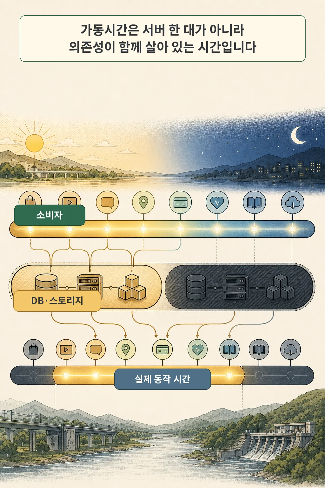
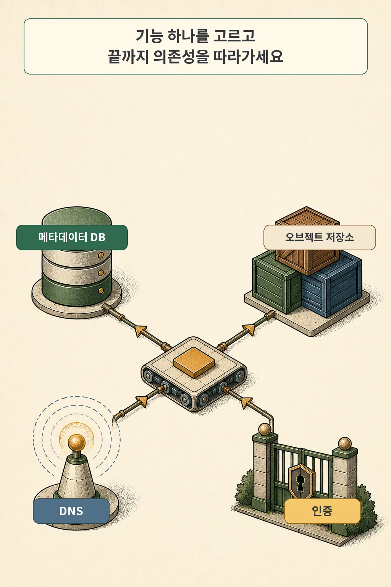
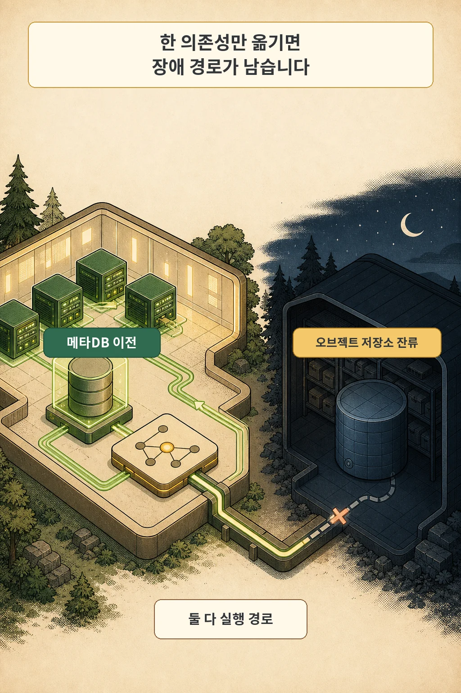

Synology NAS에서 학습용 k3s를 운영하던 때, NAS는 소음 때문에 밤에 껐습니다. 문제는 애플리케이션만 다른 장비에서 계속 실행했다는 점입니다. Airflow의 메타데이터 DB와 task가 결과를 쓰는 S3 호환 오브젝트 스토리지는 NAS에 있었고, NAS가 꺼지면 둘도 함께 사라졌습니다.

메타데이터 DB를 상시 가동 장비로 옮긴 뒤에도 문제는 끝나지 않았습니다. task가 여전히 NAS의 오브젝트 스토리지에 원본 데이터를 쓰고 있었기 때문입니다. 실행 경로의 의존성 하나만 옮겨서는 기능 전체의 가동시간이 늘지 않았습니다.

여기서 얻은 답은 명확합니다. **애플리케이션의 실질 가동시간은 프로세스가 켜진 시간이 아니라, 필수 의존성이 함께 사용 가능한 시간으로 제한됩니다.** 24시간 기능이 필요하다면 DB와 오브젝트 스토리지, 이름 해석과 인증처럼 그 기능이 통과하는 경로도 같은 시간 동안 살아 있어야 합니다.

글·해설: 다메카솔

> 당시의 정확한 장애 타임스탬프와 로그는 회수하지 못했습니다. 이 사례는 “야간 장애가 몇 번 발생했다”는 수치 증거가 아니라, 의존성을 하나씩 옮기며 확인한 설계 맥락입니다. 아래 절차는 현재 환경에서 같은 구조적 문제를 찾기 위한 방법입니다.

## 핵심 내용

- `Pod Running`은 사용자 기능의 가동을 뜻하지 않습니다. DB·스토리지·DNS·인증을 포함한 전체 경로를 봐야 합니다.
- 모든 장비를 24시간 켤 필요는 없습니다. 라이브 실행 의존성, 예약 지원 서비스, 복구·보관 사본을 분리합니다.
- StatefulSet은 안정적인 식별자와 스토리지를, PDB는 자발적 축출의 중단 범위를 다룹니다. 어느 쪽도 서비스 가동을 보증하지 않습니다.
- replica 수보다 먼저 같은 전원, 스위치, NAS 볼륨처럼 함께 꺼지는 장애 경계를 찾습니다.
- 상태 표시가 아니라 실제 입력 하나가 DB 기록과 오브젝트 저장까지 끝나는지 시험해야 합니다.

## 가동시간은 겹치는 시간창입니다

애플리케이션 프로세스가 하루 종일 살아 있어도 요청을 처리하려면 다른 서비스가 필요합니다. 로그인에는 인증과 사용자 DB가, 파일 업로드에는 이름 해석과 메타데이터 DB와 오브젝트 스토리지가 필요할 수 있습니다. 이 가운데 하나라도 필요한 순간에 사용할 수 없다면 프로세스는 살아 있어도 기능은 중단됩니다.

따라서 가동시간은 서버별 숫자를 따로 보는 문제가 아닙니다. 사용자 기능 하나가 통과하는 필수 의존성들의 **공통 시간창**을 찾는 문제입니다. 소비자는 24시간 켜져 있고 DB가 주간에만 켜진다면 해당 기능의 가동시간은 DB의 시간창을 넘지 못합니다.

그렇다고 모든 홈랩 서비스를 24시간 켜야 한다는 뜻은 아닙니다. 낮에만 쓰는 개발 환경은 의존성도 그 시간에 맞추면 됩니다. 목표는 무조건적인 상시 가동이 아니라, 독자가 기대하는 사용 시간과 실행 경로의 가동시간을 일치시키는 것입니다.

## 사용자 기능 하나에서 의존성 그래프를 그립니다

“Airflow를 운영한다”처럼 제품 전체를 적으면 의존성이 금세 추상적이 됩니다. 대신 “새 원본 파일 하나를 수집해 저장한다”처럼 결과를 확인할 수 있는 사용자 기능 하나를 고릅니다. 그다음 호출 경로를 끝까지 따라갑니다.

Airflow 공식 문서는 메타데이터 데이터베이스가 task와 DAG, variable 등의 상태를 저장하며 Airflow 동작에 필요하다고 설명합니다. 그러나 task의 출력이 별도 오브젝트 스토리지에 기록된다면 DB 접속 성공만으로 작업 성공을 말할 수 없습니다. Kubernetes 안에서도 워크로드가 Service를 이름으로 찾는다면 DNS가 공통 선행 의존성이 될 수 있습니다.

아래 표부터 채우면 숨은 경로가 드러납니다.

| 의존성 | 기능에서 하는 일 | 필요한 시간창 | 꺼지면 보이는 현상 | 실제 확인 방법 |
| --- | --- | --- | --- | --- |
| DNS | 서비스 이름을 주소로 해석 | 요청 처리 시간 전체 | 연결 전에 이름 해석 실패 | 새 Pod에서 실제 Service 이름 조회 |
| 인증·비밀정보 | 호출 주체와 자격 증명 확인 | 로그인·접속·갱신 시점 | 로그인 또는 토큰 갱신 실패 | 새 세션으로 인증부터 재실행 |
| 메타데이터 DB | 실행 상태와 참조 정보 저장 | 스케줄·실행·조회 시간 | task 상태 기록·조회 실패 | 새 작업 생성 후 상태 저장 확인 |
| 오브젝트 스토리지 | 원본과 결과 객체 저장 | task가 읽고 쓰는 시간 | 작업 후반의 업로드·다운로드 실패 | 새 객체 쓰기와 다시 읽기 |
| 외부 API | 입력 수집 또는 후속 호출 | 해당 stage 실행 시간 | 일부 단계만 재시도·실패 | 같은 요청을 제한된 입력으로 재현 |

연결 문자열만 보지 말고 세 가지를 더 확인합니다. 이름이 어디에서 해석되는지, 자격 증명이 언제 갱신되는지, 성공 판정 전에 어떤 저장이 끝나야 하는지입니다. DNS cache나 이미 열린 DB connection 때문에 기존 Pod는 잠시 정상처럼 보여도 새 연결은 실패할 수 있습니다.

## DB만 옮겼는데 왜 장애가 남았을까

홈랩 사례에서는 메타데이터 DB를 상시 가동 장비로 옮긴 것이 첫 번째 개선이었습니다. scheduler가 상태를 기록하는 경로는 살아났지만 task의 원본 저장 경로는 여전히 야간에 꺼지는 NAS를 향했습니다. DB 이전은 필요했지만 충분하지 않았습니다.

이 실수는 마이그레이션에서 자주 반복됩니다. 눈에 잘 띄는 데이터베이스만 옮기고 다음 항목을 놓칩니다.

- 결과 파일과 원본 객체가 저장되는 경로
- DNS, 인증, 비밀정보 전달처럼 모든 연결보다 먼저 필요한 서비스
- queue, cache, registry처럼 특정 단계에서만 만나는 의존성
- 실패 알림과 재시도가 다시 호출하는 외부 시스템

마이그레이션의 완료 조건을 “DB가 새 서버에서 실행됨”으로 두지 마세요. **새 입력이 들어와 최종 결과를 다시 읽을 때까지 이전 실행 경로를 전혀 사용하지 않는 것**을 완료 조건으로 삼아야 합니다. 로그와 설정 검색, 네트워크 관측, 실제 end-to-end 요청을 함께 쓰는 이유입니다.

## 상시 실행·예약 지원·복구 보관을 분리합니다

의존성 목록을 만들었다면 장비가 아니라 역할을 기준으로 세 계층으로 나눕니다.

| 계층 | 대표 대상 | 전원·가동 원칙 | 검증 질문 |
| --- | --- | --- | --- |
| 상시 실행 | 라이브 DB, 라이브 오브젝트 스토리지, 필수 DNS·인증 | 사용자 기능의 필요 시간창과 일치 | 지금 새 요청이 처음부터 끝까지 성공하는가? |
| 예약 지원 | 백업 NAS, 배치 전용 파일 서버, 점검 도구 | 정해진 작업 창에 켜지고 놓친 작업을 처리 | 예약을 놓치면 언제, 어떻게 다시 실행하는가? |
| 복구·보관 | 분리된 백업, 오프사이트·콜드 사본 | 평소 라이브 경로와 분리 | 운영 데이터가 없어도 정한 시점으로 복구 가능한가? |

이 구분을 하면 NAS를 밤에 꺼도 되는 조건도 선명해집니다. NAS가 라이브 오브젝트 스토리지라면 꺼진 시간의 기능도 중단됩니다. 반대로 NAS가 예약 백업 대상이고, 백업 창과 놓친 작업의 재시도 정책이 있다면 애플리케이션과 같은 시간 내내 켜져 있을 필요는 없습니다.

복제와 백업은 이 표에서 다른 칸을 담당합니다. replica는 현재 서비스를 이어 가기 위한 사본이고, 백업은 삭제·손상·랜섬웨어·운영 실수 뒤 과거 시점으로 돌아가기 위한 사본입니다. replica가 여러 개여도 잘못된 삭제가 모두 복제될 수 있고, 백업이 있어도 복원에 시간이 걸리면 현재 요청은 중단됩니다. Longhorn 복제, 데이터베이스 장애 조치, 3-2-1 백업 정책은 각각 별도 설계로 다뤄야 합니다.

## StatefulSet과 PDB가 해결하지 않는 것

Kubernetes의 리소스 이름이 그보다 큰 운영 목표처럼 들릴 때가 있습니다. 역할을 정확히 나누면 과신을 피할 수 있습니다.

StatefulSet은 Pod에 안정적인 네트워크 식별자와 지속 스토리지를 연결하고 순서가 필요한 배포·확장을 돕습니다. 그러나 스토리지 자체를 대신 만들거나, 데이터베이스 복제와 장애 조치 정책을 자동으로 완성하거나, 백업을 만들어 주는 객체는 아닙니다. StatefulSet을 썼다는 사실만으로 DB가 고가용성이라고 말할 수 없습니다.

PodDisruptionBudget(PDB)은 노드 drain 같은 **자발적 축출**에서 동시에 중단될 수 있는 Pod 수를 제한합니다. Kubernetes 공식 문서도 PDB가 Pod의 상시 가동을 보장하지 않는다고 명시합니다. 노드 전원 상실, 하드웨어 장애, 같은 스토리지 장애, 애플리케이션 오류까지 막는 방패가 아닙니다.

replica를 늘릴 때는 개수보다 배치 경계를 먼저 봅니다. Kubernetes 문서는 zone을 장애 도메인으로 보고 replica를 분산해 상관된 장애를 줄이는 원칙을 설명합니다. 홈랩에서는 이를 다음과 같이 번역할 수 있습니다.

- 서로 다른 노드지만 같은 멀티탭에 연결돼 있는가?
- 다른 노드의 볼륨이 결국 같은 NAS와 같은 디스크 풀에 있는가?
- DNS와 인증이 한 대의 VM에 함께 묶여 있는가?
- 노드가 나뉘어도 같은 스위치 하나를 반드시 통과하는가?

이것은 “각 자원을 반드시 이중화하라”는 처방이 아닙니다. 한 번의 고장으로 무엇이 함께 사라지는지 표시하고, 그 영향이 받아들일 수 있는지 결정하라는 뜻입니다.

## RTO와 RPO는 장비보다 질문을 먼저 정합니다

NIST SP 800-34는 RTO를 허용할 수 없는 영향이 생기기 전 자원이 중단될 수 있는 최대 시간, RPO를 장애 이전 어느 시점까지 데이터를 복구해야 하는지로 정의합니다. 홈랩에서는 복잡한 계약서보다 두 질문으로 시작해도 충분합니다.

1. 이 기능이 중단된 뒤 언제까지 다시 쓸 수 있어야 하는가?
2. 복구할 때 최근 데이터가 어느 시점까지 남아 있어야 하는가?

예를 들어 개인 사진 업로드가 밤새 중단돼도 괜찮지만 마지막 사본은 잃으면 안 되는 서비스와, 수집 pipeline이 10분만 멈춰도 입력을 놓치지만 원본을 다시 받을 수 있는 서비스는 설계가 달라집니다. 전자는 데이터 보존 쪽이, 후자는 실행 연속성과 재처리 쪽이 더 중요할 수 있습니다.

RTO와 RPO를 적었다고 목표를 달성한 것은 아닙니다. 실제 복원 시간이 목표 안에 들어오는지, 백업에서 필요한 시점의 데이터가 나오는지 시험해야 합니다. 복구 순서도 의존성 그래프를 따릅니다. 공통 선행 서비스와 상태 서비스를 복구하지 않은 채 소비자 Pod부터 재시작하면 실패를 반복할 뿐입니다.

## 15분 가동시간 설계 절차

아래 절차는 문서가 없는 홈랩에서도 시작할 수 있는 최소 단위입니다.

1. **사용자 기능 하나를 고릅니다.** “서비스 운영” 대신 “새 파일 하나를 업로드하고 다시 읽기”처럼 성공을 판정할 수 있게 적습니다.
2. **호출 경로를 끝까지 그립니다.** DNS, 인증, DB, queue, cache, 오브젝트 스토리지, 외부 API를 빠뜨리지 않습니다.
3. **각 의존성의 필요 시간창을 적습니다.** 항상 필요한지, 특정 stage에서만 필요한지, 예약 작업에서만 필요한지 구분합니다.
4. **세 계층으로 나눕니다.** 라이브 실행, 예약 지원, 복구·보관 중 하나에 놓습니다. 라이브 경로가 예약 장비를 통과하면 이유를 검토합니다.
5. **공유 장애 경계를 표시합니다.** 노드뿐 아니라 전원, 네트워크, 스토리지 풀, DNS·인증 호스트를 원으로 묶습니다.
6. **RTO·RPO 질문에 답합니다.** 허용 중단 시간과 되돌아갈 데이터 시점을 대략이라도 적습니다.
7. **중단과 복구를 시험합니다.** 계획된 시간에 의존성 하나를 끊고 탐지, 영향, 복구 순서, 실제 완료 시간을 기록합니다.

## Ready가 아니라 실제 기능을 시험합니다

Pod의 `Ready` 상태는 readiness probe가 정의한 조건을 통과했다는 뜻입니다. probe가 DB와 오브젝트 저장까지 확인하지 않는다면 실제 사용자 경로의 성공을 보장하지 않습니다. 가동시간 검증은 같은 입력을 넣고 최종 결과를 다시 읽는 합성 점검으로 닫아야 합니다.

최소 시험 기록은 다음 정도면 됩니다.

| 기록 항목 | 남길 내용 |
| --- | --- |
| 시험 기능 | 입력과 기대 결과 |
| 중단 대상 | DB, 스토리지, DNS, 노드, 전원 등 |
| 탐지 | 어떤 경보·로그·사용자 현상으로 알았는가 |
| 영향 | 어느 단계까지 성공하고 어디서 멈췄는가 |
| 복구 순서 | 공통 선행 서비스 → 상태 서비스 → 소비자 |
| 복구 증거 | 새 입력 성공, DB 기록 확인, 객체 다시 읽기 |
| 소요 시간·데이터 시점 | 실제 RTO·RPO 목표와 비교 |

시험은 운영 데이터를 위험하게 만드는 방식으로 할 필요가 없습니다. 작은 테스트 namespace와 합성 데이터로 시작하고, 백업이 있다는 사실보다 복원이 된다는 증거를 먼저 만드세요. 전원을 끄기 어렵다면 방화벽이나 Service endpoint를 제한된 범위에서 차단해 실패 경로부터 관찰할 수 있습니다.

가동시간 설계의 핵심은 더 많은 장비가 아닙니다. **기능이 의존하는 경로를 보이게 만들고, 각 경로를 역할에 맞는 시간창과 장애 경계에 배치하는 것**입니다. 애플리케이션보다 먼저 살아 있어야 하는 것이 무엇인지 알면, 무엇을 상시 가동하고 무엇을 예약하거나 분리해도 되는지도 함께 결정할 수 있습니다.

## 자주 묻는 질문

### DB를 24시간 켜 두면 고가용성이 되나요?

아닙니다. 상시 가동은 계획된 전원 시간의 문제이고 고가용성은 장애가 발생해도 서비스를 이어 갈 수 있는 구조와 운영 절차의 문제입니다. DB 한 대를 계속 켜도 그 장비나 볼륨은 단일 장애점일 수 있습니다.

### replica가 세 개면 안전한가요?

개수만으로는 알 수 없습니다. 세 replica가 같은 노드, 같은 멀티탭, 같은 NAS 볼륨에 묶여 있다면 하나의 장애가 모두에 영향을 줄 수 있습니다. 배치된 장애 도메인과 실제 장애 조치 동작을 확인해야 합니다.

### 백업 NAS는 항상 켜 둬야 하나요?

라이브 실행 경로에 없다면 반드시 그럴 필요는 없습니다. 다만 예약된 백업 창, 장비 기동 실패 탐지, 놓친 작업의 재시도, 정기 복원 시험이 있어야 합니다. 백업 대상이 꺼진 동안 애플리케이션이 그 NAS를 읽거나 쓰면 이미 라이브 의존성입니다.

### readiness probe를 DB까지 확인하면 충분한가요?

DB 접속만 확인하면 오브젝트 저장, 인증, 후속 queue처럼 다른 경로는 놓칠 수 있습니다. probe를 지나치게 무겁게 만들기보다 가벼운 준비 상태 확인과 별도의 end-to-end 합성 점검을 나누는 편이 안전합니다.

## 출처

- [Apache Airflow 3.3.0: Architecture Overview](https://airflow.apache.org/docs/apache-airflow/stable/core-concepts/overview.html)
- [Kubernetes: DNS for Services and Pods](https://kubernetes.io/docs/concepts/services-networking/dns-pod-service/)
- [Kubernetes: StatefulSets](https://kubernetes.io/docs/concepts/workloads/controllers/statefulset/)
- [Kubernetes: Specifying a Disruption Budget](https://kubernetes.io/docs/tasks/run-application/configure-pdb/)
- [Kubernetes: Running in multiple zones](https://kubernetes.io/docs/setup/best-practices/multiple-zones/)
- [NIST SP 800-34 Rev. 1](https://nvlpubs.nist.gov/nistpubs/legacy/sp/nistspecialpublication800-34r1.pdf)

이 글의 홈랩 사례는 작성자의 정본 초안과 내부 근거 감사 기록에 기반하며, 당시 상세 로그와 타임스탬프는 미회수 상태입니다. 기술 설명은 2026년 7월 24일 확인한 공식 문서를 기준으로 작성했습니다.

이미지는 생성형 AI로 만든 텍스트 없는 원화에 결정적 레터링을 합성해 제작했습니다. 공식 로고·UI·문서 도표·외부 이미지 자산은 사용하지 않았습니다.
