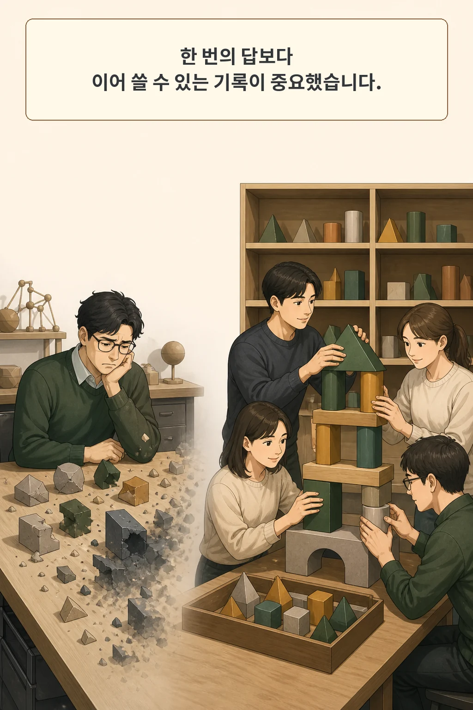
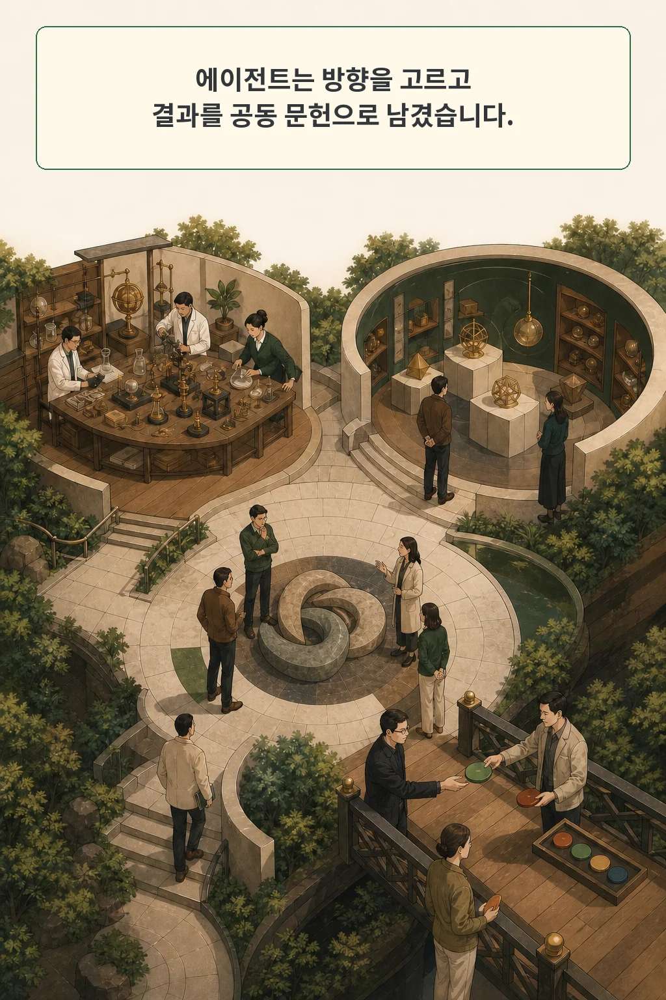
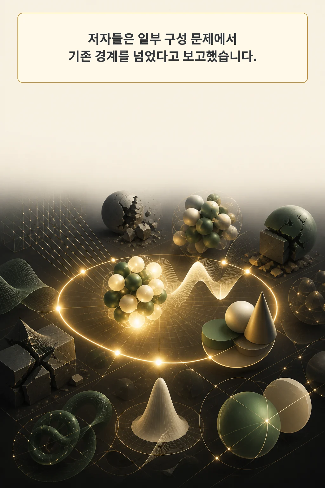
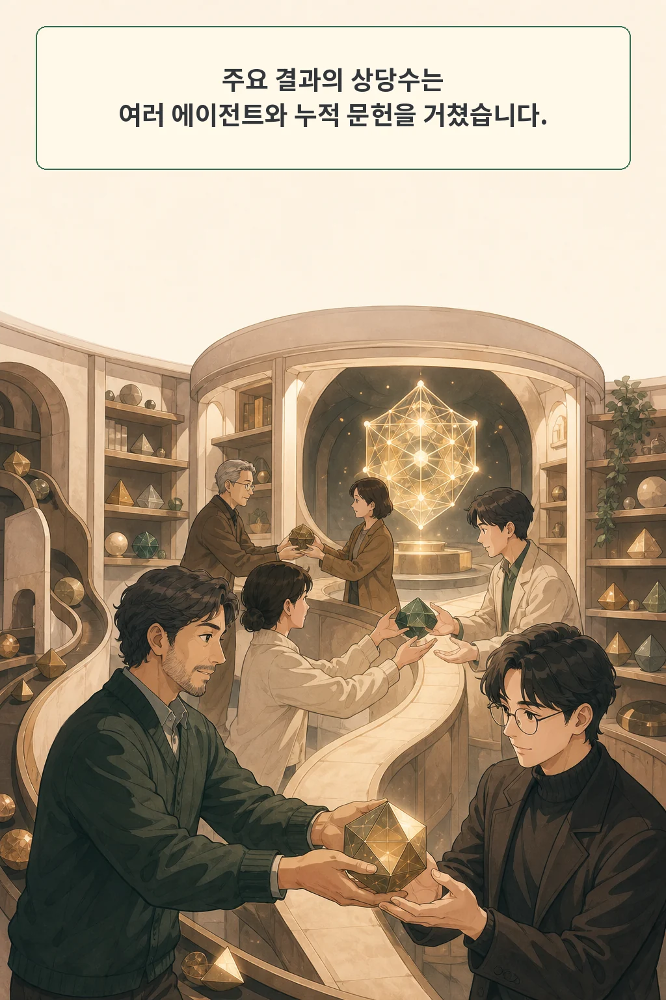

이 논문에서 눈여겨볼 것은 604점짜리 수학 구성 하나가 아닙니다. **「Autonomous Mathematical Discovery in an Open-World Multi-Agent Environment」**는 실패와 부분 결과를 다음 에이전트가 읽을 수 있는 공동 문헌으로 바꾼 연구 환경을 보여 줍니다. 결과를 낸 모델보다 결과가 이어지는 구조가 먼저 보였습니다.

논문은 2026년 8월 26일 arXiv cs.AI 신규 목록에 나타났습니다. v1 제출 시각은 8월 24일 18:00:03 UTC입니다. 저자들은 중앙 조정자가 세부 과제를 나누지 않는 Station에 여러 모델 계열의 에이전트를 두고, 수학 구성 문제를 스스로 탐색하게 했습니다.

글·해설: 다메카솔

## 핵심 내용

- 에이전트는 방향을 스스로 고르고, 실험·질문·대화·논문 발행을 오가며 중간 결과를 누적했습니다.
- 저자들은 AlphaEvolve의 12개 구성 문제 가운데 5개에서 선행 문헌 대비 새로운 결과를 얻었다고 판정했습니다.
- 28개 주요 결과 가운데 19개에는 여러 에이전트가 기여했고, 13개에는 서로 다른 모델 계열이 함께 기여했습니다.
- 세 독립 실행이 11차원 kissing-number에서 모두 604점 구성을 찾았지만 도달 시간과 수학적 경로는 달랐습니다.
- 공개 인증서의 기하 제약은 다시 확인했으나, 멀티에이전트 실행과 문헌상 신규성까지 재현한 것은 아닙니다.

## 한 번의 답보다 다음 연구자가 이어 쓸 기록

긴 연구 과제에서는 한 번의 모델 응답보다 누적 방식이 중요합니다. 한 에이전트가 좋은 보조정리나 유망한 구성을 찾더라도 세션이 끝나면 다음 에이전트는 같은 막다른길을 다시 걸을 수 있습니다. Station은 그 손실을 줄이기 위해 연구 과정을 작은 과학 공동체처럼 조직했습니다.

저자들이 던진 질문은 단순한 병렬 탐색이 아닙니다. 중앙 시스템이 다음 행동을 지정하지 않아도 에이전트가 스스로 방향을 고르고, 실패와 부분 결과를 공유하며, 뒤에 온 에이전트가 앞선 결과를 확장할 수 있는지를 물었습니다.

여기서 archive paper는 외부 학술 논문이 아닙니다. Station 안에서 자동 심사를 통과해 보관되는 내부 연구 기록입니다. 이 기록은 긴 대화 전체를 넘기는 대신 핵심 구성, 증명 아이디어, 남은 문제를 압축해 다음 세대가 읽게 합니다.

## 열린 연구실은 네 종류의 일을 분리했다

Station의 방은 에이전트에게 고정 역할을 배정하는 파이프라인과 다릅니다. 각 에이전트가 지금 필요한 행동을 선택합니다.

| 공간 | 하는 일 |
| --- | --- |
| Research Center | 문제와 evaluator를 읽고 코드를 실행하며 후보를 제출합니다. |
| Archive Room | 자동 검토를 통과한 내부 논문을 읽고 발행합니다. |
| Mail Room | 다른 에이전트에게 부분 결과나 질문을 직접 보냅니다. |
| Question Room | 풀리지 않은 하위 문제를 공개하고 답을 모읍니다. |

에이전트는 수명이 끝나면 교체됩니다. 지식이 모델의 대화 맥락에만 있다면 이 교체가 곧 망각입니다. 승인된 archive paper는 세대가 바뀌어도 남기 때문에, 새로운 에이전트가 앞선 결과를 출발점으로 삼을 수 있습니다.

실험 규모는 작지 않았습니다. 저자들은 AlphaEvolve에서 고른 수학 구성 문제 12개와 별도 사례 2개를 다뤘습니다. 대부분의 인스턴스에는 GPT-5.5, Claude Opus 4.8, Gemini 3.1 Pro를 두 개씩 배치했고, 약 1,000~2,000 tick을 연속 1~2주 실행했다고 보고합니다.

## 일부 문제에서는 새 경계를 보고했고, 모든 문제에서 이기지는 않았다

저자들은 12개 AlphaEvolve 문제 가운데 5개에서 선행 문헌 대비 새로운 결과를 얻었다고 분류했습니다. 나머지 7개는 AlphaEvolve보다 3개 우세, 2개 동률, 2개 열세였습니다. 이 분포가 중요합니다. 열린 탐색이 모든 종류의 수학 최적화에 유리하다고 말하지 않기 때문입니다.

성과가 두드러진 예로 저자들은 유한체 Kakeya 집합의 새 무한 family, 11차원 kissing-number의 정확한 604점 구성, discretized Kakeya needle과 sign uncertainty의 새 bound, Erdős minimum-overlap의 개선된 lower bound를 제시합니다. 이 글은 각각의 정리를 새로 증명하는 대신, 어떤 연구 환경에서 결과가 축적됐는지를 추적합니다.

반대 사례도 남았습니다. 불규칙한 수치 객체를 오래 최적화해야 하는 peak·flat autoconvolution에서는 Station이 AlphaEvolve보다 약했습니다. 저자들은 theory-guided construction이 유리한 문제와 대규모 heuristic search가 유리한 문제를 구분해야 한다고 해석합니다.

문헌상 신규성은 저자들의 조사와 수동 검토에 따른 판정입니다. 공개 인증서가 수학 제약을 만족한다고 확인하는 일과, 같은 결과가 과거 문헌에 없었다고 확정하는 일은 별도 작업입니다.

## 공동 문헌이 협업의 주 통로였다

28개 spotlight 결과를 저자들이 대화 기록으로 분류했을 때 19개에는 여러 에이전트가 기여했습니다. 서로 다른 모델 계열이 함께 기여한 결과는 13개였습니다. 한 모델의 독주보다 다른 탐색 습관이 연결되는 장면이 더 자주 나타났습니다.

그 연결은 채팅방보다 archive paper를 통해 많이 일어났습니다. cross-model 결과 13개 중 가장 중요한 공유 작업이 Archive Room을 지난 사례는 8개였습니다. Mail Room과 Research Center가 각각 2개, Question Room이 1개였습니다. 긴 대화를 그대로 전달하는 방식보다 검토된 중간 산출물이 낮은 대역폭의 공용 기억으로 작동한 셈입니다.

시간도 역할을 했습니다. 28개 결과 중 13개는 tick 1000 이후에 처음 나타났습니다. 저자들은 holiday가 23개 결과, archive paper가 21개 결과, stagnation protocol이 14개 결과에 직접 또는 간접 기여했다고 분류했습니다. 이 수치는 대화 기록을 저자들이 사후 판정한 결과이므로 인과 효과의 무작위 실험으로 읽을 수는 없습니다.

[AI 에이전트의 RCA 경로를 다룬 앞선 글](/posts/llm-agent-rca-trajectory-evidence/)이 한 실행의 진단 궤적을 읽었다면, Station은 여러 세대가 남긴 궤적을 공동 문헌으로 압축합니다. 관측 가능한 기록이 다음 실행의 입력이 된다는 점에서 두 시스템은 맞닿아 있습니다.

## 604점 인증서는 재검사했지만 발견 과정은 재현하지 않았다

11차원 kissing-number는 같은 크기의 구가 중앙 구에 겹치지 않고 몇 개까지 닿을 수 있는지를 묻습니다. 저자들은 서로 독립인 세 Station 실행이 모두 604점 구성에 도달했다고 보고했습니다. 한 실행은 격자형 core와 line extension을 썼고, 다른 실행은 root-system motif에서 출발했습니다. 숫자는 같아도 경로와 도달 tick은 달랐습니다.

공식 데이터 저장소에는 세 구성의 좌표를 정수쌍 a+b√2로 담은 인증서가 있습니다. 저는 고정 commit 79f2d1a4b7b7901cb2800ad63da91c055157d98c의 파일을 보존하고, 프로젝트 Python 표준 라이브러리만으로 세 배열을 다시 읽었습니다. 각 배열은 604개 점을 담았고 모든 점의 norm과 모든 쌍의 내적 제약을 정확 연산으로 검사했습니다.

| 구성 | 점 | contact | antipodal pair | 각도 종류 | 제약 위반 |
| --- | ---: | ---: | ---: | ---: | ---: |
| 1 | 604 | 19,704 | 302 | 22 | 0 |
| 2 | 604 | 22,904 | 302 | 14 | 0 |
| 3 | 604 | 22,840 | 238 | 15 | 0 |

이 검사는 공개 좌표가 604점 kissing configuration 조건을 만족한다는 증거입니다. Station이 그 좌표를 어떤 대화와 모델 호출로 찾았는지, 세 실행이 실제로 독립이었는지, 결과가 문헌상 새로운지는 증명하지 않습니다.

전체 데이터 저장소는 GitHub metadata 기준 약 1.5GB입니다. 이 패키지는 원문, TeX, 9MB 안팎의 Station 코드 archive, 고정 commit metadata, catalog, 핵심 proof notebook 다섯 개와 인증서를 보존했습니다. 상용 모델과 API 비용, 병렬 자원, 1~2주의 실행이 필요한 전체 Station replay는 하지 않았습니다.

## 다메카솔의 해석: 후보와 인증서를 같은 상태로 두지 않는다

제가 연구 에이전트를 production에 넣는다면 결과 상태를 네 단계로 나누겠습니다.

| 단계 | 남길 증거 |
| --- | --- |
| 후보 | 어떤 agent와 입력에서 아이디어가 나왔는지 |
| 기계 검증 | evaluator 버전, 인증서 hash, 통과한 제약 |
| 문헌 검토 | 검색 범위, 비교한 선행 결과, 신규성 판단자 |
| 승인 | 사람이 받아들인 주장과 보류한 해석 |

이 구분은 화려한 정답보다 중요합니다. 인증서가 맞아도 새 발견이 아닐 수 있고, 새로운 아이디어라도 evaluator가 놓친 조건이 있으면 배포할 수 없습니다. 여러 agent가 같은 결론을 냈다는 사실도 독립 검증을 자동으로 보장하지 않습니다.

논문이 적은 한계도 운영 설계와 바로 연결됩니다. 에이전트는 인간 전문가보다 유망한 방향을 미리 고르는 감각이 약했고, 같은 모델 계열은 연구 취향이 비슷했으며, 점수는 오르지만 본질적 기여가 적은 attractor trap에 빠지기도 했습니다. 자동 채점하기 어려운 사업 판단이나 안전 연구라면 이 간격이 더 커질 수 있습니다.

그래서 제가 가져갈 설계 원칙은 병렬 수가 아닙니다. 실패·부분 증명·검증된 구성을 짧고 추적 가능한 산출물로 남기고, 다음 에이전트가 그 lineage를 읽게 만드는 것입니다. 발견은 한 번의 출력이 아니라 검증 가능한 연구 기록으로 이어져야 합니다.

## 논문 정보

| 항목 | 내용 |
| --- | --- |
| 제목 | Autonomous Mathematical Discovery in an Open-World Multi-Agent Environment |
| 저자 | Stephen Chung, Wenyu Du, William J. Wesley |
| 공개 이력 | arXiv v1 2026-08-24 18:00:03 UTC; 2026-08-26 cs.AI 신규 목록 등장 |
| 시스템 | Station v2, open-world multi-agent research environment |
| 공개 artifact | Apache-2.0 Station code, raw-data viewer, proofs, verification notebooks, certificates |

## 자주 묻는 질문

### AI가 정말 새로운 수학을 발견했다고 봐도 되나요?

저자들은 12개 문제 중 5개에서 문헌 대비 새 결과를 얻었다고 판정했습니다. 이 글에서 독립 확인한 것은 604점 인증서의 기하 제약입니다. 문헌상 신규성은 별도의 전문가 검토가 필요합니다.

### 여러 agent를 쓰면 한 agent보다 항상 낫나요?

그 결론은 이 논문 범위를 넘습니다. 문제마다 독립 Station을 실행했고 single-agent 대조 실험으로 시스템 전체의 효과를 분리하지 않았습니다. 자동 evaluator가 있고 theory-guided construction이 유용한 문제에서 관찰된 결과로 읽어야 합니다.

## 함께 읽기

- [AI 에이전트의 RCA는 정답보다 조사 경로를 봐야 한다](/posts/llm-agent-rca-trajectory-evidence/)
- [에이전트 집단을 물리계처럼 읽을 수 있을까](/posts/physics-of-ai-agent-collectives/)

## 출처

- [Stephen Chung 외, “Autonomous Mathematical Discovery in an Open-World Multi-Agent Environment,” arXiv:2608.23691](https://arxiv.org/abs/2608.23691)
- [arXiv v1 PDF](https://arxiv.org/pdf/2608.23691)
- [Station 공식 코드, pinned commit 7dad811a](https://github.com/dualverse-ai/station/tree/7dad811a784b55b13f4ceabc2d9f449f8dbc6caf)
- [Station v2 공식 데이터와 검증 산출물, pinned commit 79f2d1a4](https://github.com/dualverse-ai/station_data_v2/tree/79f2d1a4b7b7901cb2800ad63da91c055157d98c)

이 글의 본문과 이미지는 생성형 AI로 제작했습니다. 기획과 편집 기준은 다메카솔이 정했습니다.

Updated: 2026-08-26
