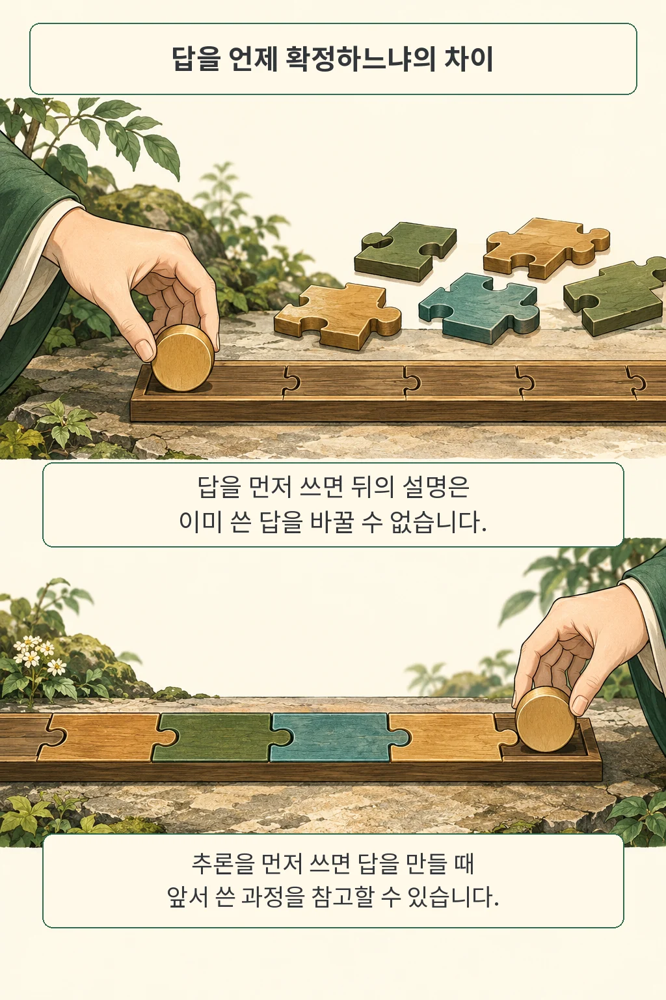

글·해설: 다메카솔

AI 응답을 JSON으로 받을 때는 **어떤 항목을 먼저 생성하게 할지도 정확도 검사에 넣는 편이 좋습니다.** 결과를 읽는 프로그램에는 같은 항목들이지만, 한 토큰씩 답을 만드는 모델에는 순서가 작업 조건이 되기 때문입니다. 「Structure Tax」의 저자들은 이 차이를 실험했습니다. 제가 주목한 부분은 특정 형식의 승리보다, 응답 스키마와 채점 코드를 함께 점검해야 한다는 점입니다.

## 같은 JSON 항목인데 무엇이 달라질까

이미 생성한 답은 뒤에 쓸 설명을 참고할 수 없습니다. 연구진은 이 자기회귀 생성의 특성에 주목해, 답변을 먼저 쓰고 이유를 붙이는 순서와 추론을 먼저 쓴 뒤 답변을 쓰는 순서를 비교했습니다. JSON과 XML 각각에 두 순서를 적용하고 자유형 응답도 함께 평가했습니다.

여기서 순서는 **모델이 텍스트를 생성하는 순서**입니다. 서버에서 완성된 JSON 객체의 키를 보기 좋게 재정렬하는 일과는 단계가 다릅니다. 이 구분을 놓치면 화면 표시만 바꾼 뒤 모델 동작도 달라졌다고 생각하기 쉽습니다.

또한 저자들은 프롬프트로 출력 형식을 지정했습니다. 이 결과를 토큰 선택을 강제하는 모든 구조화 출력 API나 내부 추론을 따로 수행하는 모델까지 넓혀 적용하려면 별도 실험이 필요합니다. 공개된 설명이 실제 판단 과정을 충실하게 반영하는지도 이 글에서 보장할 수 있는 범위 밖입니다.

## 어떤 조건에서 차이가 났을까

저자들은 GPT-4o, Gemini-Flash-2.0, Claude-Sonnet-4.5, Llama-3.1-8B, Gemma3-4B를 네 과제로 평가했습니다. 표 1은 temperature를 0으로 설정한 5회 실행의 평균과 표준편차를 제시합니다. 수학·지식·논리 과제는 답의 일치 여부를, SQL 과제는 실행 결과의 일치 여부를 평가했습니다.

GSM8K 수학 문제에서 **GPT-4o의 JSON 답변 먼저는 55.34±1.58%, 추론 먼저는 95.60±1.01%**였습니다. 필드 순서 하나로 보기에는 큰 간격입니다. 이 수치는 저자들이 보고한 테스트 문제 1,319개의 결과이며, 같은 표의 자유형 출력은 88.78±1.02%였습니다. 여기서 ±는 다섯 실행의 표준편차이고 신뢰구간을 뜻하지 않습니다.

예외도 함께 봐야 합니다. LogicBench 평가 문제 500개에서는 Llama-3.1-8B의 JSON 답변 먼저가 76.00±1.05%, 추론 먼저가 74.60±2.05%였습니다. SQL을 생성하는 Spider 검증 문제 1,030개에서는 같은 모델의 자유형 출력이 64.99±1.85%, 추론 먼저 JSON이 54.84±2.71%였습니다. 이 평균 차이에 대해 별도의 유의성 검정을 했다고 주장하지는 않겠습니다.

따라서 이 연구를 모든 업무에 적용할 단일 순서 규칙으로 읽기에는 예외가 있습니다. 저는 실제 서비스의 모델과 질문 묶음에서 비교할 실험 항목을 얻었다고 해석합니다. 모델 이름과 함께 실행 조건을 남겨야 한다는 점은 [에이전트 평가의 설정 문제](/posts/agent-evaluation-system-configuration/)와도 맞닿아 있습니다.

## 부록의 추출기 버그를 함께 읽어야 하는 이유

부록 A.3에는 Gemma3-4B 자유형 답변을 읽는 추출기의 버그가 명시돼 있습니다. 빈 답으로 추출된 비율은 MMLU에서 29.8%, LogicBench에서 45.2%라고 적었습니다. 모델이 무엇을 썼는지와 평가 코드가 무엇을 읽었는지를 나눠 볼 이유입니다.

공개 원문에서 이 버그의 수정 전후 결과가 본문 집계에 어떻게 반영됐는지까지 확인하지 못했습니다. 그래서 이 글에서는 해당 모델의 자유형 대비 개선을 추론 능력 향상으로 단정하지 않습니다. 이 문제를 근거로 다른 모든 모델의 실험도 무효라고 결론 내릴 근거 역시 없습니다.

해석 범위에도 선이 있습니다. 내부 표현 분석은 Llama와 Gemma 두 모델에 한정됐고, 저자들은 더 복잡한 스키마·훈련을 통한 적응·다언어 확장을 미해결 문제로 남겼습니다. 표와 부록을 함께 읽으면, 흥미로운 가설을 실제 제품의 기본값으로 옮기기 전에 필요한 확인이 보입니다.

## 다메카솔의 해석: 스키마 변경도 회귀 검사에 넣기

제가 AI 응답 스키마를 바꾼다면, 기존 요청 묶음을 고정한 뒤 기존 순서와 새 순서를 비교하겠습니다. 입력과 모델 설정을 같게 두고 **형식 통과율, 정답률, 추출 실패율을 별도로 기록**하는 방식입니다. 이 절차는 논문 결과를 서비스 테스트에 연결한 제 판단이며, 이번 연구에서 제품 운영 효과까지 검증한 것은 아닙니다.

원시 응답도 필요합니다. 실패한 답 한 건을 열어 모델이 답을 틀렸는지, 추출기가 놓쳤는지, 뒤의 설명과 앞의 답이 모순되는지 구분할 수 있어야 수정할 대상을 찾습니다. 추론 문장이 길다는 사실만으로 정답을 보장하지 않으므로, 길이보다 최종 업무 결과를 확인하는 검사가 중심이 되어야 합니다.

사용자 화면에서는 결론을 먼저 보여주는 편이 읽기 좋을 수 있습니다. 생성 순서와 표시 순서를 분리하면 그 선택을 유지하면서도 모델에 적합한 출력을 실험할 여지가 생깁니다. 다음 스키마 변경에서는 파싱 테스트 옆에 같은 입력의 정답 회귀 검사를 함께 두겠습니다.

## 출처와 확인 범위

- Vineet Kumar, Kanishka, Bhuvanesh Mandora. [Structure Tax: How Structured Output affects LLMs Performance, arXiv:2610.12056v1](https://arxiv.org/abs/2610.12056v1). 2026년 10월 8일 제출본.
- [원문 PDF](https://arxiv.org/pdf/2610.12056v1)의 실험 설계, 표 1, 부록 A.3·B, 한계를 대조했습니다. MMLU는 검증 분할 1,531개이며, 이 글의 수치 사례는 위에서 명시한 과제와 모델에 한정합니다.
- 이 연구의 공개 실험 코드·원시 응답 저장소 링크는 PDF와 메타데이터에서 확인하지 못했습니다. 모델 실험을 독립적으로 재실행하지 않았습니다.
- 만화는 생성 순서와 추출 과정을 설명하는 창작 비유이며 논문의 그림이나 실제 실험 화면을 복제하지 않았습니다.

확인·업데이트: 2026-10-10

이 글의 본문과 이미지는 생성형 AI로 제작했습니다. 기획과 편집 기준은 다메카솔이 정했습니다.
