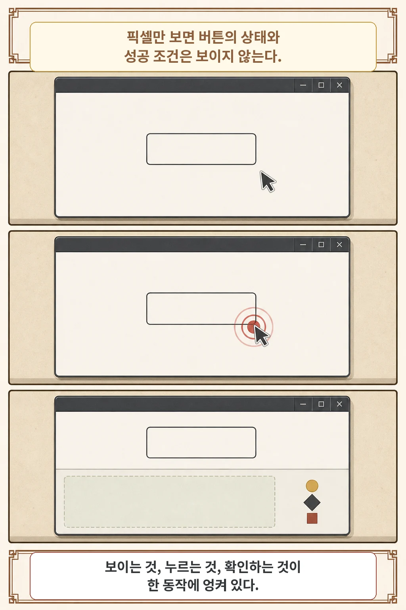
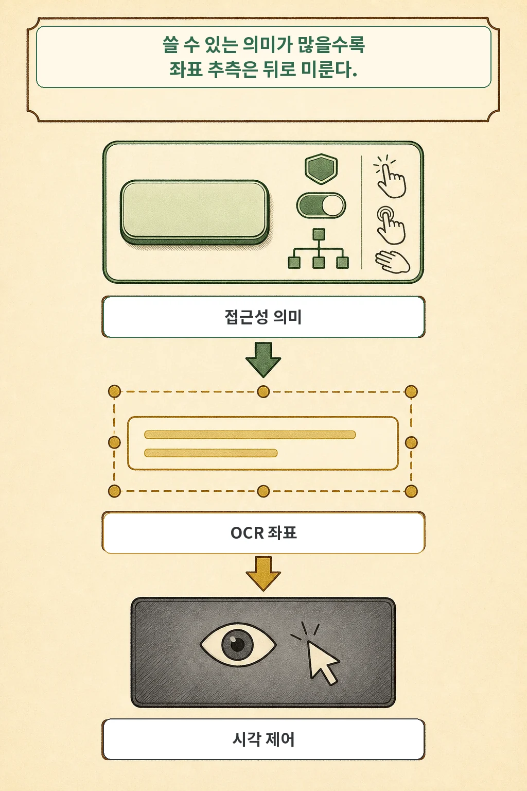
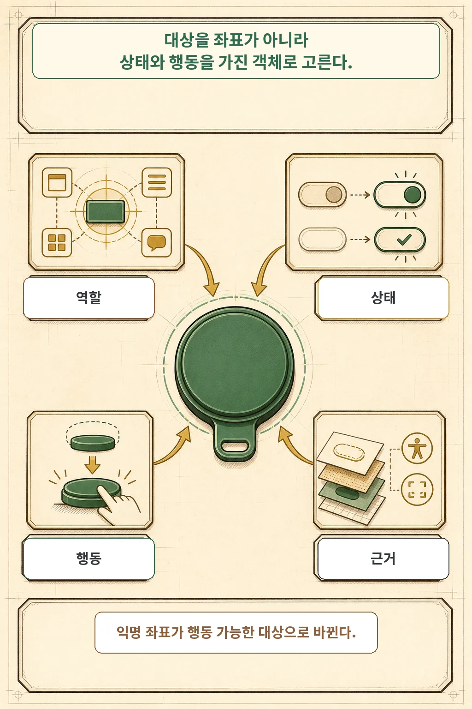
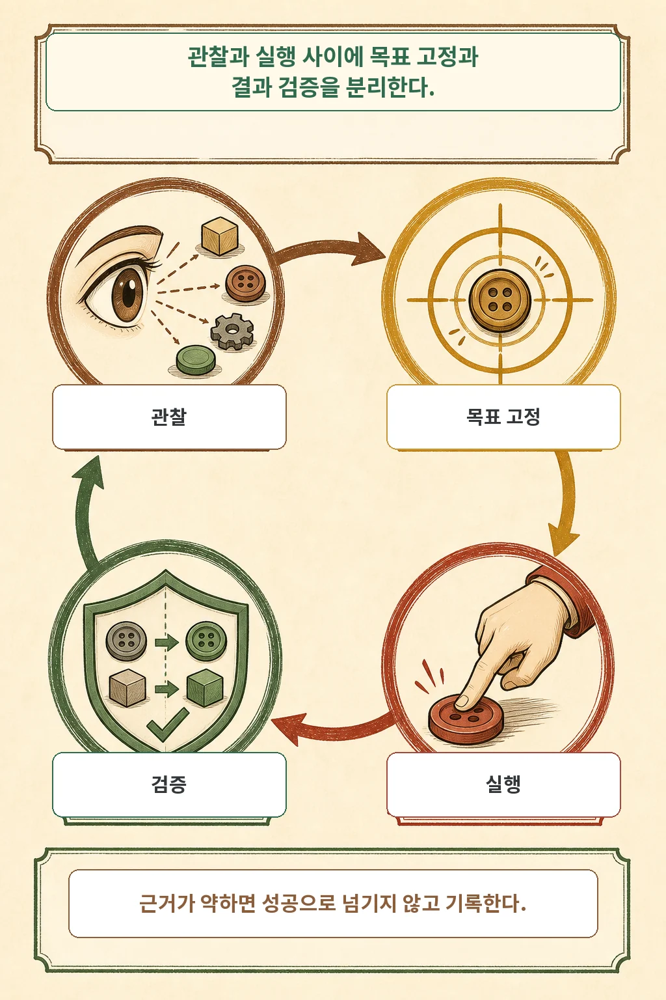
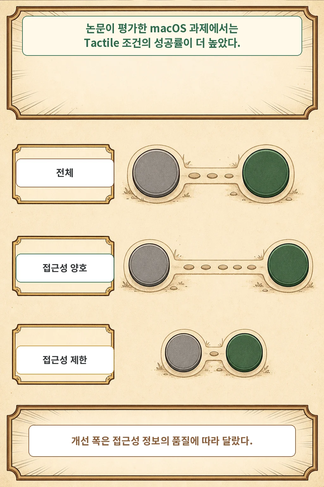
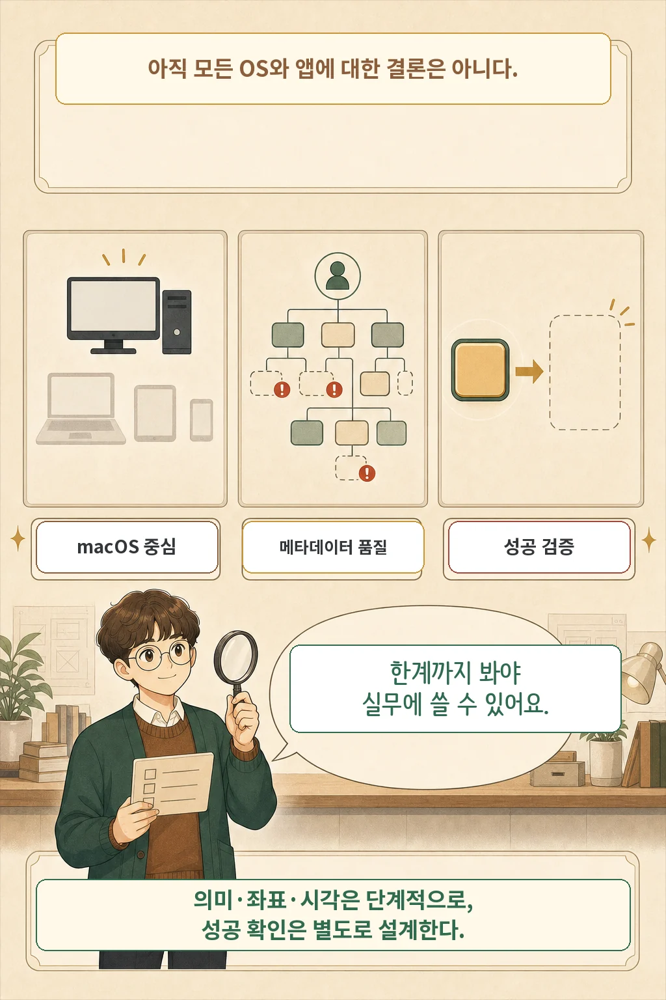

AI 에이전트가 화면의 `보내기`를 보고 클릭했는데, 빗나갔는지 버튼이 비활성인지 전송이 늦는지 알 수 없었던 적이 있나요? 2026년 7월 16일 공개된 **Tactile** 논문은 이 문제를 더 좋은 좌표 예측만으로 풀지 않습니다. 운영체제 접근성 정보, OCR 좌표, 시각 제어를 차례로 결합하고 **관찰-목표 고정-실행-검증**을 분리하는 실행 계층을 제안합니다.

핵심은 화면을 버리는 것이 아닙니다. 소프트웨어가 역할·상태·행동 같은 의미를 제공하면 그것을 먼저 쓰고, 부족할 때 OCR과 시각 제어로 내려가자는 설계입니다. 저자들의 macOSWorld-style 예비 평가에서는 Tactile 조건의 성공률이 높아졌지만, 현재 구현과 평가는 macOS 중심이며 교차 에이전트 수치는 학습된 호출 정책이 아니라 과제별 최선 결과를 고른 상한입니다.

글·해설: 다메카솔

## 핵심 내용

- 스크린샷 중심 제어는 대상 선택, 좌표 실행, 성공 확인을 한 단계에 뒤섞습니다.
- Tactile은 접근성 의미를 먼저 쓰고 OCR 좌표와 시각 제어를 대체 경로로 둡니다.
- 에이전트는 익명 좌표 대신 역할·상태·행동·근거를 가진 대상 후보를 고릅니다.
- 현재 채점된 Codex 비교에서 Success@100은 전체 41.06%에서 50.00%로 높아졌습니다.
- 결과는 예비적입니다. macOS 중심 구현, 제한된 과제, upper-bound 교차 에이전트 비교와 어려운 결과 검증이 남아 있습니다.

버튼 하나를 누르는 일도 실제로는 네 개의 판단으로 나뉩니다. 무엇을 봤고, 어느 대상을 골랐고, 어떤 행동을 실행했고, 결과가 바뀌었는지 따로 확인해야 합니다.

## 화면에 버튼이 보이면 충분할까

화면 속 `보내기`라는 글자만으로는 그 요소가 활성화된 버튼인지, 어떤 네이티브 행동을 지원하는지, 클릭 뒤 무엇이 바뀌어야 성공인지 알기 어렵습니다. 스크린샷은 화면에 그려진 모습을 충실하게 보여 주지만, 실행 의미까지 직접 드러내지는 않습니다.

저자들은 이 결합을 실패 분석의 문제로 봅니다. 한 단계가 실패했을 때 오래된 화면을 봤는지, 대상을 잘못 골랐는지, 좌표를 잘못 변환했는지, 포커스가 다른 창에 있었는지, 앱이 응답하지 않았는지, 성공했지만 확인하지 못했는지 구분하기 어렵기 때문입니다.

시각 제어 자체가 잘못이라는 뜻은 아닙니다. 캔버스, 영상 타임라인, 원격 데스크톱, 아이콘 전용 컨트롤은 여전히 화면 이해가 필요합니다. 논문의 질문은 **어떤 증거를 먼저 쓸 것인가**입니다.

## 접근성 의미에서 시각 제어까지 내려가는 사다리

Tactile은 증거를 세 단계로 정렬합니다. 강한 의미 정보가 있으면 좌표 추측을 뒤로 미루고, 의미가 부족할 때만 더 일반적인 수단으로 내려갑니다.

1. **접근성 의미**: 역할, 이름, 값, 활성·선택·포커스 상태, 계층, 위치, 지원 행동을 읽습니다. `AXPress` 같은 네이티브 행동이 있으면 일시적인 화면 좌표 대신 그 행동을 실행할 수 있습니다.
2. **OCR 좌표**: 접근성 이름이 부족하지만 화면 글자가 분명할 때 현재 텍스트 영역과 중심 좌표를 사용합니다. OCR 결과는 의미 상태가 아니라 좌표가 붙은 텍스트 증거로 다룹니다.
3. **시각 제어**: 접근성 트리가 없거나 잘못됐고 OCR도 대상을 찾지 못하면 스크린샷 이해와 좌표 행동으로 내려갑니다.

논문은 이를 `accessibility-first`라고 부르지만 `accessibility-only`라고 부르지 않습니다. 실제 앱의 접근성 메타데이터는 비어 있거나, 오래됐거나, 잘못된 행동을 노출할 수 있습니다.

## 좌표가 행동 가능한 대상 객체로 바뀌는 과정

에이전트가 고르는 것은 `(x, y)` 한 쌍이 아니라 **대상 가설**입니다. Tactile의 action-grounded interface state는 각 후보에 다음 정보를 묶습니다.

| 후보 정보 | 에이전트가 확인하는 질문 |
| --- | --- |
| 출처 | 접근성 API, OCR, 시각 영역 중 어디에서 왔는가 |
| 역할·텍스트 | 버튼인가, 입력창인가, 어떤 이름이나 글자가 보이는가 |
| 상태 | 보이는가, 활성화됐는가, 선택됐는가, 포커스가 있는가 |
| 위치 | 어떤 좌표 계약과 화면 영역을 사용하는가 |
| 행동 | 네이티브 누르기, 입력, 스크롤, 드래그, 좌표 클릭 중 무엇이 가능한가 |
| 검증 단서·근거 | 실행 뒤 어떤 상태 변화로 성공을 확인하며, 이 후보는 어떻게 만들어졌는가 |

예를 들어 접근성 트리의 활성 버튼과 같은 영역에 OCR의 `보내기`가 겹치면 두 출처가 하나의 대상 가설을 강화할 수 있습니다. 반대로 캔버스 안의 글자는 의미 버튼으로 합치지 않고 좌표 기반 후보로 남깁니다. 후보 압축은 컨텍스트를 줄이지만, 순위가 낮은 중요한 요소를 빠뜨릴 수 있다는 새 실패 가능성도 만듭니다.

## 관찰과 실행 사이에 두 단계를 더 두는 이유

한 번의 조작은 네 단계로 닫힙니다.

1. **관찰**: 접근성 요소, OCR 문장, 선택적 시각 정보, 활성 앱과 좌표 계약을 모읍니다.
2. **목표 고정**: 출처·상태·위치·행동이 붙은 후보 하나를 고릅니다.
3. **실행**: 안전한 네이티브 행동을 우선하고, 필요하면 키보드·스크롤·드래그·좌표 행동을 씁니다.
4. **검증**: 다시 관찰해 체크 상태, 입력값, 대화상자, 목록, 화면 변화가 기대와 맞는지 확인합니다.

검증 근거가 약하다고 해서 실행이 반드시 실패한 것은 아닙니다. 다만 시스템이 성공을 확정할 수 없다는 뜻입니다. 논문은 이런 약한 근거와 실패 범주를 추적 기록에 남겨 재현과 원인 분석에 쓰도록 설계했습니다.

현재 macOS 구현은 Swift 런타임이 접근성 탐색과 행동, 화면 캡처, Vision OCR, 입력 이벤트를 맡고 Python 계층이 MCP 도구 스키마, 후보 압축, 작업 상태와 로그를 맡습니다. 논문은 초기 Windows UI Automation 지원도 언급하지만, 구현과 평가의 중심은 macOS입니다.

## macOSWorld-style 평가에서 무엇이 달라졌나

저자들은 현재 채점된 macOSWorld-style 표본에서 Codex와 Codex+Tactile을 비교했습니다. 지표인 **Success@100**은 100번의 상호작용 단계 안에 완료한 과제의 비율입니다.

| 과제군 | Codex | Codex + Tactile | 차이 |
| --- | ---: | ---: | ---: |
| 전체 현재 채점 표본 | 41.06% | **50.00%** | +8.94%p |
| 접근성 친화 과제 | 45.22% | **55.26%** | +10.04%p |
| 접근성 제한 과제 | 27.78% | **33.33%** | +5.55%p |

접근성 정보가 유용한 과제에서 개선 폭이 더 컸고, 접근성이 제한된 과제에서는 폭이 작았습니다. 이는 의미 정보가 좋을 때 강점이 커진다는 시스템 설계와 맞지만, 불확실성 구간이나 전체 채점 표본의 과제 수는 본문에 보고되지 않았습니다.

96개 과제 교차 에이전트 하위집합에서도 전체 성공률은 Codex 38.54%→50.00%, Claude Code 33.33%→43.75%, OpenCode 33.33%→40.62%, Goose 41.67%→43.75%로 보고됐습니다. 그러나 이 `With Tactile` 점수는 no-skill, tactile-implicit, tactile-explicit 가운데 **과제별 최선 결과를 고른 skill-optional upper bound**입니다. 에이전트가 언제 Tactile을 호출할지 스스로 정하는 학습된 라우팅 정책의 성능으로 읽으면 안 됩니다.

## 어디까지 믿고 적용해야 할까

이 결과를 모든 데스크톱 자동화의 결론으로 옮길 수 있을까요? 논문은 그렇지 않다고 선을 긋습니다.

- **macOS 중심**: 운영체제, 앱 프레임워크, 웹뷰, 권한 모델마다 접근성 API가 다릅니다. 같은 후보 스키마를 유지해도 플랫폼 어댑터는 따로 검증해야 합니다.
- **메타데이터 품질**: 이름이 없거나 오래된 노드, 거대한 동적 트리, 화면 밖 요소가 후보 순위와 압축을 흔들 수 있습니다.
- **OCR·시각 대체의 실패**: 낮은 대비, 아이콘 전용 UI, 애니메이션, 겹친 창과 캔버스는 다시 좌표 모호성을 가져옵니다.
- **성공 검증의 빈틈**: 어떤 앱은 실행 뒤 의미·텍스트·화면 변화가 거의 없어 성공과 실패, 대기 상태를 구분하기 어렵습니다.
- **평가 범위**: 더 큰 과제 집합, 불확실성 추정, 강한 시각 전용 기준, oracle 없이 호출 시점을 정하는 정책 평가가 남아 있습니다.

공식 공개 저장소는 macOS용 MCP 구현과 운영 스킬을 제공합니다. 이번 글은 저장소와 구조를 확인했지만 설치·실행하거나 논문 수치를 독립 재현하지 않았습니다.

## 다메카솔의 실무 해석

제가 이 논문에서 가져갈 설계 교훈은 '에이전트가 화면을 더 잘 보게 하자'보다 구체적입니다. **대상 선택, 실행 수단, 성공 증거를 서로 다른 계약으로 만드십시오.**

실제 시스템을 검토할 때는 네 가지를 따로 물어볼 수 있습니다.

1. 같은 UI 요소를 접근성 의미, OCR, 시각 정보 중 무엇으로 찾았는가?
2. 네이티브 행동과 좌표 행동 중 무엇을 왜 선택했는가?
3. 실행 뒤 어떤 상태 변화가 성공을 증명하는가?
4. 증거가 약하거나 행동이 고위험이면 누구에게 확인을 돌리는가?

접근성을 잘 만든 소프트웨어는 화면 읽기 도구와 키보드 사용자를 돕습니다. 이 논문은 같은 의미 구조가 에이전트에게도 안정적인 대상과 행동을 제공할 수 있다고 봅니다. 다만 접근성 메타데이터가 좋다는 사실만으로 업무 성공이나 안전이 보장되지는 않습니다. 의미·좌표·시각을 단계적으로 쓰고, 성공 확인과 사용자 승인 경계를 별도로 설계해야 합니다.

## 출처

- [Tactile: Giving Computer-Using Agents Hands and Feet — arXiv:2607.14443](https://arxiv.org/abs/2607.14443)
- [논문 HTML 원문](https://arxiv.org/html/2607.14443)
- [공식 코드 저장소 — yliust/Tactile](https://github.com/yliust/Tactile)
- [arXiv 원문 라이선스 — CC BY 4.0](https://creativecommons.org/licenses/by/4.0/)

이 글의 만화 이미지는 AI로 생성했습니다.

Updated: 2026-07-17
