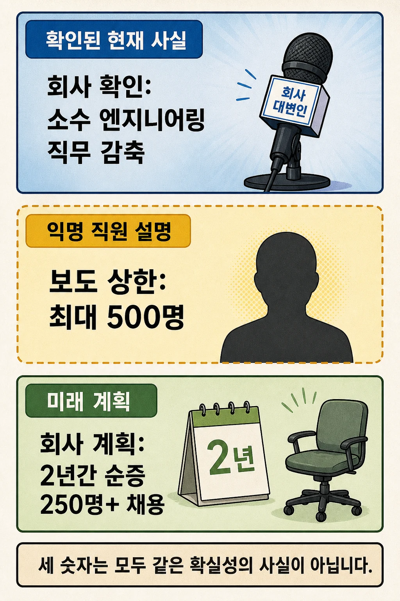
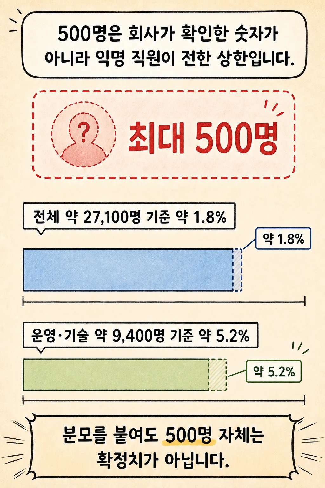
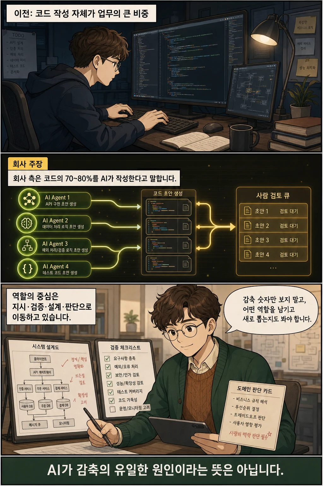

“AI 때문에 엔지니어 500명이 해고됐다”라고 한 줄로 읽기 쉬운 뉴스가 나왔습니다. 하지만 **2026년 7월 13일 Reuters 보도에서 회사가 확인한 것은 ‘소수 엔지니어링 직무 감축’이며, 최대 500명은 익명 직원이 전한 상한입니다.** 동시에 회사는 향후 2년간 시니어·AI 중심 엔지니어링 직무를 250개 넘게 순증 채용할 계획이라고 밝혔습니다.

글·해설: 다메카솔

## 핵심 내용

- Thomson Reuters는 엔지니어링 조직의 소수 직무를 감축한다고 Reuters에 확인했습니다.
- 최대 500명은 회사 공식 수치가 아니라 익명 직원의 설명입니다.
- 회사는 향후 2년 동안 엔지니어링 직무 250개 이상을 순증 채용할 계획이며, 대다수를 시니어·AI 중심 역할로 구성하겠다고 밝혔습니다.
- 이번 뉴스는 단순 인원 축소보다 **어떤 직무를 줄이고 어떤 역량을 새로 뽑는가**를 함께 봐야 합니다.

## ‘소수 감축’, ‘최대 500명’, ‘250명 채용’은 같은 종류의 숫자가 아니다



이번 보도에는 서로 다른 확실성의 정보가 한꺼번에 들어 있습니다.

| 확인 수준 | 내용 | 시간 기준 |
| --- | --- | --- |
| 회사 대변인 확인 | 엔지니어링 부문의 소수 직무 감축 | 현재 진행 |
| 익명 직원 설명 | 최대 500명 감축 가능성 | 보도 상한, 미확정 |
| 회사 대변인 계획 | 전 세계 엔지니어링 직무 250개 이상 순증 채용 | 향후 2년 |

따라서 제목에 `최대 500명`을 쓸 때는 반드시 **보도·익명 출처·미확정 상한**이라는 조건을 붙여야 합니다. 반대로 250명도 이미 채용된 인원이 아니라 2년에 걸친 미래 계획입니다.

Reuters는 감축이 전 세계 직원을 대상으로 하며 기술 부문 직원 회의에서 공지됐다고 전했습니다. 이 부분 역시 회의에 참석했다는 익명 직원의 설명에 근거합니다. Thomson Reuters가 별도의 공개 보도자료로 상세 규모를 발표한 상태는 아닙니다.

참고로 Thomson Reuters는 Reuters News의 모회사입니다. 이번 글은 Reuters 보도를 핵심 출처로 사용하되, 인력 분모는 Thomson Reuters의 공식 연차보고서로 교차 확인했습니다.

## 최대 500명은 조직에서 어느 정도 규모인가



Thomson Reuters의 2025년 연차보고서에는 2025년 12월 31일 기준 다음과 같이 기록돼 있습니다.

- 전체 직원: 약 27,100명
- Operations & Technology: 약 9,400명

Reuters 계산대로 최대 500명을 가정하면 전체 직원의 약 **1.8%**, Operations & Technology 조직의 약 **5.2%** 수준입니다.

```text
500 ÷ 약 27,100명 → Reuters 계산 약 1.8%
500 ÷ 약 9,400명  → Reuters 계산 약 5.2%
```

연차보고서의 직원 수 자체가 반올림된 근사치라 단순 나눗셈 결과는 약간 달라질 수 있습니다. 더 중요한 경계는 따로 있습니다. **분모가 정확해도 분자인 500명은 확정치가 아닙니다.** 실제 감축 인원과 완료 시점은 추가 공개가 나오기 전까지 알 수 없습니다.

## 감축과 AI 중심 채용이 동시에 나타난 이유



Thomson Reuters 대변인은 고객의 법률·세무·규제 업무 기대가 바뀌면서 역량을 중요한 영역에 집중한다고 설명했습니다. 동시에 향후 2년 동안 250개가 넘는 엔지니어링 직무를 순증 채용하고, 대다수를 시니어와 AI 중심 역할로 구성할 계획이라고 밝혔습니다.

이 방향은 2026년 6월 회사 최고운영기술책임자가 공개한 글과도 이어집니다. 그는 회사 엔지니어가 다루는 코드의 **70~80%를 AI가 작성한다**고 주장하면서, 엔지니어의 역할이 에이전트 지시, 결과 검토, 아키텍처 결정 쪽으로 이동할 것이라고 전망했습니다.

다만 70~80%는 측정 방법이 공개된 독립 감사 수치가 아니라 회사 임원의 설명입니다. 그리고 공개된 자료가 뒷받침하는 범위는 AI가 요인 가운데 하나라는 데까지입니다.

현재 확인 가능한 가장 좁은 해석은 이렇습니다.

> 일부 기존 엔지니어링 직무를 줄이는 동시에 시니어·AI 중심 역할을 새로 뽑으려는 직무 구성 재편이 진행되고 있다.

이 문장은 “AI가 엔지니어를 모두 대체한다”거나 “새 채용이 감축을 완전히 상쇄한다”는 뜻이 아닙니다.

## 개발자가 이 뉴스에서 점검할 것

1. **생성보다 검증** — AI가 만든 코드의 정확성·보안·운영 영향을 검증할 수 있는가?
2. **작업보다 시스템** — 여러 에이전트와 도구가 연결된 전체 흐름을 설계하고 관찰할 수 있는가?
3. **문법보다 도메인** — 법률·세무·금융처럼 오류 비용이 큰 영역의 조건을 코드에 반영할 수 있는가?
4. **속도보다 책임** — 최종 결정과 배포 권한이 어디에 남아야 하는지 설명할 수 있는가?
5. **뉴스의 확실성** — 회사 확인, 익명 추정, 미래 계획을 같은 사실처럼 섞지 않았는가?

이번 보도가 보여주는 변화는 코딩이 사라지는 쪽보다 직무 구성이 옮겨 가는 쪽에 가깝습니다. **코드를 직접 만드는 시간의 비중이 줄수록, 무엇을 만들지 정하고 결과를 검증하며 책임지는 역량의 가치가 커지는 방향**에 가깝습니다. 실제 감축 규모와 250명 순증 채용 계획의 이행 여부는 후속 공개를 확인해야 합니다.

## 자주 묻는 질문

### Thomson Reuters가 엔지니어 500명 감축을 공식 발표했나요?

아닙니다. 회사는 소수 엔지니어링 직무 감축을 확인했습니다. 최대 500명은 Reuters에 말한 익명 직원의 설명입니다.

### 250명을 새로 채용하면 전체 엔지니어 수가 늘어나나요?

회사는 향후 2년 동안 250개가 넘는 엔지니어링 직무를 `순증` 채용할 계획이라고 밝혔습니다. 하지만 미래 계획이라 실제 완료 여부와 조직별 배치는 추가 공개를 기다려야 합니다.

### 이번 감축이 AI 때문이라고 확정할 수 있나요?

회사는 AI를 적극 도입하고 있으며 역할 재편 방향도 공개했습니다. 그러나 공개 자료만으로 AI가 감축의 유일한 원인이라고 단정할 수는 없습니다.

### 개발자는 무엇을 준비해야 하나요?

코드 생성 도구 사용법에만 머무르지 말고, 에이전트 지시, 결과 검증, 아키텍처, 보안, 도메인 판단 역량을 실제 프로젝트에서 증명하는 편이 좋습니다.

## 출처

- [Reuters 재게시본 — Thomson Reuters to cut ‘small number’ of engineering jobs (2026-07-13)](https://www.investing.com/news/stock-market-news/thomson-reuters-to-cut-small-number-of-engineering-jobs-4789191)
- [Thomson Reuters — 2025 Annual Report](https://ir.thomsonreuters.com/static-files/d4676c84-359c-42c3-9f84-8c62552d49a2)
- [Thomson Reuters — The AI Era is Here (2026-06-04)](https://insight.thomsonreuters.com/sea/legal/posts/the-ai-era-is-here)

이 글의 본문과 이미지는 생성형 AI로 제작했습니다. 기획과 편집 기준은 다메카솔이 정했습니다.
