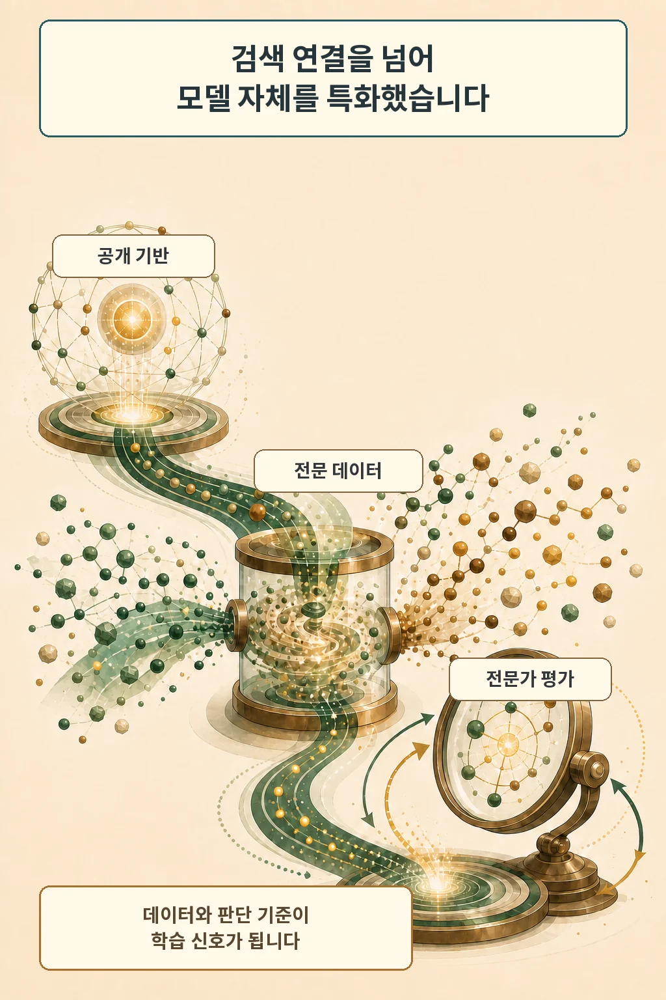

글·해설: 다메카솔

4천만 달러. 톰슨로이터는 이 비용에 인력과 연산 자원을 포함해 첫 자체 대규모 언어 모델 `Thomson`을 만들었다고 밝혔습니다. 회사는 2026년 8월 24일 모델 출시를 알렸고, 법률·세무·규제 업무에 쌓인 자료와 전문가 판단을 모델 학습에 넣은 점을 차별점으로 내세웠습니다.

## 공개 기반 위에 전문 지식을 다시 학습했습니다

Thomson은 처음부터 모든 기반 모델을 만든 결과가 아닙니다. 개발팀은 현재 Imperial College London의 `Snowdon` 오픈웨이트 모델을 출발점으로 삼고, 톰슨로이터 자료를 이용한 continued pre-training과 후속 학습을 더했습니다. 기반 모델은 공개 생태계의 발전에 맞춰 교체할 수 있게 설계했습니다.

회사가 공개한 범위에서는 Westlaw, Practical Law, Checkpoint, Reuters 자료의 10% 미만이 지금까지 학습에 쓰였습니다. 데이터 양만 늘린 작업도 아닙니다. 현업 전문가들이 어려운 법률 과제의 채점 기준을 만들고, 서로 다른 답변 가운데 어떤 것이 특정 관할과 고객 상황에 더 맞는지 평가했습니다.

이 구조는 검색 증강과 다른 비용을 요구합니다. RAG가 질문 시점에 관련 문서를 찾아 컨텍스트로 붙인다면, Thomson은 데이터 혼합과 전문가 판단을 모델 가중치와 후속 학습 신호에 반영합니다. 검색 인덱스를 준비하는 일에 더해 학습 데이터 권리, 평가 기준, 일반 능력 보존까지 관리해야 합니다.

## 성능 수치는 회사 평가로 읽어야 합니다

톰슨로이터는 Thomson이 여러 법률·일반 과제에서 최신 범용 모델과 경쟁 가능하다고 주장합니다. 엔지니어링 글은 Westlaw·Practical Law를 이용한 deep research 평가에서 인용 사실성 점수가 0.83이었고 비교한 두 범용 모델은 0.65와 0.68이었다고 보고했습니다. 이 평가는 답변의 각 주장에 붙은 인용이 실제 근거가 되는지를 측정한 회사 측 실험입니다.

숫자는 눈에 띕니다. 아직 독립 재현 결과로 다루기는 이릅니다. 공식 페이지는 기술 보고서를 안내하지만 같은 날 엔지니어링 글은 전체 보고서가 앞으로 공개될 예정이라고 적었고, 외부 연구자 평가도 진행 중입니다. 평가 데이터, 비교 모델 설정, 도구 접근 조건을 확인해야 성능 차이의 범위를 판단할 수 있습니다.

## 첫 배치는 CoCounsel의 문서 검토 기능입니다

고객이 Thomson을 만나는 첫 장소는 `CoCounsel Legal`의 `Tabular Analysis`입니다. 이 기능은 많은 문서를 표 형태로 검토하는 작업에 Thomson을 적용합니다. CoCounsel 전체가 한 모델로 바뀐 것은 아닙니다. 제품은 작업에 따라 여러 모델을 쓰며, 다른 에이전트 기능에는 Anthropic의 Claude Agent SDK도 활용합니다.

제품 출시와 모델 직접 제공도 분리해야 합니다. 2026년 8월 25일 현재 Thomson을 독립 상품이나 일반 API로 구매할 수 없고, 공식 제품 페이지는 CoCounsel 기능 안에서 먼저 경험하게 된다고 설명합니다. 고객 데이터를 Thomson 학습에 사용하지 않는다는 설명 역시 톰슨로이터의 현재 제품 약속입니다.

회사는 학술·비상업 용도의 소형 오픈웨이트 버전을 공개하고 외부 평가를 넓히겠다고 발표했습니다. 제가 8월 25일 09:00 KST에 확인한 공식 Hugging Face 모델 목록에는 아직 Thomson이 보이지 않았습니다. 발표된 계획과 실제 내려받을 수 있는 상태를 같은 말로 묶지 않는 편이 정확합니다.

## 다메카솔의 해석

제가 보는 변화는 ‘전문 문서를 많이 가진 회사가 모델도 만들었다’에서 끝나지 않습니다. 사내 지식을 검색 결과로 공급하는 단계에서 데이터 혼합, 현업 판단의 채점 기준, 모델 학습까지 내부 역량으로 옮겼습니다. 범용 모델의 가격이나 로드맵에 대한 의존을 줄이는 대신 데이터 권리와 평가 체계를 운영할 책임은 커집니다.

이 접근을 검토하는 개발팀이라면 모델 순위보다 먼저 세 가지를 봐야 합니다. 전문가의 암묵적 판단을 일관된 평가 기준으로 바꿀 수 있는지, 도메인 학습 뒤에도 지시 준수와 일반 능력이 유지되는지, 실제 제품에서 인용과 결과를 다시 검증할 수 있는지입니다. Thomson의 다음 판단 지점은 전체 기술 보고서와 소형 모델이 공개된 뒤입니다.

## 출처

- [Thomson Reuters, Thomson Reuters Leverages its World-Class Data Assets to Launch Its Own Frontier Model (2026-08-24)](https://www.thomsonreuters.com/en/press-releases/2026/august/thomson-reuters-leverages-its-world-class-data-assets-to-launch-its-own-frontier-model)
- [Thomson Reuters, Thomson: a purpose-built foundation model for professionals (2026-08-25 확인)](https://www.thomsonreuters.com/en/thomson-llm)
- [Thomson Reuters Institute, How we built Thomson (2026-08-24)](https://www.thomsonreuters.com/en-us/posts/innovation/how-we-built-thomson/)
- [Thomson Reuters, Next Generation of CoCounsel Legal (2026-08-20)](https://www.thomsonreuters.com/en/press-releases/2026/august/thomson-reuters-launches-next-generation-of-cocounsel-legal-the-ai-ecosystem-built-for-legal-professionals)
- [Thomson Reuters verified Hugging Face organization (2026-08-25 확인)](https://huggingface.co/thomsonreuters/models)

이 글의 본문과 이미지는 생성형 AI로 제작했습니다. 기획과 편집 기준은 다메카솔이 정했습니다.
