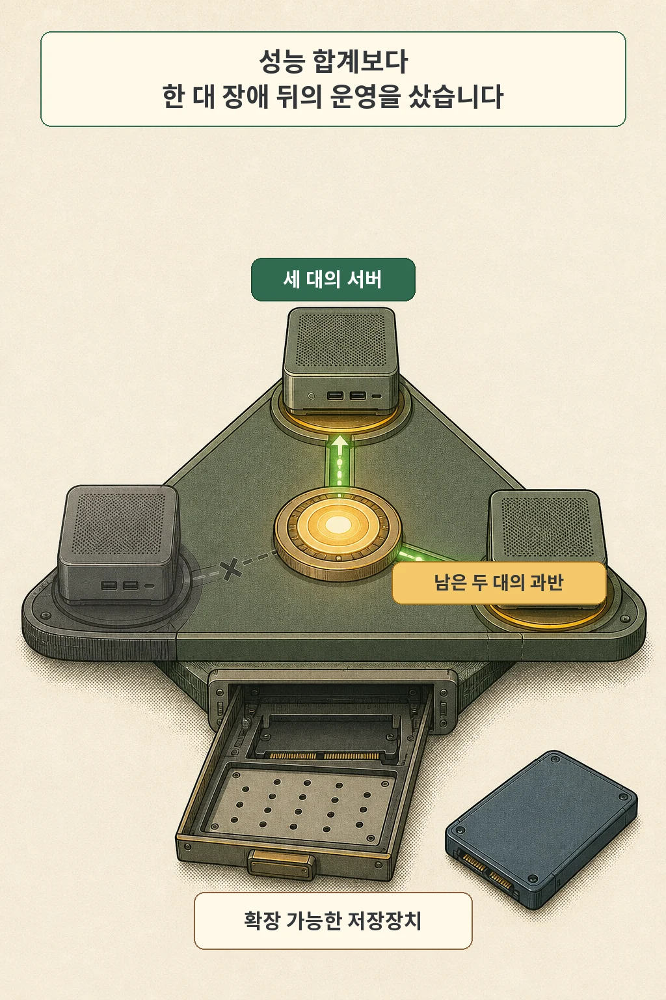
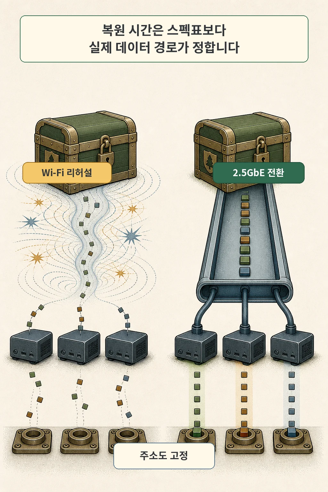
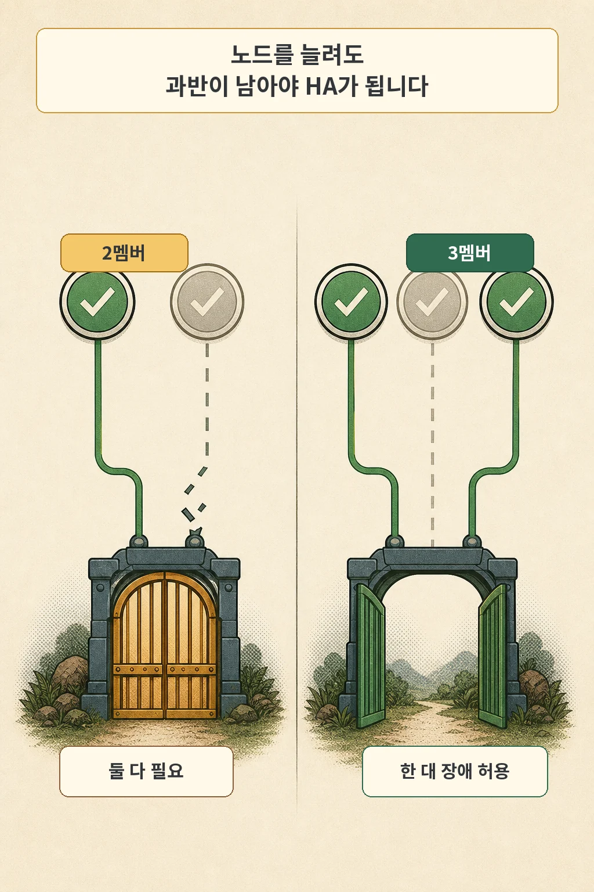

미니PC 세 대로 k3s HA 클러스터를 세운 뒤 첫 점검을 시작했습니다. `kubectl get svc -A`를 실행했는데 결과가 비어 있었습니다. 오류도, 권한 거부도 없었습니다. “아직 서비스가 없구나” 하고 넘어가기 쉬운 화면이었습니다.

하지만 새 홈랩 클러스터가 아니었습니다. WSL의 기본 kubectl 컨텍스트가 다른 프로젝트의 로컬 kind 클러스터를 가리키고 있었습니다. 더 위험한 일은 그다음에 기다리고 있었습니다. 자동화가 그 클러스터의 ServiceAccount JWT를 꺼내 새 홈랩의 Vault 인증 설정에 넣으려던 참이었습니다.

3노드를 마련한 이유는 한 대가 멈춰도 etcd 과반을 유지하기 위해서였습니다. 그런데 운영자가 엉뚱한 클러스터를 보고 있다면 노드 수와 쿼럼 계산은 아무 소용이 없습니다. 이 회고에서 얻은 결론은 하나입니다. **HA는 장비 수가 아니라, 실패 뒤에도 과반과 운영 대상을 함께 증명하는 설계입니다.**

글·해설: 다메카솔

> 이 글은 `~/dev/infra`에서 PARA Vault로 자동 수집된 2026년 7월 20일 초안을 바탕으로 합니다. WiFi 복원 시간과 유선 전환 추산, 잘못된 컨텍스트와 JWT 추출 직전 사건은 당시 기록에 근거합니다. 원 ADR·인벤토리·명령 로그에는 현재 직접 접근하지 못하므로, 측정값과 추산값을 구분하고 실제로 발생하지 않은 장애를 결과처럼 쓰지 않습니다.

## 핵심 내용

- 2멤버 etcd는 과반이 2라서 장애 허용 수가 0입니다. 3멤버는 과반이 2라 한 대 장애를 허용합니다.
- 3노드는 제어면 합의를 위한 선택입니다. 애플리케이션·스토리지·전원·네트워크 전체의 고가용성을 보장하지 않습니다.
- `kubectl` 명령의 성공과 빈 출력은 올바른 클러스터를 조회했다는 증거가 아닙니다.
- 자동화가 조회 결과로 자격을 추출하거나 쓰기 작업을 시작한다면 컨텍스트, API 서버, 예상 노드 지문을 먼저 확인해야 합니다.
- CPU와 RAM보다 복원 경로, 유선 NIC, M.2 확장성이 뒤늦게 더 큰 제약이 될 수 있습니다.

## E01의 답은 상시 가동 미니PC였습니다

1화에서는 시놀로지 NAS에서 이미 학습용 k3s를 운영하고 있었습니다. RAM은 32GB였지만 CPU 코어가 부족했고, 소음 때문에 밤에 NAS를 끄면 Airflow의 메타데이터 DB와 오브젝트 스토리지도 함께 사용할 수 없었습니다. 컴퓨팅 병목과 가동시간 병목이 한 장비에 묶여 있었습니다.

그래서 24시간 켜 둘 수 있는 미니PC 클러스터로 실행 계층을 옮기기로 했습니다. 이번에는 “RAM이 얼마나 많은가”만으로 장비를 고르지 않았습니다. 한 대가 멈춘 뒤 제어면이 계속 결정을 내릴 수 있는지, 복원 데이터가 어느 경로로 흐르는지, 나중에 저장장치를 확장할 수 있는지를 함께 봤습니다.

선택한 장비는 GMKtec M5 Ultra 세 대였습니다. 당시 기록의 각 구성은 Ryzen 7 7730U 8코어 16스레드, RAM 32GB, NVMe 512GB입니다. 제조사 사양에서도 이 모델은 8코어 16스레드 CPU, 듀얼 2.5G Ethernet, M.2 2280 슬롯 두 개를 제공합니다.



세 대를 산 핵심 이유는 CPU를 3배로 합치는 데 있지 않았습니다. embedded etcd를 쓰는 k3s 제어면에서 한 대 장애를 허용하기 위한 최소 홀수 구성이 필요했습니다. 두 번째 M.2 슬롯은 이후 데이터와 스냅숏이 늘어났을 때 저장장치만 확장할 수 있는 여지를 남겼습니다.

## 스펙표보다 복원 리허설이 먼저 답했습니다

처음에는 세 노드를 WiFi로 연결했습니다. 구성 자체는 가능했지만 84GB 데이터베이스 복원 리허설에 88분이 걸렸습니다. 당시 기록은 유선 2.5GbE로 바꾸면 35~55분 범위가 될 것으로 추산했습니다. 이 숫자는 같은 조건에서 완료한 유선 실측이 아니라, 이관 계획을 세울 때 사용한 예상 범위입니다.

중요한 것은 특정 분 수가 아닙니다. 복원 리허설이 CPU와 RAM 스펙표에는 없는 경로를 드러냈다는 점입니다. 백업을 읽는 장치, 네트워크 링크, 대상 디스크, 압축과 인덱스 재생성 가운데 가장 좁은 구간이 실제 복구 시간을 정합니다.



리허설 뒤에는 세 노드를 유선 2.5GbE로 옮기고 DHCP에 의존하던 주소를 정적 주소로 재배치했습니다. 사설 주소는 이 글에 공개하지 않습니다. 여기서 남은 기준은 단순합니다.

- 정상 실행뿐 아니라 전체 복원 때 데이터가 지나가는 경로를 그립니다.
- NIC의 표기 속도 대신 실제 백업 원본부터 대상 디스크까지의 병목을 잽니다.
- 두 번째 디스크가 필요한 시점과 스냅숏·복구 중 임시 여유를 계산합니다.
- 주소가 바뀌어도 살아야 하는 설정과 인증서, 인벤토리를 찾습니다.

장비 선택은 구매 순간의 최대 성능보다, 장애와 데이터 증가 뒤에도 바꿀 수 있는 부분을 남기는 일에 가까웠습니다.

## 2멤버는 장애 허용 수가 늘지 않습니다

etcd는 멤버의 과반이 동의해야 새 상태를 확정합니다. etcd 공식 문서의 표에 따르면 1멤버는 과반 1, 장애 허용 0입니다. 2멤버는 과반 2, 장애 허용 0입니다. 멤버를 한 대 늘렸지만 한 대가 사라졌을 때 결정을 계속할 수 있는 능력은 늘지 않습니다.

3멤버부터 달라집니다. 과반은 2이고 장애 허용 수는 1입니다. 한 대가 정지해도 남은 두 대가 과반을 유지할 수 있습니다. K3s 공식 문서가 embedded etcd HA에 세 대 이상의 홀수 server node를 요구하는 이유입니다.



| etcd 멤버 수 | 필요한 과반 | 허용 가능한 멤버 장애 |
| ---: | ---: | ---: |
| 1 | 1 | 0 |
| 2 | 2 | 0 |
| 3 | 2 | 1 |
| 4 | 3 | 1 |
| 5 | 3 | 2 |

따라서 “2노드는 언제나 1노드보다 가용성이 낮다”는 문장은 너무 넓습니다. 정확한 표현은 **2멤버 etcd가 1멤버보다 장애 허용 수를 늘리지 않으면서 두 멤버 모두를 필요로 한다**입니다. 워커만 두 개인 클러스터, 외부 데이터베이스를 쓰는 제어면, 애플리케이션 replica 두 개는 조건이 다릅니다.

3노드 역시 만능 답은 아닙니다. 세 장비가 같은 멀티탭과 스위치에 연결돼 있으면 공통 장애 지점이 남습니다. etcd 과반이 살아 있어도 애플리케이션 데이터가 한 NAS 볼륨에만 있다면 서비스는 멈출 수 있습니다. 이번 선택이 해결한 범위는 “embedded etcd 제어면에서 한 대 장애 뒤 합의를 유지한다”까지입니다.

## 빈 결과는 오류보다 위험했습니다

클러스터를 만든 뒤 `kubectl get svc -A`를 실행했습니다.

```bash
kubectl get svc -A
```

출력은 비어 있었습니다. 명령은 실패하지 않았고 403도 없었습니다. 이 상황에서 “리소스가 아직 없다”고 판단하기 쉽습니다. 실제로는 WSL의 기본 컨텍스트가 홈랩이 아니라 다른 프로젝트의 로컬 kind 클러스터였습니다.

Kubernetes 공식 문서에서 kubeconfig의 context는 cluster, user, namespace 참조를 묶는 값입니다. `current-context`는 kubectl이 기본으로 사용할 context를 정합니다. 같은 명령을 입력해도 이 연결이 달라지면 전혀 다른 API 서버와 사용자에게 요청을 보냅니다.


빈 목록은 그 클러스터에 결과가 없다는 뜻일 수 있습니다. 문제는 **그 클러스터가 내가 의도한 대상인지**를 증명하지 않는다는 점입니다. 권한 오류가 났다면 멈췄겠지만 정상 종료가 오히려 의심을 늦췄습니다.

사건은 조회에서 끝날 뻔하지 않았습니다. 다음 자동화 단계는 조회한 클러스터에서 ServiceAccount JWT를 추출해 홈랩 Vault의 Kubernetes 인증 설정에 넣으려 했습니다. 실제 반영 전에 잘못된 대상을 알아차려 인증 장애는 발생하지 않았습니다. 하지만 읽기 대상 오류가 다음 쓰기의 입력 오염으로 이어지는 구조는 분명했습니다.

이후에는 “명령이 성공했는가?”보다 먼저 “어디에 물었는가?”를 확인했습니다.

```bash
kubectl config current-context
kubectl cluster-info
kubectl get nodes -o name
```

첫 명령은 컨텍스트 이름, 두 번째는 control plane 주소, 세 번째는 실제 노드 집합을 보여 줍니다. API 주소나 노드 이름을 공개 로그에 그대로 남기기 어렵다면 허용 목록과 해시, 환경 식별자처럼 노출 위험이 낮은 지문으로 비교할 수 있습니다.

## 읽기 결과를 쓰기 입력으로 쓰기 전에


사람이 한 번 확인하는 습관만으로는 자동화를 지키기 어렵습니다. 위험한 단계 앞에서 틀리면 실패하도록 preflight를 만들어야 합니다.

| 확인 대상 | 확인할 내용 | 불일치할 때 |
| --- | --- | --- |
| 컨텍스트 | 예상한 context 이름인가 | 즉시 중단 |
| API 서버 | 허용한 endpoint 또는 인증서 지문인가 | 즉시 중단 |
| 노드 집합 | 예상한 노드 이름·role이 보이는가 | 쓰기와 자격 추출 금지 |
| namespace | 쓰기 대상 namespace가 명시됐는가 | 기본값에 맡기지 않음 |
| 결과 개수 | 0건이 가능한 정상 상태인가 | 가능 조건이 없으면 조사 |

특히 다음 작업은 조회와 쓰기 사이의 경계를 따로 둡니다.

1. 조회 단계에서 대상 클러스터 지문을 검증합니다.
2. 사람이 읽을 수 있는 실행 계획에는 자격 값 대신 대상과 작업 종류만 남깁니다.
3. JWT와 kubeconfig 원문은 콘솔이나 일반 로그에 출력하지 않습니다.
4. 쓰기 단계는 예상한 지문이 모두 일치할 때만 별도로 승인합니다.
5. 변경 뒤에는 원래 기대한 기능으로 검증합니다.

이 홈랩에서는 운영 클러스터를 로컬 kubeconfig에 합치지 않고 SSH로 노드에 접속해 `sudo k3s kubectl`을 사용하는 정책을 택했습니다. 이 방식은 로컬 kind와 홈랩을 섞을 가능성을 줄였지만 모든 환경의 정답은 아닙니다. 별도 kubeconfig 파일, 명시적인 `--context`, 권한이 제한된 계정, CI 환경 분리도 같은 목적을 달성할 수 있습니다.

핵심은 도구 선택이 아니라 **대상 클러스터를 암묵적인 기본값에 맡기지 않는 것**입니다.

## 레거시 클러스터를 지우기 전에도 같은 원칙을 썼습니다

새 클러스터를 세우는 일과 기존 단일 노드 k3s를 폐기하는 일은 별개의 위험을 가집니다. 당시에는 옮겨야 할 데이터가 남지 않았음을 확인한 뒤 제거 절차를 실행했습니다. “새 클러스터가 정상”이라는 사실만으로 “기존 클러스터를 지워도 됨”이 자동으로 증명되지는 않습니다.

폐기 전에는 최소한 다음을 분리해 확인합니다.

- 남은 namespace와 상태 서비스
- PV·외부 DB·오브젝트 스토리지의 실제 데이터 위치
- DNS·인증·CI가 여전히 옛 endpoint를 참조하는지
- 복구 가능한 백업과 복원 증거
- 제거 명령의 정확한 대상 노드

컨텍스트 사고와 폐기 검증은 같은 질문으로 연결됩니다. **지금 보고 있거나 지우려는 대상이 정말 그 클러스터인가?**

## 이번 회고 뒤에 남긴 운영 규칙

1. etcd 멤버 수는 총 장비 수가 아니라 과반과 장애 허용 수로 결정합니다.
2. 복원 리허설은 데이터 크기뿐 아니라 실제 네트워크·디스크 경로를 포함합니다.
3. `kubectl`의 빈 결과를 정상으로 판정하기 전에 현재 context와 API 서버를 확인합니다.
4. 조회 결과가 자격 추출이나 쓰기의 입력이 되면 대상 지문 검증을 자동화합니다.
5. 3노드 제어면과 애플리케이션·스토리지·백업의 HA를 같은 것으로 부르지 않습니다.
6. 폐기 작업은 새 환경의 성공이 아니라 옛 환경의 의존성과 데이터가 0이라는 증거로 승인합니다.

미니PC 세 대는 한 대 장애 뒤에도 제어면을 유지하기 위한 물리적 조건이었습니다. 그러나 실제 운영을 지킨 것은 “정상 종료”를 믿지 않고 대상과 전제부터 확인한 절차였습니다. HA는 살아 있는 서버의 개수만 세는 일이 아닙니다. 실패한 뒤에도 올바른 다수가 올바른 대상을 보고 있는지를 증명하는 일입니다.

## 자주 묻는 질문

### k3s HA는 반드시 세 대가 필요한가요?

embedded etcd로 HA server cluster를 구성한다면 K3s 공식 문서는 세 대 이상의 홀수 server node를 요구합니다. 단일 server, 외부 datastore, agent만 추가한 구성은 조건이 다릅니다. 먼저 어떤 datastore와 control plane 구조를 쓰는지 확인해야 합니다.

### 2노드 클러스터는 사용하면 안 되나요?

“노드 두 대”만으로 판단할 수 없습니다. 2멤버 etcd는 장애 허용 수가 0이므로 HA 합의 계층으로는 이점이 없습니다. 하지만 control plane과 worker 역할, 외부 datastore, workload 배치가 다르면 평가도 달라집니다.

### `--context`만 붙이면 충분한가요?

실수를 크게 줄이지만 이름 자체가 잘못 매핑됐거나 kubeconfig가 바뀔 수 있습니다. 위험한 쓰기 전에는 API server와 예상 노드처럼 독립적인 지문도 함께 확인하는 편이 안전합니다.

### 빈 결과가 언제는 정상인가요?

새 namespace나 필터 조건에 맞는 객체가 없을 때 정상일 수 있습니다. 다만 자동화가 0건을 다음 행동의 근거로 쓴다면 “0건이 허용되는 조건”을 코드에 명시하고 대상 클러스터 검증을 먼저 통과시켜야 합니다.

## 출처

- [K3s: High Availability Embedded etcd](https://docs.k3s.io/datastore/ha-embedded)
- [etcd FAQ: failure tolerance](https://etcd.io/docs/v3.2/faq/)
- [Kubernetes: The kubectl command-line tool](https://kubernetes.io/docs/concepts/overview/kubectl/)
- [Kubernetes: Kubeconfig v1 API](https://kubernetes.io/docs/reference/config-api/kubeconfig.v1/)
- [Kubernetes: kubectl cluster-info](https://kubernetes.io/docs/reference/kubectl/generated/kubectl_cluster-info/)
- [GMKtec: NucBox M5 Ultra](https://www.gmktec.com/products/gmktec-nucbox-m5-ultra-amd-ryzen-7-7730u-mini-pc)

홈랩 사건과 수치는 PARA Vault에 보존된 `~/dev/infra` 자동 수집본을 기준으로 작성했습니다. 2026년 7월 25일 공식 문서와 제조사 사양을 다시 확인했습니다. 내부 JWT, kubeconfig, 사설 주소와 호스트명은 공개하지 않았습니다.

이미지는 생성형 AI로 만든 텍스트 없는 원화에 결정적 레터링을 합성해 제작했습니다. 공식 로고·제품 사진·UI·문서 도표·외부 이미지 자산은 사용하지 않았습니다.
