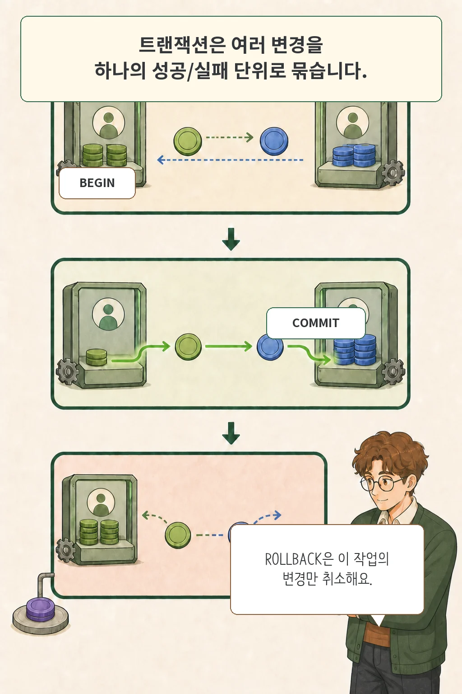
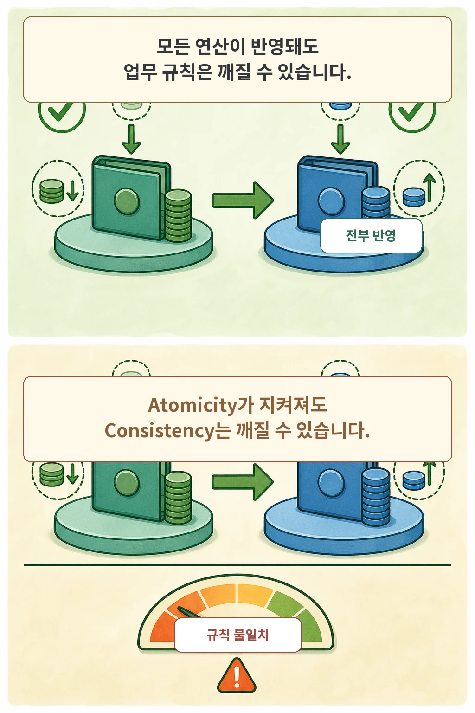
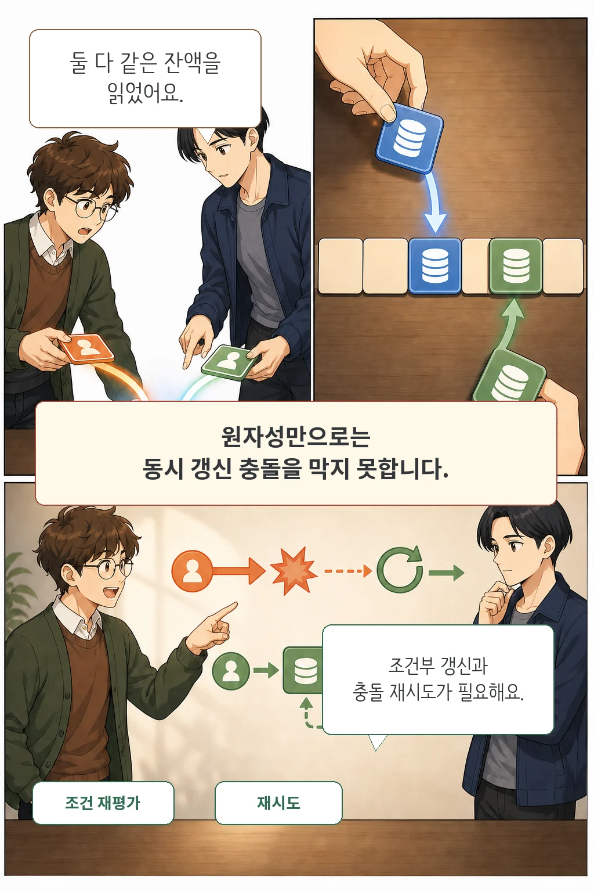
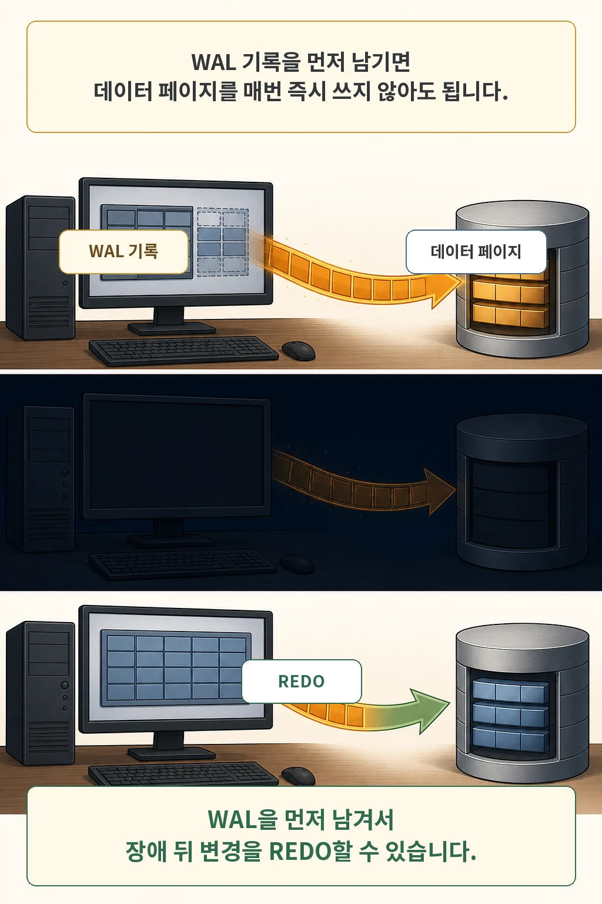

글·해설: 다메카솔

송금 시스템에서 내 통장의 출금 처리는 끝났는데 상대방 통장 입금 직전에 서버가 다운된다면 어떻게 될까요? 내 돈은 사라지고 상대방은 받지 못하는 최악의 금융 사고가 발생합니다.

데이터베이스 **트랜잭션(Transaction)**은 논리적으로 쪼개질 수 없는 여러 개의 작업을 **"모두 성공하거나, 아니면 하나도 일어나지 않은 것처럼 완전히 되돌리는(All or Nothing)" 하나의 원자적 작업 단위**로 묶어주는 핵심 안전장치입니다.

이번 글에서는 트랜잭션을 제어하는 `COMMIT`과 `ROLLBACK`의 메커니즘, 그리고 트랜잭션의 신뢰성을 지탱하는 **ACID 4대 속성**을 실무 엔지니어의 관점에서 명확하게 짚어보겠습니다.

## 핵심 요약

- 트랜잭션의 본질은 복수의 SQL 연산을 하나의 원자적(All-or-Nothing) 실행 경계로 묶는 것입니다.
- **원자성(Atomicity)**은 전부 반영 또는 전부 취소를 보장하고, **일관성(Consistency)**은 데이터베이스의 무결성 제약과 비즈니스 불변식을 지킵니다.
- 트랜잭션을 쓴다고 동시성 문제가 저절로 해결되지는 않습니다. 동시 다발적인 읽기/쓰기 충돌(Lost Update 등)은 **격리성(Isolation)** 수준과 비관적/낙관적 잠금 설계로 해결해야 합니다.
- **지속성(Durability)**은 커밋 성공 후 DB 서버 전원이 불시에 꺼져도 데이터가 보존되는 성질이며, 데이터베이스 엔진은 이를 **WAL(Write-Ahead Logging)**을 통해 디스크에 보장합니다.

## 트랜잭션은 성공과 실패의 원자적 경계다


송금 작업은 반드시 출금과 입금이 하나의 묶음으로 처리되어야 합니다. PostgreSQL과 같은 표준 RDBMS에서는 `BEGIN`으로 트랜잭션을 열고, 모든 작업이 정상 완료되었을 때 `COMMIT`으로 디스크에 영구 확정합니다. 만약 도중에 예외가 발생하면 `ROLLBACK`을 호출해 해당 트랜잭션이 수행한 모든 중간 변경사항을 깨끗이 폐기합니다.

```sql
BEGIN;

-- 1. 보내는 계좌 출금
UPDATE account
SET balance = balance - :amount
WHERE id = :from_id;

-- 2. 받는 계좌 입금
UPDATE account
SET balance = balance + :amount
WHERE id = :to_id;

COMMIT;
```



여기서 주의할 점은 `ROLLBACK`이 데이터베이스 전체 시점을 과거로 되돌리는 마법이 아니라, **"오직 현재 세션의 트랜잭션이 시도했던 쓰기 연산만 취소하는 명령"**이라는 점입니다. 다른 트랜잭션이 이미 `COMMIT`한 데이터는 롤백되지 않습니다.

## 원자성(Atomicity)과 일관성(Consistency)의 차이

면접이나 실무에서 가장 많이 혼동하는 개념이 바로 원자성과 일관성입니다.

- **원자성 (Atomicity)**: "작업이 반쪽짜리로 남지 않는다." 100보를 가든 0보를 가든 둘 중 하나여야 한다는 실행 단위의 규칙입니다.
- **일관성 (Consistency)**: "데이터베이스가 허용한 규칙(제약조건)을 위반하지 않는다." 트랜잭션 전후로 시스템이 항상 유효한 상태를 유지해야 한다는 데이터 상태의 규칙입니다.



예를 들어 A 계좌에서 100원을 차감하고 B 계좌에 90원만 입금하는 버그성 로직이 있다고 가정해 봅시다. 두 `UPDATE` 쿼리가 끝까지 실행되어 정상 커밋되었다면 **원자성(Atomicity)은 만족**한 것입니다(두 쿼리가 모두 완료되었으므로).

하지만 "두 계좌 잔액의 총합은 보존되어야 한다"는 비즈니스 불변식은 깨졌으므로 **일관성(Consistency)은 위반**된 상태입니다. 즉, 원자성이 보장된다고 해서 비즈니스 일관성까지 자동으로 지켜지는 것은 아닙니다.

## 트랜잭션만으로는 해결되지 않는 동시성: 격리성(Isolation)

트랜잭션을 걸었다고 해서 여러 사용자가 동시에 같은 데이터를 수정할 때 생기는 문제가 저절로 해결될까요? 전혀 아닙니다.

대표적인 예가 **갱신 분실(Lost Update)**입니다. 두 사용자가 동시에 잔액 100원을 조회한 뒤, 각각 50원씩 차감하여 50원으로 `UPDATE`를 날리면, 늦게 도착한 트랜잭션이 먼저 처리된 트랜잭션의 결과를 덮어써 버립니다. 결국 100원이 빠져나가야 하는데 50원만 차감되는 참사가 일어납니다.



동시성 제어를 위해서는 격리 수준(Isolation Level)과 적절한 락(Lock) 기법을 병행해야 합니다:

1. **원자적 조건부 업데이트 (Atomic Update)**:
   ```sql
   UPDATE account
   SET balance = balance - :amount
   WHERE id = :from_id AND balance >= :amount;
   ```
2. **비관적 락 (Pessimistic Lock)**: `SELECT ... FOR UPDATE`로 행을 선점하여 다른 트랜잭션의 접근을 대기시킵니다.
3. **낙관적 락 (Optimistic Lock)**: `version` 컬럼을 두고 충돌 시 애플리케이션에서 재시도(Retry) 처리합니다.

## 전원이 꺼져도 날아가지 않는 이유: 지속성(Durability)과 WAL

`COMMIT` 응답을 받았다는 것은 데이터가 안전하게 저장되었다는 약속입니다. 하지만 데이터베이스는 매번 무거운 테이블 데이터 파일(Data Page) 전체를 디스크에 즉시 동기화(fsync)하지 않습니다. 그렇게 하면 I/O 병목으로 TPS가 바닥을 치기 때문입니다.

대신 성능과 안정성을 모두 잡기 위해 **WAL(Write-Ahead Logging)** 방식을 사용합니다.



1. 실제 테이블 데이터 파일에 기록하기 전에, 변경 이력을 가벼운 순차 로그 파일(WAL)에 먼저 기록합니다.
2. WAL 로그가 디스크에 완전히 기록(Flush)된 순간 클라이언트에게 `COMMIT` 성공을 반환합니다.
3. 불시에 서버 전원이 차단되더라도, 재부팅 시 WAL 로그를 순차 재생(REDO)하여 데이터 파일의 불일치를 완벽하게 복구합니다.

## 다메카솔의 해석: 백엔드 아키텍처 관점의 트랜잭션 설계

시니어 엔지니어로서 결제나 주문 도메인을 설계할 때 트랜잭션은 단순히 `@Transactional` 어노테이션 하나 붙이고 끝나는 영역이 아닙니다.

다음 3가지 아키텍처 트레이드오프를 반드시 고려해야 합니다:

1. **트랜잭션 범위 최소화**: 트랜잭션 내부에 외부 결제 PG사 API 호출이나 메일 발송 같은 네트워크 I/O를 절대 포함하지 마세요. DB 커넥션 고갈(Connection Pool Exhaustion)의 주범이 됩니다.
2. **명확한 격리성 전략**: 트래픽이 높은 서비스에서는 `SERIALIZABLE` 같은 무거운 격리 수준 대신 `READ COMMITTED` 기반에 원자적 쿼리나 낙관적 락을 조합하는 것이 처리량(Throughput) 확보에 유리합니다.
3. **분산 환경의 한계 인지**: MSA 환경처럼 여러 마이크로서비스로 나뉜 경우 RDBMS의 단일 ACID 트랜잭션을 쓸 수 없습니다. 이때는 Saga 패턴이나 Outbox 패턴, 보상 트랜잭션(Compensating Transaction)을 통해 결과적 일관성(Eventual Consistency)을 확보해야 합니다.

## 함께 읽을 DB 핵심 원리

- [데이터베이스 정규화와 3대 이상 현상](/posts/database-normalization-anomalies/): 데이터 무결성을 위한 스키마 설계 원칙
- [SQL 선언형 모델과 옵티마이저의 실행 계획](/posts/sql-declarative-language/): DB 엔진이 인덱스를 선택하는 알고리즘

## 출처

- [PostgreSQL Documentation — BEGIN & Transactions](https://www.postgresql.org/docs/current/sql-begin.html)
- [PostgreSQL Documentation — Transaction Isolation](https://www.postgresql.org/docs/current/transaction-iso.html)
- [PostgreSQL Documentation — Write-Ahead Logging (WAL)](https://www.postgresql.org/docs/16/wal-intro.html)

이 글의 본문과 이미지는 생성형 AI로 제작했습니다. 기획과 편집 기준은 다메카솔이 정했습니다.
