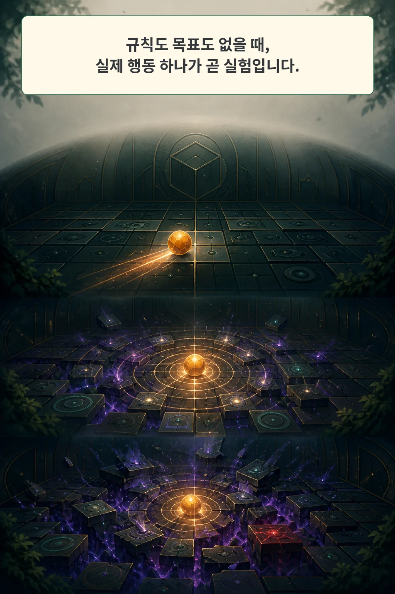
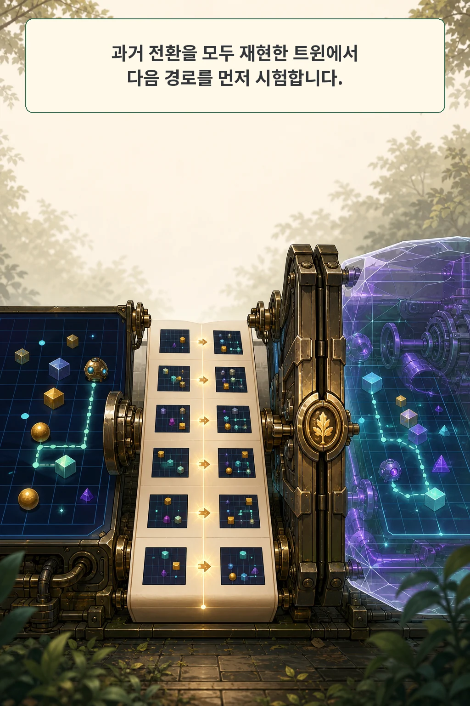
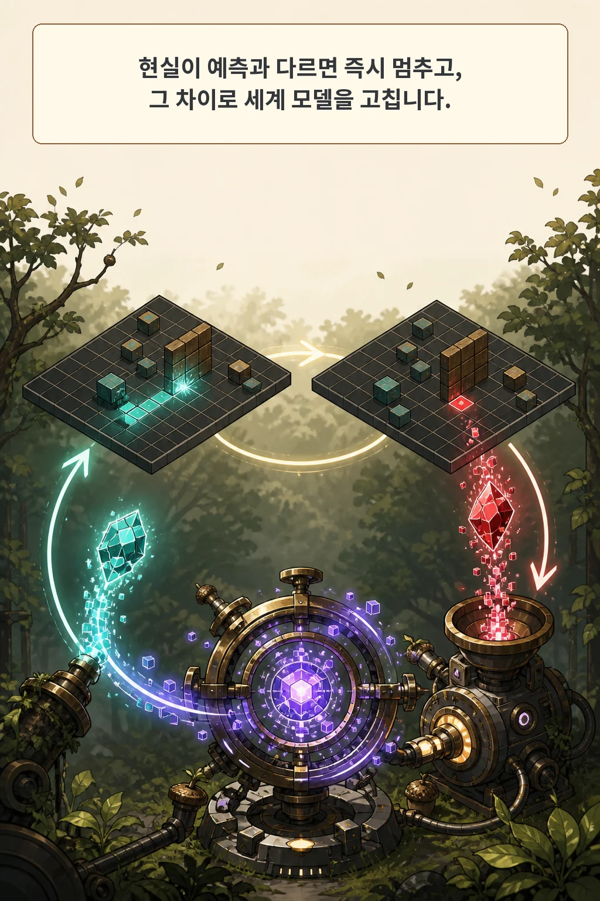
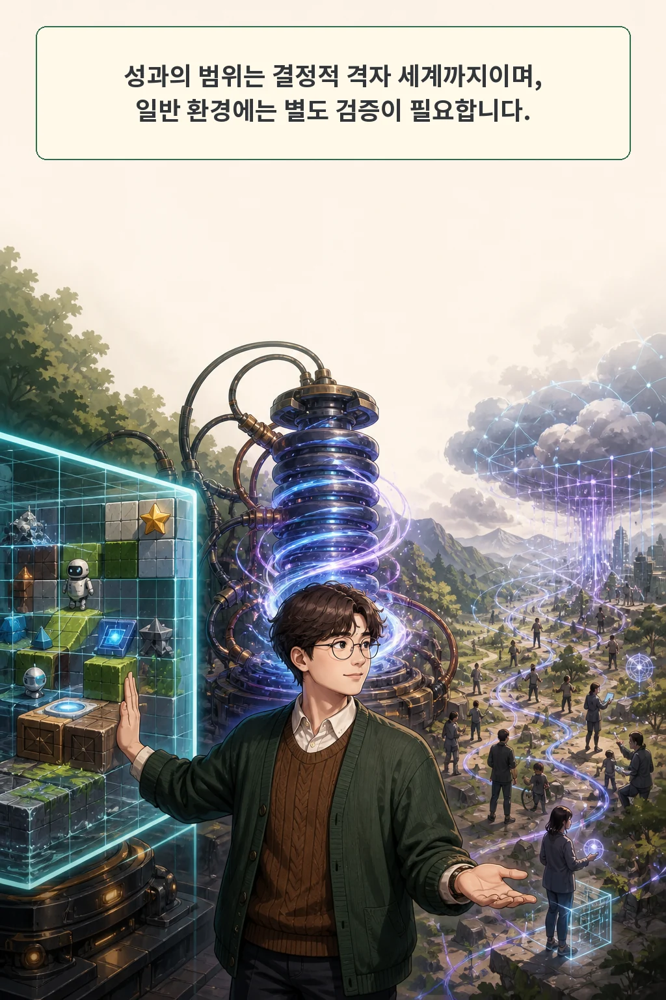

Twin의 핵심 산출물은 답이 아니라 게임 엔진입니다. 에이전트가 낯선 게임의 규칙을 Python 코드로 옮기고, 지금까지 본 장면을 모두 재현한 복사본 안에서 다음 수를 먼저 시험합니다.

2026년 8월 17일 arXiv Artificial Intelligence 최근 목록에 공개된 **Twin: Playing an Unknown Game with a Test-Time Digital Twin**은 이 구조를 ARC-AGI-3 공개 게임에서 평가했습니다. 같은 기본 모델을 그대로 둔 비교에서 하네스만 바꿔도 결과가 크게 달라졌습니다. 이 글은 그 차이를 만든 검증 루프, 숨은 목표를 찾는 방법, 그리고 결정적 격자 밖에서 다시 따져야 할 경계를 살펴봅니다.

글·해설: 다메카솔

## 핵심 내용

- Twin은 관찰한 환경 전환을 실행 가능한 Python 월드 모델로 옮깁니다.
- 하네스는 과거 전환이 하나라도 재현되지 않으면 실제 행동을 막습니다.
- 같은 GPT-5.6 Sol 기본 모델 비교에서 Twin 하네스는 93.3점, 일반 Codex 하네스는 61.1점을 기록했습니다.
- 행동 효율 점수에는 26억 처리 토큰과 91.4시간의 추론 비용이 들어가지 않습니다.
- 직접 범위는 결정적인 64×64 이산 격자이며, 연속·확률적·잠재 상태 환경에는 별도 검증이 필요합니다.

## 규칙도 목표도 없는 환경에서 행동한다는 것



ARC-AGI-3 게임은 64×64 색 격자를 보여 주지만, 버튼의 의미와 승리 조건을 설명하지 않습니다. 에이전트는 현재 화면과 가능한 행동만 받고, 행동 뒤 다음 화면과 레벨 완료 신호를 봅니다. 객체 이름, 규칙, 시범, 내부 시뮬레이터 상태는 주어지지 않습니다.

평가가 비싸게 세는 자원은 실제 게임에 제출한 행동입니다. 첫 플레이 인간보다 적은 행동으로 레벨을 끝낼수록 점수가 높아지고, 코드 작성·추론·내부 시뮬레이션은 점수에서 빠집니다. 그래서 Twin은 실제 세계에서 시행착오를 반복하기보다, 점수에 잡히지 않는 계산을 길게 써서 한 번의 행동을 준비합니다.

이 비대칭이 연구 질문을 만듭니다. 환경의 움직임은 매 행동 뒤 관찰할 수 있지만, 무엇이 승리인지는 성공하기 전까지 양성 예시가 없습니다. Twin은 동역학과 목표를 한 문제로 묶지 않고 서로 다른 증거로 다룹니다.

## 실행 가능한 복사본을 만들고 과거를 재생한다



에이전트가 쓰는 트윈은 두 Python 함수로 요약됩니다.

```python
step(grid, action) -> grid
goal_reached(grid) -> bool
```

`step`은 현재 격자와 행동을 받아 다음 격자를 예측합니다. `goal_reached`는 한 상태가 목표라고 판단하는 함수입니다. 처음의 `step`은 아무 변화도 만들지 않는 정체 함수에 가깝고, 실제 행동에서 얻은 반례가 들어올 때마다 규칙을 덧붙입니다.

하네스의 강한 경계는 `Validate`입니다. 새 행동을 내기 전에 지금까지 기록한 모든 `이전 상태-행동-다음 상태`를 트윈이 다시 계산합니다. 한 셀이라도 맞지 않으면 검증이 끝날 때까지 실제 행동을 제출하지 않습니다. [워크플로 판단과 실행 권한을 분리해 기록하는 방법](/posts/workflow-as-knowledge/)이 의미 계보에 초점을 둔다면, Twin은 실행 전 환경 재현을 기계적인 문턱으로 둡니다.

과거가 모두 맞으면 `Plan`이 트윈 안에서 breadth-first search를 돌립니다. 논문의 기본 계획 예산은 깊이 8, 노드 20,000개이며 목표 탐색 때는 깊이 14, 노드 30,000개로 넓어집니다. 찾은 경로는 현실에 한 동작씩 제출하고, 각 동작의 다음 화면을 미리 약속합니다.

## 첫 불일치가 실행을 멈추고 모델을 고친다



현실이 예측과 달라지는 순간 계획은 멈춥니다. 그 차이는 실패 로그로만 남지 않고, 트윈이 설명해야 할 새 반례가 됩니다. 에이전트가 코드를 고친 뒤 과거 전환 전체를 다시 재생해야 다음 행동 문이 열립니다.

트윈이 과거를 정확히 재현해도 목표까지 경로가 없을 수 있습니다. 이때 `Explore`는 도달 가능한 상태를 임시 목표로 제안합니다. 과거 프레임에서 이미 참이었던 후보는 승리가 아니므로 버리고, 남은 후보 가운데 실제 행동 비용이 가장 작은 시험을 고릅니다. 레벨 경계가 나타나면 첫 양성 예시가 되고, 후보 상태에 정확히 도달했는데도 레벨이 끝나지 않으면 그 후보는 폐기됩니다.

방법의 핵심은 두 벽을 분리하는 데 있습니다. 과거를 재현하지 못하면 동역학 벽이고, 과거는 맞지만 목표 경로가 없으면 목표 벽입니다. 전자는 코드를 수리하고, 후자는 새 목표 가설을 시험합니다.

## 같은 기본 모델에서도 하네스가 결과를 바꿨다

저자들은 ARC-AGI-3 공개 게임 25개, 183개 레벨에서 시스템을 평가했습니다. 가장 직접적인 비교는 기본 모델, 파일 브리지, 샌드박스를 고정하고 Twin 하네스만 제거한 Codex 어블레이션입니다.

| 시스템 | 행동 효율 점수 | 완료 게임 | 완료 레벨 |
| --- | ---: | ---: | ---: |
| 같은 기본 모델의 Codex 하네스 | 61.1 | 13/25 | 148/183 |
| Twin 하네스 | 93.3 | 23/25 | 179/183 |

Twin은 자신이 완료한 179개 레벨 가운데 158개에서 첫 플레이 인간보다 적은 행동을 썼습니다. 완료한 23개 게임만 놓고 보면 인간 기준 행동 수의 평균 0.61배였습니다. 이 값은 행동 효율에 대한 결과이며, 추론 효율을 뜻하지 않습니다.

보지 않은 전환을 예측했는지도 따로 확인했습니다. 방문한 상태에서 에이전트가 실제로 고르지 않았던 행동을 사후 엔진에 적용하자, 순서 민감 게임을 제외한 19,583개 상태-행동 쌍 가운데 68.6%가 다음 프레임 전체를 정확히 맞혔습니다. 대부분 셀이 그대로인 격자에서는 높은 cell match가 쉽게 나올 수 있어, 저자들도 exact frame을 주 지표로 둡니다.

## 목표를 맞힌 횟수와 목표 판정의 정밀도는 다르다

첫 목표 가설은 완료된 179개 레벨 중 156개에서 첫 보상 전에 맞았습니다. 레벨 단위로 보면 인상적인 결과입니다. 그러나 에이전트가 매 행동 전에 낸 모든 `goal_reached` 판정을 세면 다른 모습이 나타납니다.

행동 단위 집계에서 recall은 0.771, precision은 0.214였습니다. 실제 승리의 많은 부분을 잡았지만 승리가 아닌 상태에도 자주 불이 켜졌습니다. 계획기가 목표로 인정한 첫 상태에서 멈추기 때문에, 너무 이른 거짓 양성은 경로를 끊고 실제 행동을 더 쓰게 만듭니다.

이 잔여 오차는 논문의 결론과도 이어집니다. 실행 가능한 동역학을 복원하는 일보다 숨은 목표를 사람처럼 빨리 알아내는 일이 더 어려웠습니다. 미완료 게임 sc25와 sp80도 정확한 이동 규칙만으로 문제가 끝나지 않는 범위를 보여 줍니다.

## 행동은 아꼈지만 계산은 많이 썼다

논문이 보고한 25개 실행에는 처리 토큰 26억 개와 벽시계 추론 91.4시간이 들었습니다. 실제 게임에 제출한 행동 한 번당 평균 약 22만4천 처리 토큰입니다. 게임별 비용은 510만 토큰부터 6억2천5백만 토큰까지 벌어졌습니다.

ARC-AGI-3 점수는 이 계산을 세지 않습니다. Twin은 실제 행동을 아끼기 위해 테스트타임 계산을 앞에 집중했습니다. 같은 기본 모델의 일반 Codex 하네스보다 점수는 높았지만 전체 처리 토큰은 2.4배, 행동당 토큰은 4.7배였습니다. “행동 효율이 높다”와 “서비스 비용이 낮다”를 같은 문장으로 합치기 어려운 이유입니다.

공식 GitHub 저장소는 MIT 라이선스로 하네스, 무결성 검사, 프롬프트, 정책과 테스트를 공개합니다. 그래도 전체 결과를 그대로 재현하려면 ARC-AGI-3 접근과 hosted GPT-5.6 Sol 환경이 필요합니다. 논문은 모델의 random seed가 노출되지 않는다고 적습니다. 이 글은 원문·TeX·공식 코드 구성을 검증했지만 25개 실행을 다시 돌렸다고 주장하지 않습니다.

## 결정적 격자에서 얻은 성과의 경계



Exact replay가 강한 이유는 비교가 싸고 결정적이기 때문입니다. 64×64 이산 격자는 두 프레임의 모든 셀을 바로 대조할 수 있습니다. 반면 연속 센서, 확률적 API, 사람이 바꾼 상태에서는 같은 입력이 항상 같은 출력을 만들지 않습니다. 무엇을 일치로 인정할지 임계값과 허용 오차부터 정해야 합니다.

논문도 긴 이력에만 남는 상태, 화면에 전혀 나타나지 않는 잠재 상태, 연속 관측, 확률적 동역학을 현재 범위 밖에 둡니다. 계획 깊이와 노드 예산도 고정되어 있어 탐색 지평선 너머의 목표는 찾지 못할 수 있습니다. 관찰한 과거를 완벽히 재현한다는 사실은 보지 않은 미래의 안전을 인증하지 않습니다.

## 다메카솔의 해석

제가 가져갈 설계 원칙은 세계 모델 자체보다 **행동을 멈추게 하는 검증 경계**입니다. 모델이 계획을 냈다는 사실로 외부 행동을 허용하지 않고, 실행 전 기록 재생, 샌드박스 계획, 첫 불일치 중단을 서로 다른 단계로 두겠습니다.

작고 결정적인 환경이라면 Twin처럼 과거 전환 전체를 재생하는 강한 검사를 걸 수 있습니다. 외부 API와 사람이 섞인 운영 환경에서는 같은 수준의 복제가 어렵습니다. 그 자리에는 권한 제한, 멱등성, 체크포인트, 되돌리기, 실제 결과 확인을 배치하겠습니다. 세계 모델의 예측은 행동 후보를 줄이고, 배포 가능 여부는 별도 검증이 정합니다.

여기부터는 논문 결과를 운영 설계로 옮긴 제 해석입니다. Twin이 보여 준 것은 규칙 없는 격자 게임에서 실행 가능한 복사본과 강제 검증 하네스가 같은 기본 모델의 행동 효율을 높였다는 사실입니다. 일반 시스템으로 옮길 때는 무엇을 정확히 재생할 수 있는지부터 다시 정의해야 합니다.

## 논문 정보

| 항목 | 내용 |
| --- | --- |
| 제목 | Twin: Playing an Unknown Game with a Test-Time Digital Twin |
| 저자 | Alexy Skoutnev, Kirill Acharya, Gaston Longhitano, Madeleine Udell, Kevin Ellis, Iddo Drori |
| arXiv v1 제출 | 2026-08-14 17:06:00 UTC |
| 공식 cs.AI 최근 목록 | 2026-08-17 |
| 분야 | Artificial Intelligence (cs.AI) |
| 이 글의 분류 | systems paper |

## 출처

- [Twin: Playing an Unknown Game with a Test-Time Digital Twin — arXiv:2608.14490](https://arxiv.org/abs/2608.14490)
- [공식 arXiv PDF](https://arxiv.org/pdf/2608.14490)
- [저자 프로젝트와 25개 실행 재생](https://arc-agi-3-twin.vercel.app/)
- [공식 MIT 코드 저장소](https://github.com/Alexyskoutnev/TWIN-ARC-AGI-3)

이 글의 본문과 이미지는 생성형 AI로 제작했습니다. 기획과 편집 기준은 다메카솔이 정했습니다. 논문 그림과 게임 화면은 복제하지 않고, claim ledger에 근거해 자체 시각 언어로 재구성했습니다.

Updated: 2026-08-17
