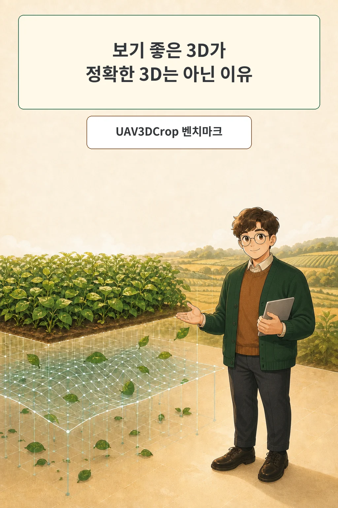
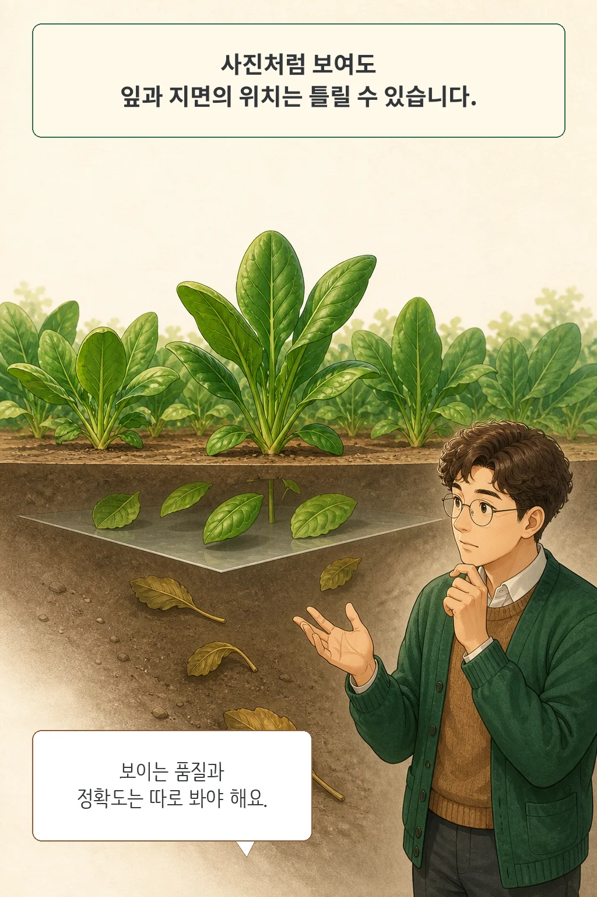
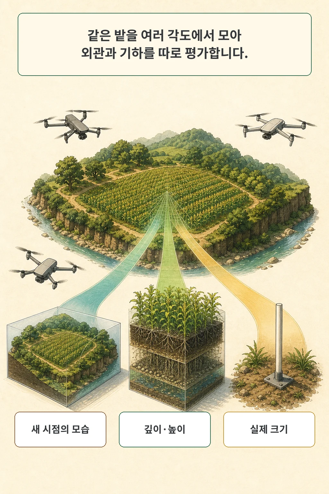
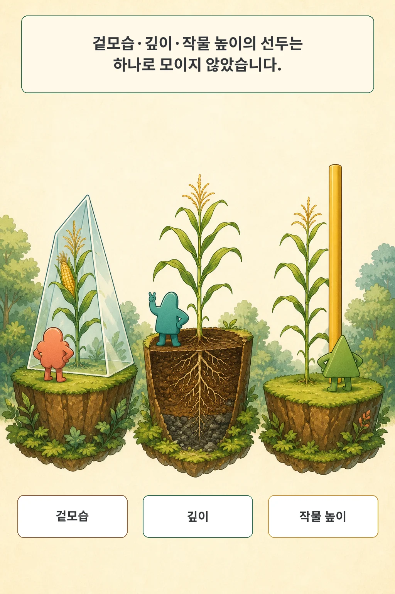
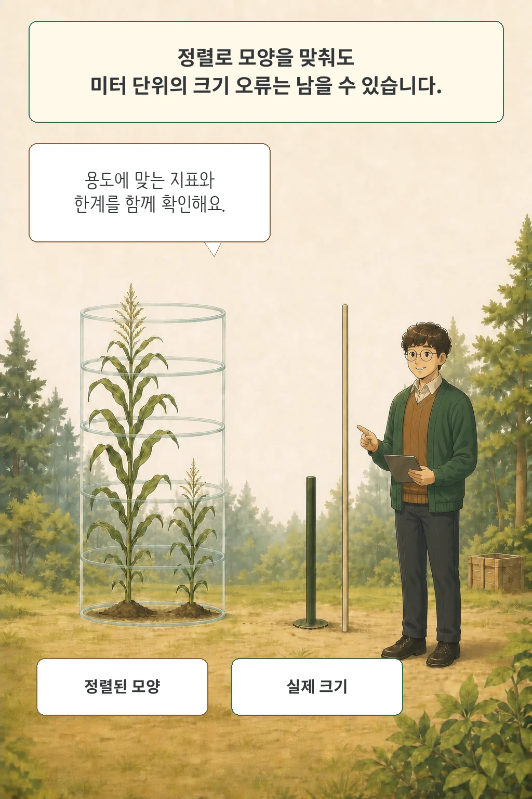

3D 복원 결과가 사진처럼 선명하면 지면과 잎의 위치도 정확해 보입니다. UAV3DCrop의 결과는 이 믿음을 깨뜨립니다. 농작물의 새 시점 이미지를 가장 잘 만든 방법과 깊이를 가장 정확히 복원한 방법이 달랐고, 작물 높이에서는 또 다른 동률이 나왔습니다. 3D 모델의 품질은 “얼마나 그럴듯하게 보이는가”와 “실제로 어디에 있는가”를 나누어 읽어야 합니다.

2026년 8월 10일 arXiv Computer Science 새 목록에 공개된 preprint **UAV3DCrop: Benchmarking 3D Reconstruction in Repeated Multi-Angle UAV Crop Surveys**는 같은 농경지를 외관, 깊이, 작물 높이, 실제 크기로 평가합니다. 엄격한 24시간 창에는 직전 실행 뒤 새 공지가 없어 탐색을 7일로 넓혔고, 목록 공개일과 2026년 8월 3일의 v1 제출 시각을 구분했습니다.

글·해설: 다메카솔

## 선명한 표면 아래에서 깊이가 어긋났다

연구진이 확인하려던 것은 한 가지였습니다. 농경지에서 보기 좋은 3D 재구성이 실제 깊이와 작물 높이까지 정확한가? 결과는 평가 목표마다 달랐습니다.

새 시점 이미지 품질에서는 Splatfacto-big이 PSNR 19.40 dB로 선두였습니다. 같은 장면의 사진측량 기준 깊이에서는 Scaffold-GS가 RMSE 0.722 m로 가장 낮았습니다. 두 선두와 2위의 짝지은 95% 부트스트랩 구간은 0을 제외했습니다. 외관 1위가 우연히 깊이 1위 자리를 놓친 정도로 읽기 어렵다는 뜻입니다.

더 큰 Gaussian 예산도 두 목표를 함께 개선하지 못했습니다. Splatfacto-big은 기본 Splatfacto보다 외관 PSNR을 0.35 dB 높였지만 처리량은 57% 줄었습니다. 깊이 오차는 옥수수·밀·귀리에서 더 커졌고 대두에서만 소폭 나아졌습니다. 표면의 색과 질감을 잘 재현하는 능력이 올바른 위치를 보장하지 않았습니다.

## UAV3DCrop은 같은 밭을 네 가지 질문으로 나눴다

저자들은 2023년부터 2025년까지 미국 중서부 농경지에서 옥수수·대두·밀·귀리를 반복 촬영했습니다. 벤치마크는 91개 장면, RGB 이미지 88,830장, 카메라 자세 88,413개, 사진측량 깊이 자료 87,890개를 포함합니다. 39개 촬영일과 8개 종단 시퀀스가 성장 시기와 촬영 조건의 변화를 담습니다.

Track A는 장면마다 두 NeRF와 다섯 3D Gaussian Splatting 계열 방법을 따로 최적화합니다. 촘촘한 촬영 시점의 90%로 장면을 맞추고, 결정적으로 고른 10%에서 새 시점 이미지를 봅니다. 이 평가는 촬영 범위 밖으로 나가는 외삽이 아니라 이미 관측한 기하 안의 보간입니다.

평가 대상은 세 층으로 갈립니다.

1. 새 시점 외관: PSNR, SSIM, LPIPS와 처리량
2. 기하: 같은 픽셀 위치의 z-depth와 사진측량 기준 차이
3. 응용 측정: 31개 장면의 현장 표본 210개와 비교한 작물 높이

Track B는 작물에 맞춘 미세조정 없이 MASt3R, VGGT, Pi3, MapAnything을 시험합니다. 장면마다 36장짜리 부분집합을 140번 뽑고, 카메라 자세·점 지도·깊이·광선 방향·실제 크기를 평가했습니다. 저자들은 20,000회 짝지은 부트스트랩으로 장면과 시퀀스의 불확실성을 보존했습니다.

## 겉모습·깊이·작물 높이의 선두가 갈렸다

작물 높이에서도 외관 순위가 그대로 이어지지 않았습니다. Scaffold-GS와 Splatfacto의 장면 매크로 MAE는 각각 0.091 m와 0.092 m였습니다. 세 높이 지표의 짝지은 구간이 모두 0을 포함해 저자들은 두 방법을 사실상 동률로 보고했습니다. 외관 선두 Splatfacto-big의 높이 MAE는 0.156 m였습니다.

작물별 차이도 남았습니다. 옥수수는 모든 장면 최적화 방법에서 깊이 오차가 가장 컸고, 귀리는 모든 방법에서 작물 높이 오차가 가장 컸습니다. Scaffold-GS는 밀과 귀리 높이에서 앞섰고 Splatfacto는 옥수수와 대두에서 앞섰습니다. 전체 평균만 보면 사라지는 조건입니다.

Track B에서는 MapAnything이 여덟 지표 중 일곱 지표에서 선두였고, Pi3가 광선 방향 오차에서 선두였습니다. 이 비교 역시 모델 하나가 모든 출력에서 가장 좋다는 결론을 지지하지 않습니다. 모델 설계와 평가 목표가 맞닿는 지점이 달랐습니다.

## 모양 정렬은 미터 단위 실패를 숨겼다

가장 큰 간격은 실제 크기에서 나타났습니다. MapAnything의 정렬 전 scale AbsRel은 0.027이었고 다른 세 모델은 0.890에서 0.965였습니다. 다른 모델도 모양을 확대·축소하고 이동해 기준과 겹치면 점 지도 구조가 훨씬 나아 보였습니다. 그러나 농작물 높이를 미터로 재야 할 때 그 정렬은 필요한 답을 미리 알려 준 셈입니다.

저자들은 이 차이를 모델 설계와 함께 해석합니다. MapAnything만 전용 metric-scale head를 갖고 있고 나머지는 정규화된 기하를 예측합니다. 그래서 정렬된 점 지도와 정렬하지 않은 실제 크기를 함께 보고해야 합니다.

기준 자체에도 경계가 있습니다. 깊이 기준은 독립 레이저 스캔이 아니라 SfM과 사진측량으로 만들었습니다. 새 시점 평가는 촘촘한 촬영 범위 안의 보간이고, 현장 작물 높이는 2025년에만 있습니다. 논문은 레이저 기준, 보지 않은 방위각, 희소 시점, 여러 지역·연도 적응을 후속 과제로 남겼습니다.

공개 자료는 분명하지만 실행 재현성은 별도입니다. 2026년 8월 11일 확인한 공식 RGB와 depth 데이터셋은 접근 요청이 없는 CC BY 4.0 공개 자료였습니다. Hugging Face API가 보고한 저장량은 약 986.8 GB와 335.7 GB라 전체 내려받기 비용도 작지 않습니다. 공식 GitHub 커밋 `0ef9998278fffcf88b72dc407f3691c6f93445b2`에는 프로젝트 페이지, 인용 파일, 경로 데이터와 데모 자산이 있으나 벤치마크 실행·학습·평가 코드는 없었습니다. 이 패키지는 데이터 공개를 확인했지만 결과를 독립 재현했다고 주장하지 않습니다.

## 다메카솔의 해석: 용도를 고른 뒤 모델을 고른다

저라면 3D 재구성 모델의 “최고 성능”부터 묻지 않겠습니다. 먼저 결과로 무엇을 하려는지 정하겠습니다. 사람이 보기 좋은 새 시점을 만들려는지, 지표면까지 정확한 깊이가 필요한지, 작물 높이를 비교하려는지, 미터 단위 지도를 바로 써야 하는지에 따라 승인할 증거가 달라집니다.

외관 점수는 렌더링 품질을 말합니다. 깊이 오차는 표면 위치를 말하고, 작물 높이는 지면과 수관의 차이가 응용 측정과 맞는지 봅니다. 실제 크기는 정렬 도움 없이 물리 단위를 회복했는지 묻습니다. 저는 이 네 질문과 작물·시기별 실패를 한 평균으로 접지 않겠습니다.

이 논문의 가장 실용적인 메시지는 특정 모델 이름보다 평가 순서에 있습니다. 용도, 지표, 기준, 정렬 전 값, 조건별 실패를 차례로 확인하면 “선명해서 정확해 보인다”는 첫인상에서 한 걸음 벗어날 수 있습니다.

## 논문 정보

| 항목 | 내용 |
| --- | --- |
| 제목 | UAV3DCrop: Benchmarking 3D Reconstruction in Repeated Multi-Angle UAV Crop Surveys |
| 저자 | Junxiong Zhou 외 13명 |
| arXiv v1 제출 | 2026-08-03 03:17:42 UTC |
| arXiv 새 목록 공개 | 2026-08-10 |
| 분야 | cs.CV, cs.LG |
| 상태 | arXiv preprint, 동료심사 채택 여부 미확인 |

## 출처

- [논문 초록과 메타데이터 - arXiv:2608.06404](https://arxiv.org/abs/2608.06404)
- [논문 원문 PDF](https://arxiv.org/pdf/2608.06404)
- [공식 UAV3DCrop 프로젝트](https://link-dev.github.io/UAV3DCrop/)
- [공식 GitHub 저장소](https://github.com/Link-dev/UAV3DCrop/tree/0ef9998278fffcf88b72dc407f3691c6f93445b2)
- [공식 RGB 데이터셋](https://huggingface.co/datasets/Link-Dev/UAV3DCrop)
- [공식 depth 데이터셋](https://huggingface.co/datasets/Link-Dev/UAV3DCrop_depth)
- [관련 글: AI 영상 평가가 점수 하나로 끝나면 안 되는 이유](/posts/videoargus-evidence-video-evaluation/)
- [관련 글: AI가 화면을 본다고 정말 더 잘 푸는 걸까](/posts/visual-tool-use-causal-audit/)

이 글의 본문과 이미지는 생성형 AI로 제작했습니다. 기획과 편집 기준은 다메카솔이 정했습니다.

Updated: 2026-08-11

