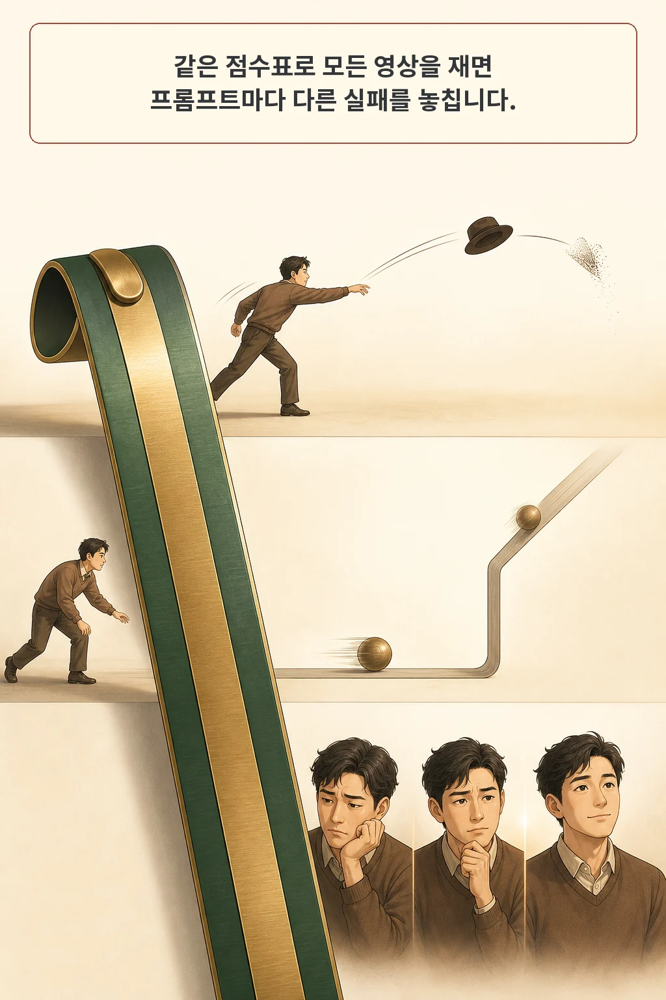
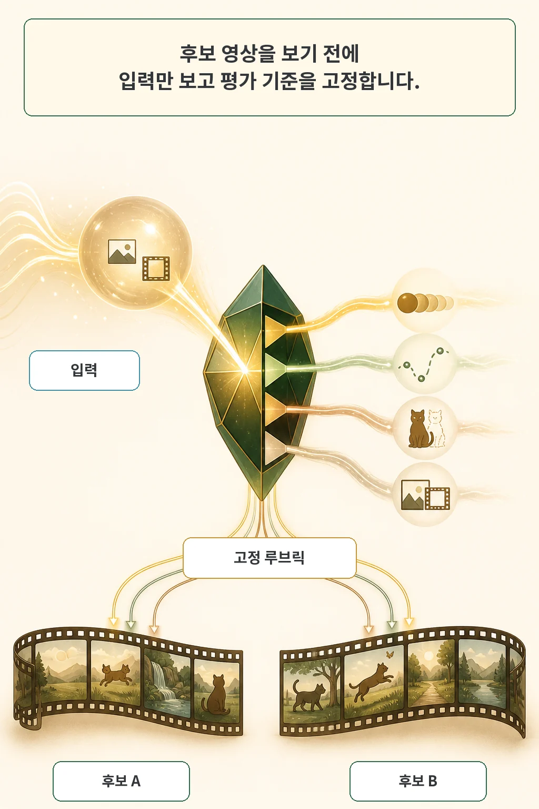
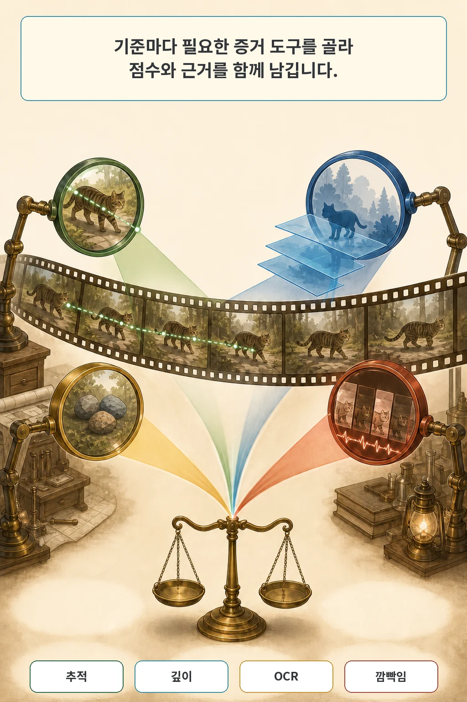
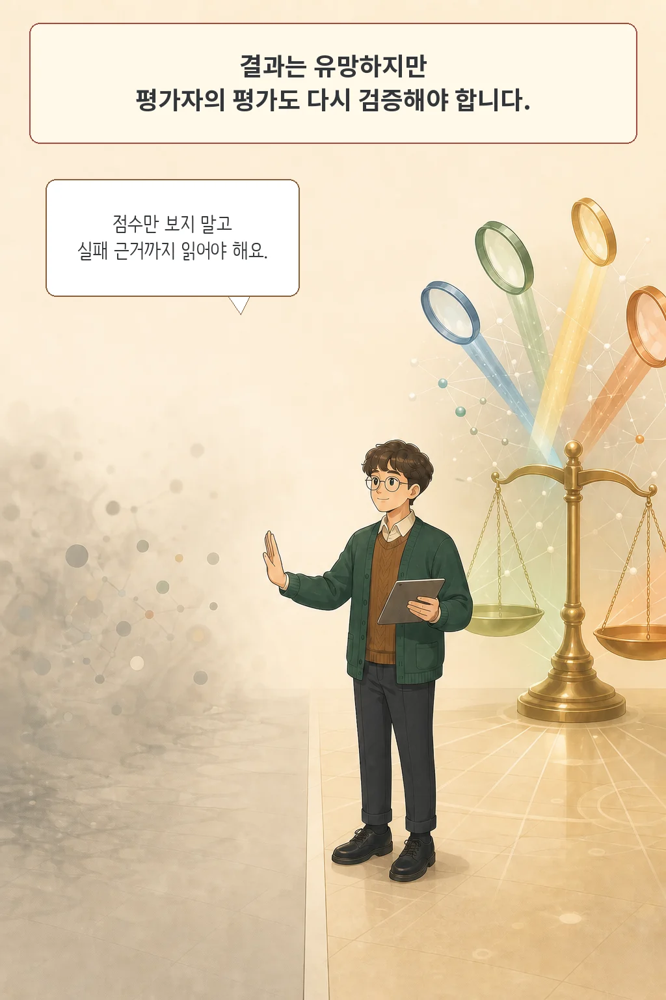

AI로 영상을 만들면 가장 먼저 묻게 됩니다. “둘 중 어떤 영상이 더 좋은가?” 그런데 한 영상은 인물의 얼굴을 잘 보존했지만 동작 순서가 틀리고, 다른 영상은 지시를 따랐지만 물체가 중간에 사라질 수 있습니다. 평균점수 하나는 승자를 고를 수 있어도 무엇을 고쳐야 하는지는 잘 말해주지 못합니다.

**VideoArgus: Agentic Rubric-Grounded Unified Evaluation for Video Generation and Editing**는 이 문제를 입력별 평가 기준과 증거 수집으로 풀려는 preprint입니다. 핵심은 후보 영상을 보기 전에 프롬프트와 조건 이미지·영상만으로 루브릭을 고정하고, 같은 입력에서 나온 모든 후보를 똑같은 기준으로 검사하는 것입니다.

글·해설: 다메카솔

## 모든 영상에 같은 자를 대면 실패 이유가 사라진다

영상 생성과 편집은 한 작업처럼 보이지만 입력 조건이 다릅니다. 텍스트만으로 만드는 T2V, 첫 프레임을 함께 주는 TI2V, 인물이나 사물 참고 이미지를 주는 TS2V, 원본 영상을 편집하는 TV2V, 참고 대상과 원본 영상을 함께 쓰는 TSV2V가 있습니다.

입력마다 중요한 실패도 달라집니다. “모자를 던졌다가 받는다”는 프롬프트에서는 동작의 순서와 물리가 중요합니다. 참고 인물 사진을 준 편집에서는 얼굴과 옷의 보존이 중요합니다. 원본 영상 편집이라면 바꾸라고 한 부분 외에 배경과 움직임이 유지됐는지 봐야 합니다.

기존 평가기는 작업별로 나뉘어 있거나 모든 입력에 같은 차원을 적용하는 경우가 많습니다. 좁은 지표는 추적이나 화질 한 가지는 잘 재지만 전체 요구를 놓칠 수 있고, VLM이 한 번에 내린 총평은 어떤 근거로 점수가 떨어졌는지 찾기 어렵습니다. VideoArgus의 연구 질문은 “이 입력에서 관찰 가능한 요구를 먼저 분해하면 사람의 순위 판단에 더 가까워질까?”입니다.

## 후보를 보기 전에 입력별 루브릭을 고정한다

VideoArgus는 텍스트 지시와 선택적인 첫 프레임, 참고 이미지, 원본 영상만 봅니다. 이 입력으로 루브릭을 한 번 만든 뒤 후보 영상 A와 B를 평가할 때 그대로 재사용합니다. 특정 후보의 장점이나 실패를 본 뒤 평가 기준을 유리하게 바꾸지 않는 `output-blind` 설계입니다.

루브릭은 단순한 질문 목록이 아닙니다. 각 기준에는 무엇을 관찰할지, 0~10점을 어떻게 줄지, 어떤 실패가 예상되는지, 필수인 `hard` 기준인지 선호에 가까운 `soft` 기준인지, 중요도가 얼마인지, 어떤 증거 도구를 어떤 순서로 쓸지가 들어갑니다. 필수 기준이 낮은 점수를 받으면 최종점수에 상한을 걸 수도 있습니다.

논문이 고려한 의미 차원은 22개입니다. 객체·속성·개수, 공간·시간 관계, 행동, 움직임, 카메라, 물리적 타당성, 화질, 스타일, 첫 프레임 일치, 대상 정체성, 편집 지시 이행, 원본 보존 등이 포함됩니다. 그러나 모든 입력에 22개 점수를 억지로 붙이지는 않습니다. 해당 입력에 필요한 차원에서만 구체적인 기준을 0개, 1개 또는 여러 개 만듭니다.

## 기준마다 다른 도구로 증거를 모은다

두 번째 단계는 실행입니다. 사람이나 물체가 프레임을 지나며 유지되는지에는 추적 도구가 맞습니다. 참고 이미지와 닮았는지는 시각 유사도, 공간 관계는 깊이 분석, 화면에 글자가 필요한지는 OCR, 시간에 따라 화면이 흔들리거나 번쩍이는지는 flicker probe가 더 직접적인 증거를 줄 수 있습니다.

각 기준은 필요한 도구만 호출합니다. 도구가 지원되지 않거나 증거를 얻지 못하면 기준별 VLM 질의로 되돌아갑니다. 평가 VLM은 기준, 수집한 증거, 대표 프레임을 함께 보고 기준별 점수와 이유를 남깁니다. 마지막에 중요도 가중 평균과 hard cap을 적용해 총점을 만들지만, 진단 보고서에는 기준별 근거가 남습니다.

이 구조의 장점은 “8.2점이라서 더 좋다”에서 멈추지 않는다는 데 있습니다. 어떤 대상이 사라졌는지, 편집하지 말아야 할 배경이 얼마나 바뀌었는지, 동작 순서가 어디서 끊겼는지를 다음 생성이나 편집 단계로 돌려보낼 수 있습니다.

## 사람의 순위 판단에는 더 가까웠다

저자들은 다섯 생성·편집 설정에 걸쳐 입력 1,026개로 VideoArgus-Bench를 구성했습니다. 고유 이미지 653개와 고유 영상 416개를 사용했고, 입력 하나의 frozen rubric에는 평균 11.9개 기준이 들어갔습니다. 공유 프로토콜에서 평가한 범위는 55개 모델-작업 조합입니다.

핵심 검증은 벤치마크 리더보드와 별도로 만들었습니다. 외부 벤치마크 입력 210개에서 입력마다 6개 모델 영상을 모아 총 1,260개를 만들고, 훈련된 평가자 15명이 익명·무작위 순서로 0~10점을 주고 동률을 순위화했습니다. VideoArgus-Full은 다섯 작업 모두에서 해당 원본 벤치마크 평가기보다 입력 내 Spearman과 Kendall 순위 상관이 높았습니다.

격차가 특히 컸던 두 작업을 보면 입력 내 Spearman 상관은 T2V에서 원본 평가기 0.162, VideoArgus-Full 0.496이었습니다. TI2V에서는 -0.060과 0.605였습니다. 나머지 세 작업에서도 같은 방향이었습니다. 생성 루브릭은 사람이 쓴 루브릭보다 기준 수가 평균 2.33배 많았지만 hard 기준 수는 평균 2.09개와 2.27개로 비슷했습니다. 단순히 더 엄격하게 만들어 성능을 올린 결과만은 아니라는 저자들의 근거입니다.

전문 시각 도구를 VLM 질의로 바꾼 절제 실험에서는 전체 구성의 입력 내 Spearman이 다섯 작업 모두 높았고 Kendall은 네 작업에서 높았습니다. 반면 전체 표본을 한데 묶은 상관 결과는 혼합됐습니다. “도구를 붙이면 언제나 모든 지표가 오른다”가 아니라 입력별 순위 복원에 보완 증거가 도움이 됐다는 범위로 읽어야 합니다.

## 다메카솔의 해석: 평균점수보다 실패 근거를 먼저 읽는다

저라면 이 논문을 영상 모델 리더보드보다 제작 QA에 먼저 적용하겠습니다. 프롬프트를 확정할 때 필수 기준과 선호 기준을 나누고, 후보를 만들기 전에 루브릭을 고정합니다. 생성 뒤에는 각 기준의 점수보다 실패 프레임과 증거를 먼저 봅니다. 같은 실패가 반복되면 프롬프트, 참고 이미지, 편집 마스크, 후처리 중 어디를 바꿀지 결정할 수 있습니다.

다만 자동 평가를 최종 승인으로 쓰지는 않겠습니다. 사람의 정체성 보존, 저작권과 초상권, 위험 행동, 브랜드 일관성은 자동 점수와 별개 게이트입니다. 루브릭 생성 모델과 평가 VLM이 놓친 요구가 없는지도 사람이 확인해야 합니다. VideoArgus가 보여준 것은 자동 평가가 인간의 상대적 순위와 더 가까워졌다는 결과이지, 인간 검토를 대체했다는 결과가 아닙니다.

## 아직 검증되지 않은 경계가 있다

이 연구는 2026년 8월 6일 공개된 University of Rochester 저자진의 arXiv preprint입니다. 동료심사 채택이나 출판사 페이지는 확인되지 않았습니다. 논문에는 별도의 limitations 절도 없습니다. 따라서 아래 경계는 방법과 공개 산출물에서 직접 확인한 범위입니다.

첫째, 배포 평가의 루브릭은 Claude Opus 4.8이 만들고, 기준별 질의와 최종 판단은 로컬 Qwen3.6-27B가 맡았습니다. 다른 루브릭 생성기 사이의 모델 순위 유사도는 평균 0.909, 평가 VLM 교체에서는 0.931로 높았지만, 시험한 모델과 여섯 개 후보 순위 안의 결과입니다.

둘째, 인간 정렬 세트는 210개 입력과 평가자 15명입니다. 저자들은 bootstrap 신뢰구간과 paired test를 부록에 보고했다고 썼지만, 보존한 11쪽 PDF와 TeX source bundle에는 부록이 없었습니다. 그 통계는 이번 검토에서 독립적으로 확인하지 못했습니다.

셋째, 공식 코드와 frozen rubric 데이터셋은 공개됐지만 생성 후보 영상은 포함되지 않습니다. 전체 리더보드를 그대로 재실행하려면 각 모델의 영상을 같은 조건으로 다시 생성해야 합니다. 루브릭 생성에는 입력당 평균 0.231달러의 일회성 API 비용이, 영상 하나의 로컬 평가에는 모델 로딩을 제외하고 평균 H100 0.033 GPU 시간이 들었다고 보고됐습니다. 개인 제작 환경에는 가벼운 도구와 작은 평가 모델로 줄이는 검증이 더 필요합니다.

## 실무 체크리스트

1. 후보 영상을 보기 전에 프롬프트별 필수·선호 기준을 고정했는가.
2. 얼굴 보존, 동작 순서, 물리, 글자, 원본 보존을 하나의 총평으로 뭉개지 않았는가.
3. 기준마다 가장 직접적인 증거 프레임과 도구를 연결했는가.
4. 평균점수와 함께 실패 이유와 수정 대상을 기록했는가.
5. 자동 평가 밖의 권리·안전·브랜드·최종 인간 승인을 별도 게이트로 남겼는가.

## 논문 정보

| 항목 | 내용 |
| --- | --- |
| 제목 | VideoArgus: Agentic Rubric-Grounded Unified Evaluation for Video Generation and Editing |
| 저자 | Ziyun Zeng, Zixuan Wang, Yongsheng Yu, Hang Hua, Jiebo Luo |
| 소속 | University of Rochester |
| arXiv v1 제출 | 2026-08-06 00:28:38 UTC |
| 분야 | cs.CV |
| subtype | empirical |

## 출처

- [논문 초록과 메타데이터, arXiv:2608.05485](https://arxiv.org/abs/2608.05485)
- [논문 원문 PDF](https://arxiv.org/pdf/2608.05485)
- [VideoArgus 공식 프로젝트](https://zzzmyyzeng.github.io/VideoArgus/)
- [공식 코드 저장소](https://github.com/zzzmyyzeng/VideoArgus)
- [VideoArgusBench 공식 데이터셋](https://huggingface.co/datasets/zengziyun/VideoArgusBench)
- [관련 글: AI가 인용한 출처를 믿어도 될까](/posts/information-discernment-llm-sources/)
- [관련 글: AI가 논문 도표를 다시 그리지 않고 고치는 법](/posts/scidiagramedit-paper-figure-revision/)

이 글의 본문과 이미지는 생성형 AI로 제작했습니다. 기획과 편집 기준은 다메카솔이 정했습니다.

Updated: 2026-08-07
