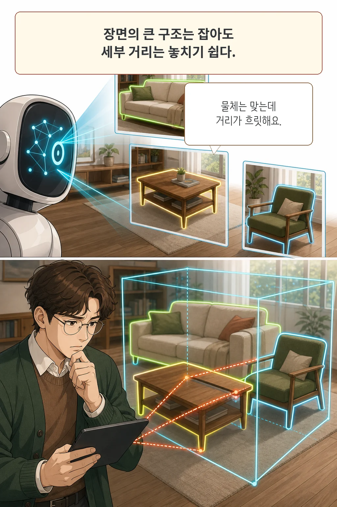

영상 속 방을 본 VLM이 책상과 의자는 맞히면서도 둘 사이의 거리나 정확한 위치를 틀릴 수 있습니다. **3D-Aware VLMs with Implicit and Explicit Geometries**는 RGB 비디오에서 전역 배치를 읽는 암시 기하와 세부 구조를 읽는 명시 기하를 함께 만들어 이 간극을 줄인 시스템 논문입니다.

글·해설: 다메카솔

## 큰 구조를 알아도 세부 거리는 놓칠 수 있다

최근 RGB 기반 공간 VLM은 비디오 프레임만으로도 장면의 3D 성질을 학습합니다. 논문이 문제 삼은 지점은 이 표현이 대체로 압축된 잠재 벡터라는 점입니다. 방의 전반적인 배치와 물체 관계는 잡아도, 언어 모델이 거리나 정확한 좌표 같은 정량 기하를 곧바로 꺼내 쓰기 어렵다는 주장입니다.

여기서 `RGB-only`는 입력 시점에 별도의 포인트클라우드나 3D 장면 데이터를 받지 않는다는 뜻입니다. 내부에서 RGB 프레임으로 깊이와 자세를 재구성하는 단계까지 없다는 뜻은 아닙니다.

## IGT는 전체 지도를, EGT는 거리 자를 맡는다

연구진은 두 종류의 기하 토큰을 만듭니다. **Implicit Geometry Tokens(IGT)**는 AnySplat의 융합 디코더에서 나온 잠재 표현입니다. 여러 프레임을 함께 보며 방 전체의 배치, 물체 사이의 관계, 장면의 고수준 3D 사전정보를 담습니다.

**Explicit Geometry Tokens(EGT)**는 같은 RGB 영상에서 재구성한 깊이맵, 포인트맵 또는 3D Gaussian 속성을 가벼운 패치 임베딩과 MLP로 변환합니다. 저자들은 기본 설정에서 깊이맵을 택했습니다. 세 후보의 3D video detection F1@0.25가 42.5~42.8로 비슷했고, 깊이맵이 가장 접근하기 쉽고 매개변수 효율적이라는 판단입니다.

## 3D-aware adapter는 세 흐름을 하나로 합친다

3D-aware adapter는 IGT를 query로, EGT를 key와 value로 쓰는 교차 어텐션을 적용합니다. 이 단계가 전역 기하와 세부 기하의 대응을 맞춥니다. 이어서 결합된 3D 표현에 2D 시각 토큰을 더하고, 텍스트 질문과 함께 VLM에 넣습니다.

이 구조는 추상적인 표현을 버리고 깊이맵으로 대체하지 않습니다. 전체 장면에 강한 표현과 정밀 위치에 강한 표현을 나란히 살린 뒤 결합하는 것이 핵심입니다.

## 네 가지 3D 과제에서 어디까지 나아졌나

연구진은 3D dense captioning, 3D visual grounding, 3D video detection, 공간 추론으로 평가 범위를 나눴습니다. 장면 이해와 공간 추론은 공정한 비교를 위해 각각 별도 모델로 학습했습니다.

ScanRefer에서 정제 전 Acc@0.25는 Qwen2.5-VL-3B의 34.0%에서 VLM-IE3D의 43.2%로, Acc@0.50은 10.6%에서 16.9%로 올라갔습니다. 이 데이터셋은 562개 실내 스캔과 36,665개 물체 설명을 사용합니다. 사전 검출 proposal로 결과를 정제하면 VLM-IE3D는 각각 55.4%와 48.9%를 기록했습니다.

공간 추론의 그림은 더 차분합니다. VSI-Bench 평균은 VLM-IE3D-4B가 47.6, 암시 표현 중심 비교 모델 VG LLM-4B가 47.3이었습니다. 평균 차이는 작고, 객체 크기나 방 크기처럼 하위 항목별 우열도 섞였습니다. “모든 3D 추론에서 크게 앞섰다”는 요약은 이 표보다 강합니다.

## 두 표현은 실제로 보완적이었나

3D video detection ablation에서 Qwen2.5-VL-3B의 F1@0.25는 30.9였습니다. EGT만 더하면 34.7, IGT만 더하면 40.5, 둘을 함께 쓰면 42.8이었습니다. 큰 상승분은 IGT가 만들었고 EGT가 그 위에 추가 개선을 보탰습니다. 논문이 두 표현의 보완성을 주장하는 가장 직접적인 근거입니다.

비용은 사라지지 않습니다. 비교 모델 VG LLM은 3.13B 매개변수와 단일 H100 기준 7 FPS였고, VLM-IE3D는 3.23B와 6 FPS였습니다. 학습은 8대의 H100 80GB GPU에서 한 epoch 진행됐습니다. 저자들은 증가분을 가볍다고 평가하지만, 실제 팀의 배치 조건에서는 지연과 자원 비용을 다시 재야 합니다.

## 다메카솔의 해석: 점수보다 재구성 경계를 먼저 확인하자

논문에는 별도의 limitations 절이 없습니다. 그래도 평가 경계는 읽을 수 있습니다. 주요 장면 이해 실험은 실내 데이터셋에 집중했고, 작업군마다 모델을 따로 학습했으며, RGB에서 기하를 재구성하는 앞단의 오차도 최종 위치 추정에 전달될 수 있습니다.

따라서 실무 검토에서는 평균 점수 하나보다 네 가지를 함께 보아야 합니다.

- 실제 카메라 움직임과 조명에서 깊이 재구성이 얼마나 안정적인가
- 필요한 하위 과제에서 개선이 유지되는가
- 지연 시간과 GPU 비용이 서비스 예산에 맞는가
- 동적 물체와 실외 장면처럼 학습 분포 밖에서도 오차를 감지할 수 있는가

이 논문의 실무적 가치는 “RGB만으로 3D가 해결됐다”는 결론보다, 압축된 공간 기억과 측정 가능한 기하를 서로 다른 역할로 설계했다는 데 있습니다. 공식 구현은 설치법과 공간 grounding·reasoning 학습 및 평가 스크립트를 MIT 라이선스로 공개합니다. 다만 이 글은 해당 학습을 독립 재현했다고 주장하지 않습니다.

## 논문 정보

| 항목 | 내용 |
| --- | --- |
| 제목 | 3D-Aware VLMs with Implicit and Explicit Geometries |
| 저자 | Wenhao Li 외 6명 |
| arXiv 제출 | 2026-07-23 17:59:59 UTC |
| 분야 | cs.CV, cs.AI, cs.LG |
| 학회 | ECCV 2026 채택(저자·arXiv 표기) |
| 공식 코드 | Vegetebird/VLM-IE3D, MIT License |

## 출처

- [논문 초록과 메타데이터, arXiv:2607.21595](https://arxiv.org/abs/2607.21595)
- [논문 원문 PDF](https://arxiv.org/pdf/2607.21595)
- [공식 구현 저장소](https://github.com/Vegetebird/VLM-IE3D)

이 글과 만화 이미지는 AI로 생성했습니다. 논문의 그림·표·사진과 프로젝트 로고를 복제하지 않고 핵심 구조를 새로운 장면으로 재구성했습니다.

Updated: 2026-07-26
