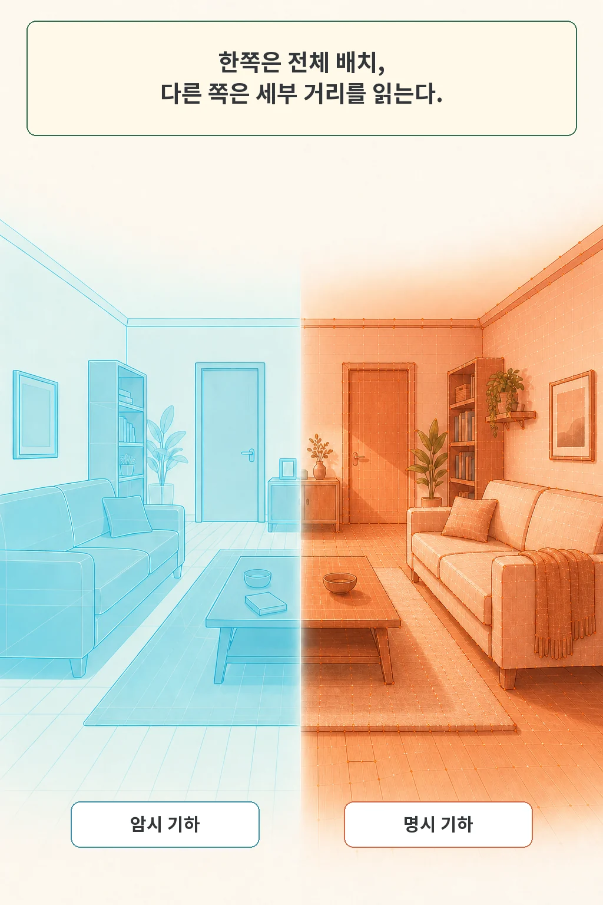
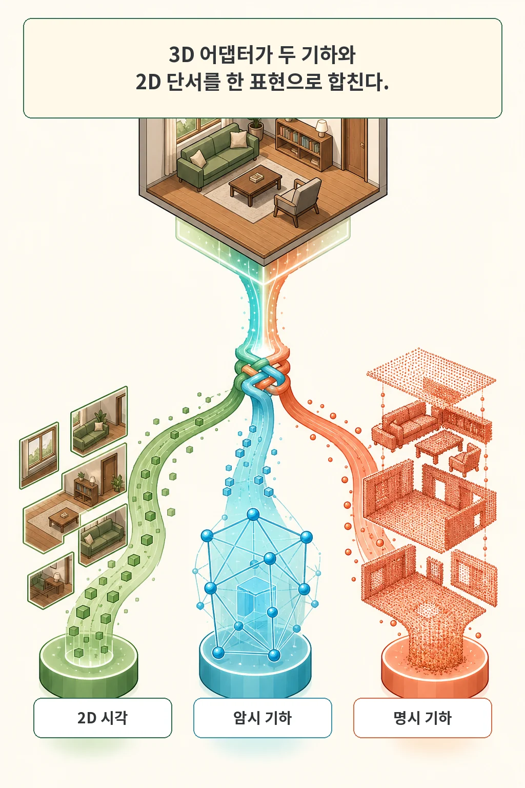
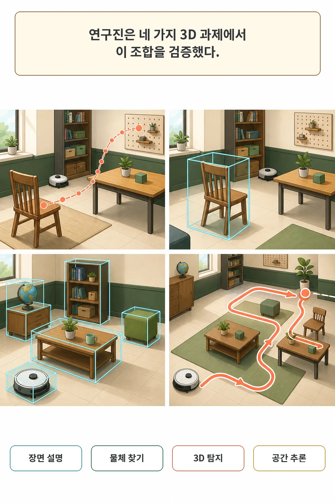
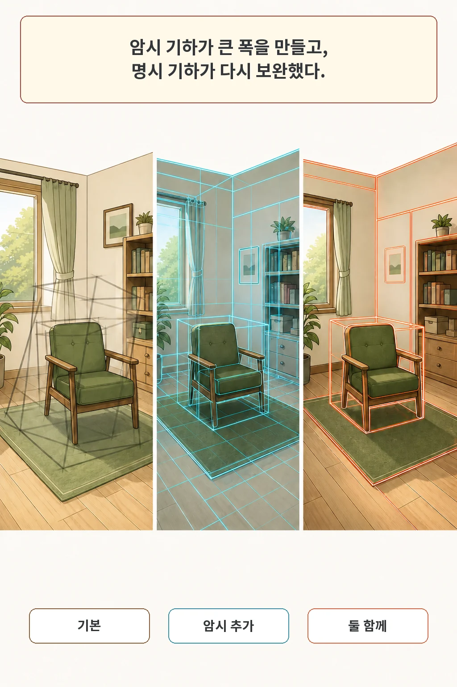

글·해설: 다메카솔

최신 멀티모달 비전-언어 모델(VLM)에게 방 안의 사진을 보여주면 "책상 위에 노트북이 있고 뒤에 의자가 있다"는 객체 설명은 기가 막히게 잘합니다.

하지만 **"책상과 의자 사이의 실제 거리가 몇 cm인가?", "로봇 팔이 물건을 집으려면 정확히 어느 3D 좌표로 이동해야 하는가?"** 같은 물리적 공간 추론을 시키면 엉뚱한 오답을 내놓습니다.

이 문제의 근본 원인은 **"대부분의 VLM이 2D 평면 이미지의 잠재 벡터(Latent Vector)만 학습하여, 3차원 공간의 깊이(Depth)와 정량적 기하학(Geometry) 정보를 직접 꺼내 쓸 수 없기 때문"**입니다.

ECCV 2026에 채택된 논문 **3D-Aware VLMs with Implicit and Explicit Geometries (VLM-IE3D)**는 비싼 라이다(LiDAR) 센서 없이도 **일반 RGB 비디오에서 전역 공간 지도(IGT)와 정밀 거리 자(EGT)를 동시에 추출해 VLM에 주입하는 획기적인 어댑터 구조**를 제안했습니다.

## 전역 배치(IGT)와 정밀 깊이(EGT)의 2중 지도 결합

연구진은 단일 비전 인코더에 의존하지 않고 2가지 상호 보완적인 3D 토큰을 분리 생성했습니다:

1. **암시적 기하 토큰 (Implicit Geometry Tokens, IGT)**  
   - 여러 비디오 프레임을 교차 분석하여 방 전체의 3D 공간 레이아웃, 가구 간의 위상 관계 등 **'고수준 전역 공간 맥락'**을 담당합니다.
2. **명시적 기하 토큰 (Explicit Geometry Tokens, EGT)**  
   - RGB 프레임에서 재구성한 고해상도 깊이맵(Depth Map)을 패치 임베딩하여, 물체 표면의 거리와 정확한 바운딩 박스 등 **'정량적 세부 3D 치수'**를 담당합니다.

## 3D-Aware Adapter: 기하 정보와 2D 시각 토큰의 융합

이 두 가지 기하 토큰은 **3D-Aware Adapter**를 통해 LLM이 이해할 수 있는 단일 임베딩으로 합성됩니다:
- 전역 맥락인 IGT를 Query로 두고, 정밀 깊이맵인 EGT를 Key/Value로 두는 **교차 어텐션(Cross-Attention)**을 수행합니다.
- 여기에 기존 2D 시각 토큰을 덧붙여 텍스트 질문과 함께 언어 모델의 백본으로 전달합니다.

## 3D 객체 탐지 및 공간 추론 벤치마크 결과

ScanRefer 및 3D Video Detection 데이터셋에서 실험한 결과:
- **3D Visual Grounding 정확도(Acc@0.25)**: 기존 베이스라인(34.0%) 대비 **43.2%로 크게 개선**
- **Ablation 분석**:
  - 기본 2D VLM: F1 Score `30.9`
  - EGT(깊이맵)만 추가: `34.7`
  - IGT(전역지도)만 추가: `40.5`
  - **IGT + EGT 동시 결합 (VLM-IE3D)**: **`42.8` (최고 성능 달성)**

## 다메카솔의 해석: 피지컬 AI와 로봇 비전의 미래

VLM-IE3D는 자율주행, 공간 컴퓨팅(XR), 그리고 피지컬 로보틱스를 개발하는 엔지니어에게 매우 실용적인 아키텍처 방향성을 제시합니다.

1. **센서 비용의 혁신**: 고가의 3D LiDAR 포인트클라우드 장비 없이도, 일반 저가형 RGB 웹캠 영상만으로 수준 높은 3D 공간 인지 모델을 구축할 수 있습니다.
2. **거대 모델의 모듈형 확장**: 거대한 파운데이션 VLM 전체를 바닥부터 3D로 재학습할 필요 없이, 가벼운 3D 어댑터 레이어(Adapter)만을 추가 학습시켜 공간 추론 능력을 주입할 수 있습니다.

## 함께 읽을 AI 시스템 글

- [로봇이 긴 작업 기억을 보존하는 방법 (RoboTTT)](/posts/robottt-long-context-policies/)
- [컴퓨터 사용 AI 에이전트의 GUI 제어 아키텍처(Tactile)](/posts/tactile-computer-use-agents/)

## 출처

- [3D-Aware VLMs with Implicit and Explicit Geometries, arXiv:2607.21595 (ECCV 2026)](https://arxiv.org/abs/2607.21595)
- [VLM-IE3D Official GitHub Repository](https://github.com/Vegetebird/VLM-IE3D)

이 글의 본문과 이미지는 생성형 AI로 제작했습니다. 기획과 편집 기준은 다메카솔이 정했습니다.
