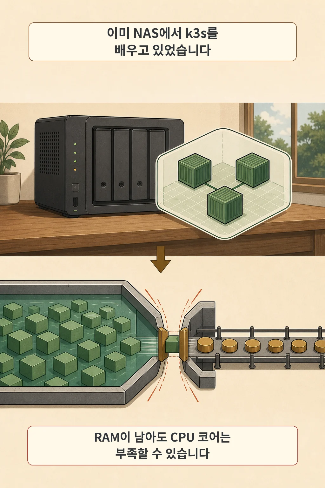
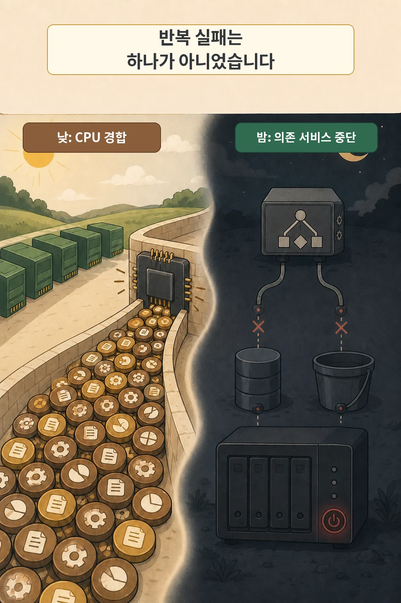
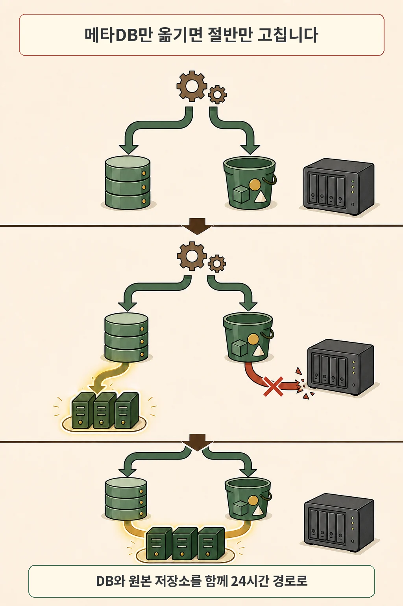

글·해설: 다메카솔

시놀로지 NAS에는 RAM이 32GB나 있었습니다. 이미 그 장비에서 학습용 k3s 클러스터를 운영하고 있었고, 메모리도 남아 보였습니다. 그런데 Airflow DAG는 계속 실패했습니다. 부족했던 것은 RAM이 아니라 CPU 코어였습니다.

문제는 하나 더 있었습니다. NAS를 밤에 끄면 Airflow가 쓰던 메타데이터 데이터베이스와 S3 호환 오브젝트 스토리지도 함께 사라졌습니다. 낮에는 계산 자원이 막혔고, 밤에는 의존 서비스가 존재하지 않았습니다. 새 홈랩 Kubernetes 환경은 이 두 제약을 분리해 해결하려고 만든 24시간 운영 계층입니다.

## 이미 NAS에서 k3s를 배우고 있었습니다

처음부터 별도 미니 PC 클러스터가 있었던 것은 아닙니다. 시놀로지 NAS라는 제한된 장비 위에 k3s를 올리고 배포, 스토리지, 네트워크, 복구를 직접 겪어보는 것이 출발점이었습니다. 설치 명령을 따라 하는 실습보다 운영 중 생기는 제약을 배우고 싶었습니다.

NAS의 32GB RAM은 이 목적에 충분해 보였습니다. 대시보드에서 남는 메모리를 확인하면 장비 전체에도 여유가 있다고 생각하기 쉽습니다. 하지만 RAM이 남는다는 사실은 CPU 코어도 남는다는 뜻이 아닙니다.

## 32GB RAM이 CPU 병목을 가렸습니다

Airflow DAG가 실패하면 먼저 코드, 스케줄, 컨테이너 상태를 의심하게 됩니다. 이 사례에서는 동시에 실행되는 작업과 k3s 시스템 구성 요소가 적은 CPU 코어를 나눠 썼습니다. 메모리 부족 흔적이 없는데 작업이 밀리고 실패한 이유였습니다.

RAM은 실행 중인 데이터와 프로세스를 담을 공간에 가깝습니다. CPU 코어는 같은 시간에 처리할 수 있는 계산량과 동시성에 영향을 줍니다. 32GB라는 한 숫자만 보고 서버 자원이 충분하다고 판단하면, 실행 대기와 CPU 경합은 보이지 않습니다.

그래서 점검 질문도 바꿨습니다. 실패 시각의 CPU 사용률과 실행 대기 작업은 어땠는가? 같은 노드에서 어떤 시스템 Pod와 DAG가 겹쳤는가? 동시 실행 수를 줄였을 때 같은 작업이 끝까지 완료되는가? 단순 재시작 뒤 한 번 성공한 결과보다 이 대조가 원인에 가깝습니다.

## 반복 실패는 하나의 원인만 갖지 않았습니다

CPU 경합을 줄여도 NAS가 꺼진 밤에는 DAG가 끝날 수 없었습니다. 소음 때문에 NAS를 야간에 종료했고, 그 장비에 Airflow 메타데이터 데이터베이스와 원본 데이터를 쓰는 S3 호환 저장소가 함께 있었습니다. 계산할 자원이 있어도 작업이 의존하는 상태 서비스가 사라진 셈입니다.

두 실패는 구분해야 합니다. CPU 코어 부족은 제한된 시간 안에 작업을 처리할 수 있느냐의 문제입니다. 야간 종료는 DB와 저장소가 그 시간에 존재하느냐의 문제입니다. 오류가 모두 Airflow에 나타났다고 해서 같은 원인으로 묶으면, 한쪽만 고치고 장애를 남기게 됩니다.

## 메타데이터 DB만 옮기면 절반만 고칩니다

처음에는 Airflow 메타데이터 데이터베이스만 24시간 장비로 옮기면 된다고 생각했습니다. 의존 경로를 따라가 보니 DAG는 수집한 원본 데이터도 NAS의 오브젝트 스토리지에 쓰고 있었습니다. DB 연결이 살아나도 `boto3`가 꺼진 저장소에 연결하는 단계에서 다시 멈춥니다.

필요한 것은 DB 한 개의 이사가 아니었습니다. 24시간 켜진 하드웨어, 상태 서비스를 올릴 컴퓨트와 스토리지, 데이터베이스 운영 계층, 오브젝트 스토리지를 한 묶음으로 설계해야 했습니다. 이 요구와 Kubernetes 운영을 직접 배우려는 목표가 겹치면서 3노드 k3s 구성이 선택지가 됐습니다.

다른 선택도 가능했습니다. NAS를 계속 켜 두거나, 미니 PC 한 대에서 Docker Compose로 운영하거나, 클라우드로 옮길 수 있었습니다. 각 선택에는 소음과 단일 장애점, 정비 중 중단, 비용이라는 다른 대가가 있습니다. 이 홈랩에서는 복제와 자동 복구, 선언적 운영을 직접 경험한다는 학습 가치까지 포함해 k3s를 골랐습니다.

## 24시간 서비스는 24시간 의존성 위에 둡니다

최종 역할은 전원과 가동시간을 기준으로 나눴습니다. 24시간 돌아야 하는 컴퓨트와 상태 서비스는 상시 가동 미니 PC 클러스터로 옮겼습니다. 밤에 꺼지는 NAS는 백업과 파일 서버처럼 주간 가동과 양립하는 역할에 집중시켰습니다.

내부 기록에는 2026년 7월 17일 Airflow를 클러스터 안에서 기동한 뒤 야간 DAG 실패가 사라졌다고 남아 있습니다. 다만 이 결과만으로 CPU 병목과 야간 종료가 각각 어떤 실패를 만들었는지 모두 증명되지는 않습니다. 정확한 실패 시각과 자원 지표는 원본 로그를 다시 대조해야 합니다.

이 글의 결론은 작은 장비가 더 좋다거나 Kubernetes가 모든 홈랩의 정답이라는 뜻이 아닙니다. 서버 여유를 RAM 한 항목으로 판단하지 말고, CPU 경합과 동시 실행 수를 함께 봐야 합니다. 24시간 워크로드라면 그 작업이 기대는 DB와 저장소도 같은 시간 동안 살아 있어야 합니다.

## 내 환경에 적용할 점검 질문

1. 실패한 작업은 메모리, CPU, 디스크 I/O 가운데 무엇을 기다리고 있었는가?
2. 실패 시각에 같은 노드에서 어떤 시스템 서비스와 작업이 겹쳤는가?
3. 애플리케이션의 DB, 오브젝트 스토리지, DNS, 인증 서비스는 필요한 시간에 모두 살아 있었는가?
4. 첫 가설에서 옮기지 않은 의존성이 하나라도 남아 있지 않은가?
5. 동시 실행 수를 줄이거나 의존성을 옮긴 뒤 같은 작업이 반복해서 완료되는가?

다음 글부터는 이 클러스터에서 실제로 만난 DNS, 스토리지, 인증, GitOps, 네트워크 정책 문제를 하나씩 다룹니다. 시작점은 32GB RAM 뒤에 가려진 CPU 병목과, 밤마다 사라지는 상태 서비스였습니다.

## 출처와 범위

- 개인 인프라 운영 기록: `왜 홈랩에 Kubernetes를 세웠나 — 야간에 꺼지는 NAS에 묶인 Airflow` (2026-07-20)
- 개인 아키텍처 결정 기록: `홈랩 코어·상태 계층 배치` (2026-07-07)
- CPU 코어 제약: 2026-07-21 작성자 직접 보정
- AI 이미지 사용 고지: 본문의 만화형 이미지는 생성형 AI로 베이스 아트를 만들고, 공개 글자는 별도 렌더링으로 합성했습니다.
