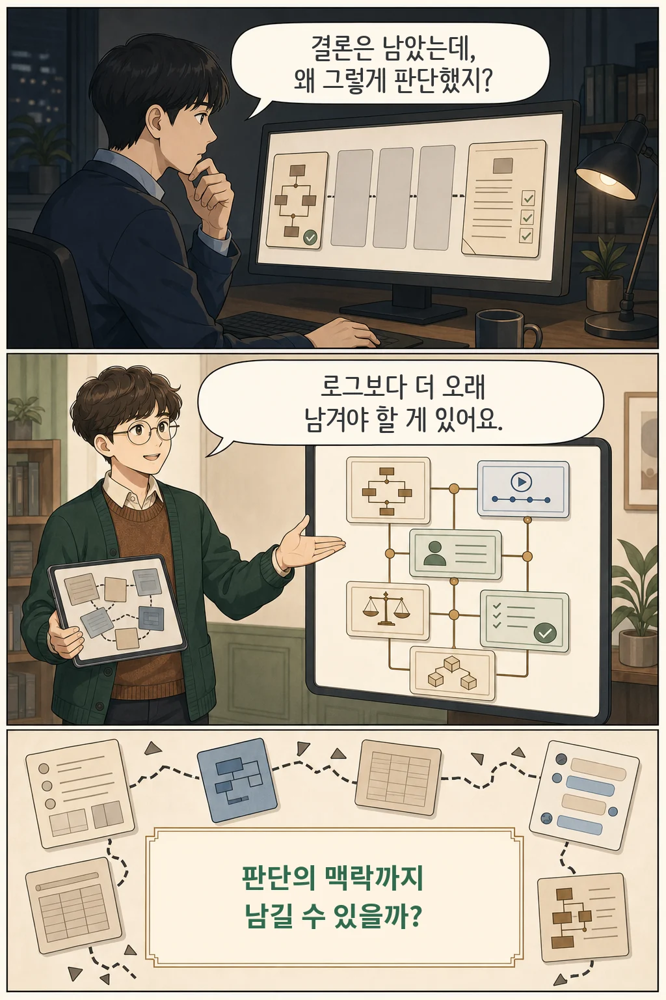
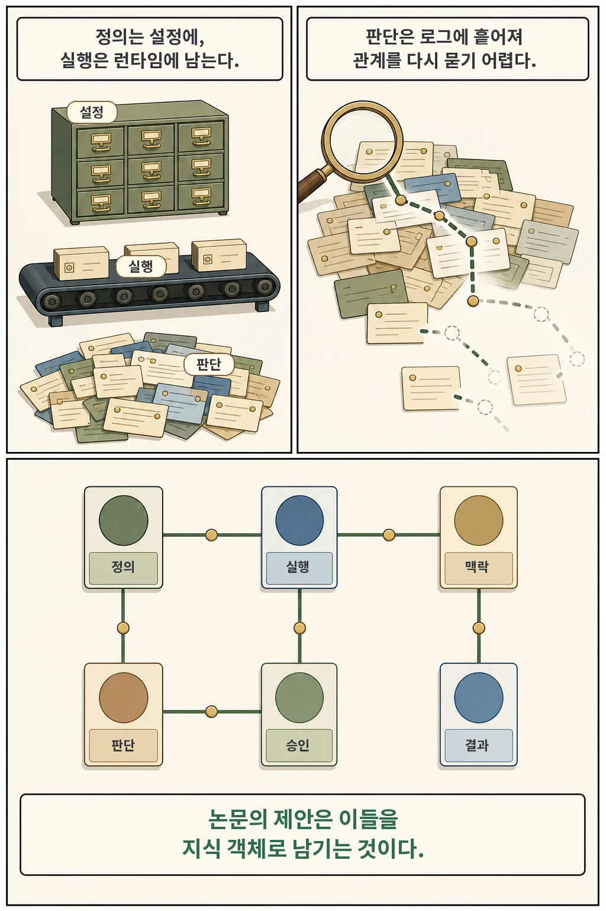
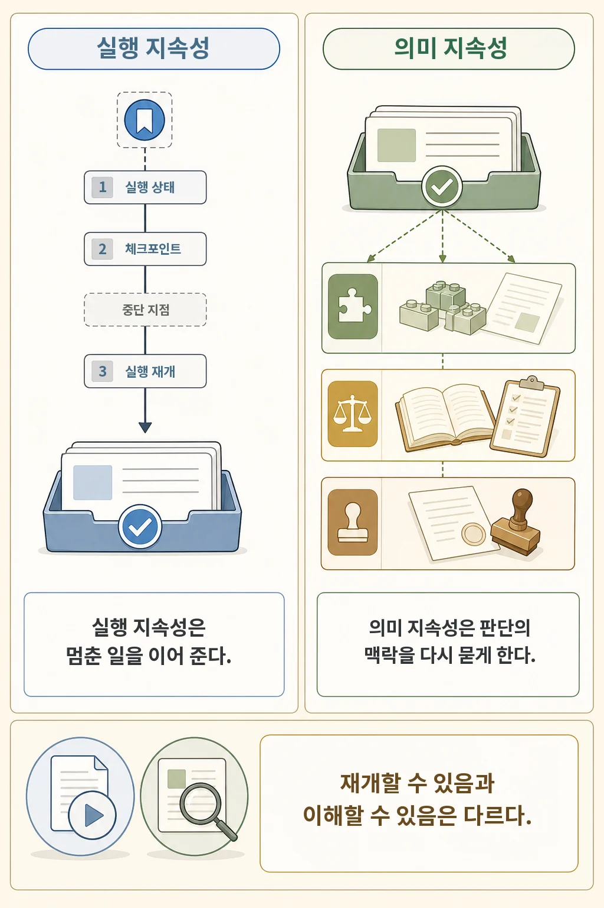
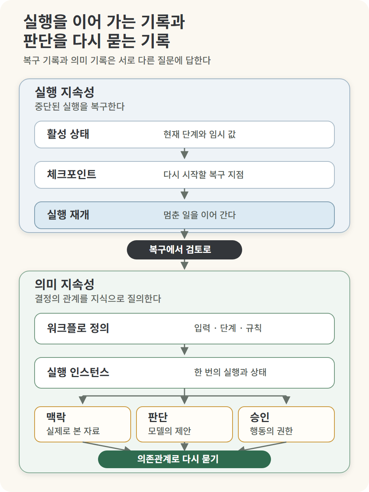
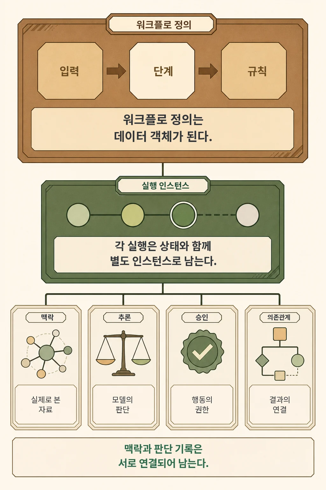
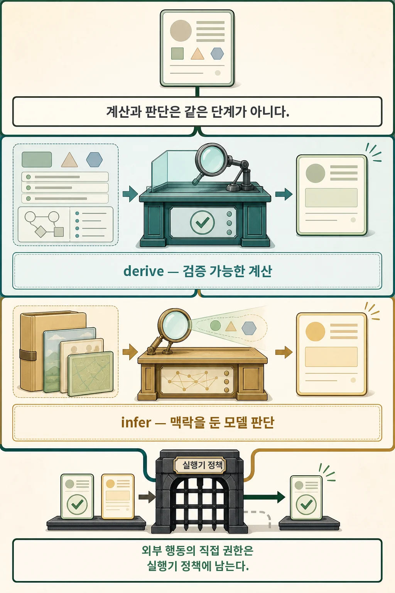
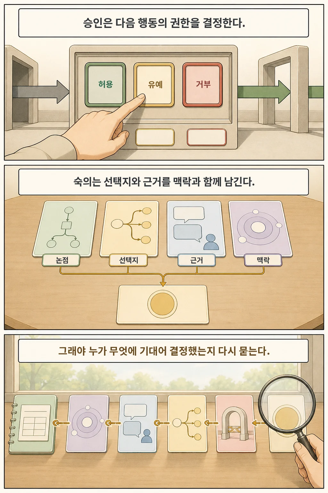
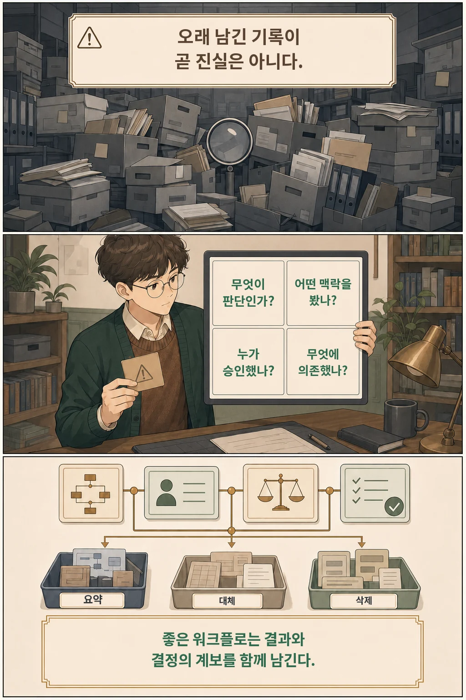

AI 에이전트가 여러 도구를 호출하고 사람의 승인을 받아 결론을 냈습니다. 며칠 뒤 “왜 그 결론이었지?”라고 물었을 때 로그는 남아 있어도 당시 모델이 본 맥락, 판단에 영향을 준 자료, 승인한 사람과 의존관계는 한 번에 찾기 어렵습니다.

2026년 7월 9일 공개된 **「Workflow as Knowledge: Semantic Persistence for LLM-Mediated Workflows」**는 이 문제에 한 가지 답을 제안합니다. LLM 워크플로를 실행하고 사라지는 절차가 아니라, **정의·실행 인스턴스·모델 판단·맥락·승인·의존관계가 연결된 지식 객체로 남기자**는 것입니다. 논문은 이를 `semantic persistence`, 여기서는 **의미 지속성**이라고 부르겠습니다.

*글·해설: 다메카솔*

## 핵심 내용

- 체크포인트와 로그가 이어 주는 것은 실행까지이고, 판단의 의미와 관계는 별도 구조가 있어야 남습니다.
- 논문은 워크플로 정의와 실행, 모델 판단, 맥락, 승인 기록을 같은 지식 기반 안의 질의 가능한 객체로 표현하자고 제안합니다.
- 결정적 계산인 `derive`와 LLM이 매개한 판단인 `infer`를 분리하고, 외부 행동의 권한은 실행기 정책에 둡니다.
- 이 제안은 아직 개념 모델입니다. 구현, 형식 의미론, 비교 실험, 기록 수명주기 정책은 남아 있습니다.

결과 파일이 있다는 사실과 그 결과를 만든 **결정의 계보**를 설명할 수 있다는 사실은 다릅니다. 이 논문은 바로 그 간극을 다룹니다.

## 왜 실행 로그만으로는 부족한가

일반적인 LLM 애플리케이션에서 워크플로 정의는 코드나 설정 파일에 있습니다. 실행 중 상태는 런타임이나 체크포인트 저장소가 관리하고, 모델 출력은 로그·트레이스·데이터베이스 행·대화 기록으로 남습니다. 각 시스템은 필요한 일을 하고 있지만, 시간이 지난 뒤 다음 질문에 답하려면 여러 저장 위치를 다시 맞춰야 합니다.

- 이 결정은 어떤 워크플로 버전에서 나왔는가?
- 모델은 그때 어떤 자료와 지시를 볼 수 있었는가?
- 어떤 모델 판단이 다음 분기에 영향을 주었는가?
- 누가 무엇을 승인했고, 그 승인은 어느 행동을 허용했는가?

논문의 문제 제기는 “기존 워크플로 엔진이 아무것도 저장하지 않는다”가 아닙니다. 저장된 흔적에 **정의된 의미 역할과 관계**가 있는지가 핵심입니다. 모델 판단, 사람 승인, 숙의, 맥락을 나중에 우연히 연결하는 대신 실행 전부터 서로 다른 종류의 객체로 선언하자는 제안입니다.

## 실행 지속성과 의미 지속성은 무엇이 다른가

**실행 지속성**은 중단된 일을 이어 가는 문제입니다. 상태, 체크포인트, 로그, 출력이 있으면 런타임은 실패 지점에서 다시 시작하거나 사람이 실행 과정을 검사할 수 있습니다.

**의미 지속성**은 실행이 끝난 뒤에도 워크플로 자체와 중요한 판단 기록을 지식으로 다루는 문제입니다. “다시 실행할 수 있는가?”를 넘어 “왜 이런 결론이 나왔고 무엇에 의존했는가?”를 질의할 수 있어야 합니다.

*논문의 개념을 바탕으로 다메카솔이 새로 구성한 설명 도식입니다. 원문 Figure를 복제하지 않았습니다.*

논문이 말하는 공유 지식 기반은 제품 이름이 아니라 접근 구조를 가리킵니다. 그래프 데이터베이스, RDF 저장소, 객체 저장소, 이벤트 로그, 관계형 데이터베이스, Lisp 이미지 등은 가능한 구현 선택지일 뿐입니다. 제안의 중심은 저장 기술이 아니라 **객체의 정체성, 타입, 맥락, 관계를 실행 경계 너머로 유지하는 모델**입니다.

## 워크플로 정의도 데이터 객체가 된다

논문은 크게 다음 객체를 같은 기반 안에서 연결합니다.

| 객체 | 남기는 것 | 나중에 가능한 질문 |
| --- | --- | --- |
| 워크플로 정의 | 입력, 자원, 상태 구조, 규칙, 단계 | 어떤 절차와 정책이 적용됐는가 |
| 워크플로 인스턴스 | 한 번의 실행과 현재 상태 | 어느 정의에서 시작했고 어디까지 진행됐는가 |
| 맥락 스냅샷 | 판단 당시 실제로 보인 제한된 자료 | 모델과 사람이 무엇을 알고 결정했는가 |
| 추론 기록 | LLM이 제안한 판단과 검증 결과 | 어떤 판단이 다음 결정에 영향을 주었는가 |
| 승인 기록 | 허용, 거부, 유예와 권한 | 누가 어떤 전이를 허용했는가 |
| 의존관계 | 결과가 기대는 자료와 판단 | 전제가 바뀌면 무엇을 다시 계산해야 하는가 |

중요한 차이는 활성 상태와 영구 기록도 분리한다는 점입니다. 실행 중 필요한 값과 장기 보존 대상은 서로 다른 목록입니다. 반대로 결과에 영향을 준 판단과 승인이라면 단순한 임시 UI 이벤트로 사라지지 않고, 맥락과 연결된 기록으로 남길 수 있습니다.

## `derive`와 `infer`: 계산과 모델 판단을 같은 상자로 넣지 않는다

이 논문에서 가장 실용적인 구분은 `derive`와 `infer`입니다.

- `derive`는 이미 있는 상태를 대상으로 한 결정적 계산입니다. 파서, 스키마 검사, 린터, 테스트, 타입 검사, 라우팅 규칙처럼 입력과 규칙을 명시하면 재생하고 검증할 수 있는 작업입니다.
- `infer`는 선언된 맥락에서 이루어지는 LLM 매개 판단입니다. 분류, 종합, 초안 작성, 의미 검토, 모델 심사처럼 같은 입력에서도 판단이 달라질 수 있는 작업입니다.

논문의 `infer`가 여는 범위는 선언된 그 단계까지입니다. 실행기는 보여 줄 맥락을 구성하고, 반환 형식을 검사하고, 결과를 기록하며, 허용된 전이만 적용합니다. 모델 출력이 이후 분기에 영향을 주더라도 그 의존관계를 기록하고 외부 행동의 직접 권한은 실행기 정책에 둡니다.

또한 이 구분은 설계 도구이고, 경계 자체는 작업마다 다시 정해야 합니다. 어떤 작업은 코드로 계산할 수도 있고 모델 판단에 맡길 수도 있습니다. 논문의 요구는 그 선택을 숨기지 말고 **명시하고 검토 가능하게 만들라**는 쪽에 가깝습니다.

## 승인과 숙의는 같은 사람 개입이 아니다

사람이 개입했다고 해서 모든 이벤트가 같은 의미를 갖지는 않습니다.

`approval`은 권한에 가깝습니다. 다음 전이나 외부 행동을 허용할지, 거부할지, 나중으로 미룰지를 결정합니다. 반면 `panel`은 구조화된 숙의입니다. 무엇을 논의했는지, 어떤 선택지가 있었는지, 찬반 근거와 불확실성이 무엇이었는지, 어떤 맥락에서 결론을 냈는지를 남깁니다.

이 구분이 있으면 나중에 “사람이 확인했다”는 한 줄을 넘어 다음을 살필 수 있습니다.

1. 모델이 어떤 판단 후보를 만들었는가
2. 그 판단에 어떤 맥락이 제공됐는가
3. 사람은 행동을 승인했는가, 아니면 논거를 검토했는가
4. 최종 결과가 어떤 자료와 판단에 의존하는가

저자들이 기대하는 효용은 워크플로 이력을 질의하고, 당시 판단에 보인 맥락을 더 정확히 검토하며, 계산·모델 판단·사용자 승인·실행기 전이의 권한 관계를 분리하는 것입니다. 다만 이것이 실제 감사 품질이나 신뢰를 높이는지는 아직 검증할 문제입니다.

## 이 논문이 아직 증명하지 않은 것

이 논문은 **position paper**, 즉 구현 성능을 입증하기보다 문제를 새롭게 정의하고 개념 모델을 제안하는 논문입니다. 저자들은 선별된 77개 워크플로 관련 자료를 살펴 어휘의 빈틈을 점검했지만, 이 자료 모음은 이질적이고 대표 표본이 아닙니다. 논문도 이 수치를 예시로만 쓰고, 중심 주장의 실증 근거는 따로 둡니다.

또한 다음 과제가 남아 있습니다.

- `derive`, `infer`, 승인, 맥락, 재개의 형식적 전이 규칙
- 체크포인트·트레이스 중심 시스템과의 비교 구현
- 저장량, 색인 비용, 검토 비용 측정
- 기록을 유지·요약·대체·보관·삭제하는 수명주기 정책
- 귀속, 재현성, 감사 품질, 신뢰에 대한 사람 대상 평가

모든 중간 출력을 영구 저장하면 의미가 풍부해지는 것이 아니라 잡음과 비용이 커질 수 있습니다. 낮은 품질의 모델 출력, 나중에 반박된 판단, 중복 맥락을 어떻게 대체하거나 삭제할지도 모델의 일부가 되어야 합니다.

## 다메카솔의 해석: ‘모두 저장’보다 ‘다시 물을 구조’

저는 이 논문을 프레임워크 도입 권고가 아니라 지금 쓰는 워크플로를 다시 읽는 방법으로 받아들였습니다. 현재 워크플로에 다음 네 질문을 분리해 던질 수 있습니다.

- 무엇이 결정적 계산이고 무엇이 모델 판단인가?
- 그 판단은 실제로 어떤 맥락을 보았는가?
- 누가 어떤 행동을 승인했는가?
- 최종 결과는 어떤 자료와 판단에 의존하는가?

네 질문에 답할 수 없다면 로그가 많아도 결정의 계보는 약합니다. 반대로 중요한 판단만 타입과 맥락, 의존관계로 연결할 수 있다면 실행이 끝난 뒤에도 워크플로를 검토하고 수정하고 다시 사용할 가능성이 커집니다.

**가장 작은 시작**은 프레임워크 도입이 아닙니다. 모델 호출을 일반 함수 호출과 같은 로그로만 남기지 말고, 판단의 목적, 실제 입력 맥락, 검증 결과, 영향을 받은 분기, 승인 주체를 분리해 기록해 보는 것입니다. 논문의 완전한 구현이 아니라 작은 설계 실험이지만, 위 네 질문에 답할 수 있는 구조가 처음 생깁니다.

이것은 논문이 입증한 운영 효과가 아니라, 논문의 개념 모델을 개발자 설계 점검표로 바꾼 **다메카솔의 해석**입니다.

## 논문 정보

| 항목 | 내용 |
| --- | --- |
| 제목 | Workflow as Knowledge: Semantic Persistence for LLM-Mediated Workflows |
| 저자 | Emanuele Quinto, Carlo Andrea Rozzi, Francesco Zanitti |
| 공개 | arXiv v1, 2026-07-09 |
| 분야 | Artificial Intelligence, Programming Languages, Software Engineering |
| 이 글의 분류 | 개념 모델을 제안하는 position paper |

## 자주 묻는 질문

### 의미 지속성은 체크포인트를 대체하나요?

아닙니다. 체크포인트는 실행을 복구하는 데 필요합니다. 의미 지속성은 그 위에 워크플로 정의와 판단, 맥락, 승인, 의존관계를 지식으로 질의하는 층을 추가하자는 제안입니다.

### `infer` 결과가 분기를 바꾸면 모델이 워크플로를 통제하는 것 아닌가요?

논문의 모델에서는 그렇지 않습니다. 모델은 선언된 자리에서 판단 후보를 만들고, 실행기가 검증과 정책을 적용해 허용된 전이를 수행합니다. 판단이 분기에 영향을 주었다는 관계도 별도 기록으로 남깁니다.

### 기록을 많이 남기면 신뢰할 수 있는 AI가 되나요?

논문도 그렇게 주장하지 않습니다. 지속 기록은 검토할 재료를 제공하지만 정확성, 신뢰, 재현성, 감사 품질을 자동으로 보장하지 않습니다. 기록 수명주기와 권한 정책, 실제 평가가 따로 필요합니다.

## 출처

- [Emanuele Quinto, Carlo Andrea Rozzi, Francesco Zanitti, “Workflow as Knowledge: Semantic Persistence for LLM-Mediated Workflows,” arXiv:2607.08740 (2026)](https://arxiv.org/abs/2607.08740)
- [arXiv HTML 본문](https://arxiv.org/html/2607.08740)

이 글의 본문과 이미지는 생성형 AI로 제작했습니다. 기획과 편집 기준은 다메카솔이 정했습니다. 비만화 설명 도식은 다메카솔이 직접 구성했습니다.
