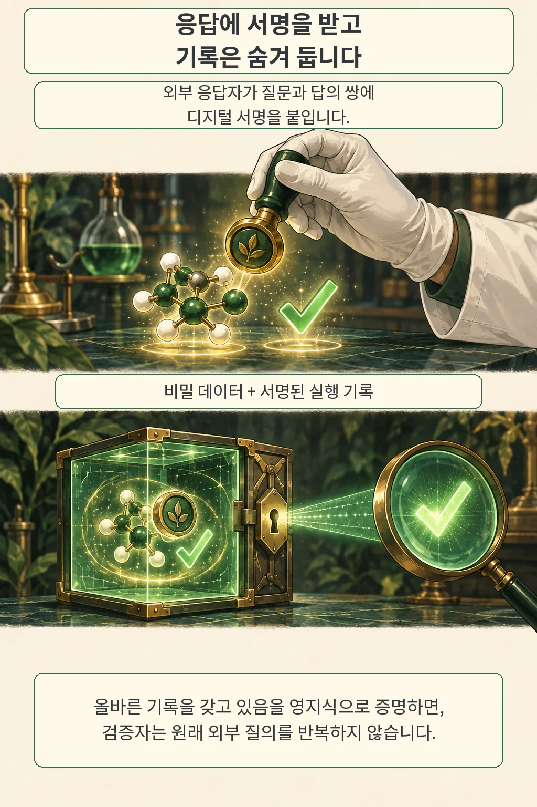
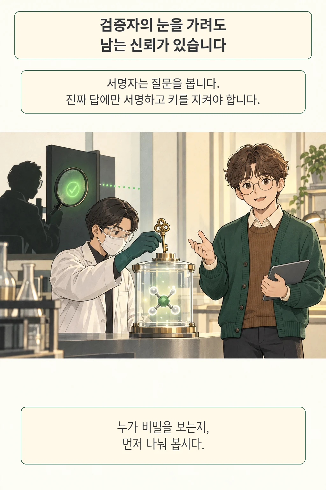

**검증자는 결과를 믿을 근거가 필요하고, 데이터 주인은 비밀을 지켜야 합니다.** 외부 실험이나 사람의 판단을 거치는 AI 작업에서는 둘을 함께 만족시키기가 까다롭습니다. 확인 질문에 비밀 입력을 넣어야 할 수 있기 때문입니다. 새 이론 논문은 이 충돌을 분석하고, 외부 응답에 디지털 서명을 붙이는 조건에서 가능한 구성을 제시합니다.

*글·해설: 다메카솔*

원문 확인·작성: 2026년 10월 3일 · 10월 2일 예정 회차

이번 논문은 Alessandro Chiesa, Ziyi Guan, Burcu Yıldız의 **Can AI Oversight Be Zero Knowledge?**입니다. 2026년 10월 1일 16:30 UTC 제출된 arXiv v1을 읽었습니다. 실험 성능을 비교하는 대신, 어떤 계산에서는 무엇이 불가능하고 어떤 가정을 더하면 가능한지 증명하는 연구입니다.

여기서 **영지식**은 검증자가 공개된 주장 자체에서 알 수 있는 내용을 넘어, 비밀 데이터에 관한 정보를 추가로 얻지 않는다는 뜻입니다. 공개 결과에 담긴 정보까지 지워 주는 개념은 아닙니다.

## 확인 질문에 비밀이 들어간다면

비밀 분자의 성질을 실험으로 확인한다고 생각해 보겠습니다. 검증자가 같은 실험을 직접 요청하려면 분자 구조나 시료를 알아야 할 수 있습니다. 확인 과정이 공개 경로가 되는 셈입니다. 논문은 이런 외부 판단·측정을 **오라클**이라는 질의 가능한 함수로 모델링합니다.

저자들은 무작위 오라클 모형에서, 검증을 빠르게 끝내라는 요구를 풀어도 비밀 증인을 숨길 수 없는 계산이 존재함을 보입니다. 이때 증인은 주장을 뒷받침하는 비밀 입력입니다. 모든 AI 작업이 정보를 누설한다는 결론으로 넓혀 읽을 수는 없습니다. 일반적인 보장에 반례가 있다는 결과입니다.

증명 개요에서는 비밀 문자열이 지정하는 행의 비트가 모두 0인지 검사합니다. 해당 행을 읽지 않은 검증자는 그 행만 조작한 경우를 구별하기 어렵고, 읽으려면 행을 지정하는 비밀을 알아야 합니다. 실제 분자 시험 결과가 무작위라는 실증 주장이 아니라, 정리를 위한 구성입니다. 저자들은 상대와 판정자가 함께 보는 정보까지 고려한 토론 모형에도 한계를 확장합니다.

그림의 금고와 돋보기는 이 충돌을 나타낸 비유입니다. 원문의 도표나 실제 보안 장치를 복제한 그림은 아닙니다.

## 서명은 재질의를 대신할 근거를 줍니다

외부 응답자가 **질문과 답의 쌍**에 디지털 서명을 붙이면 확인 경로가 바뀝니다. 공개키를 가진 검증자는 서명이 유효한지 검사해 그 답이 해당 오라클에서 나왔는지 확인합니다. 원래 외부 질의를 반복할 필요가 줄어듭니다.

서명만 붙여 기록을 보내면 질문 속 비밀도 함께 전달됩니다. 그래서 증명자는 비밀 입력과 서명된 실행 기록을 보관한 채, **그 기록이 올바른 계산을 나타내고 서명도 모두 유효하다**는 사실을 영지식 지식 논증으로 입증합니다. 그림의 투명한 금고는 독자가 내부 관계를 보도록 그린 단면이며, 검증자에게 내부를 공개한다는 뜻은 아닙니다.

충돌 저항 해시 함수가 존재한다는 암호학적 가정 아래, 저자들은 서명된 오라클을 이용하는 효율적 증명자와 간결한 영지식 검증의 구성을 제시합니다. 여기서 효율은 이론적 성질입니다. 이 글에서 실제 구현의 응답 시간이나 비용을 측정한 결과는 없습니다.

## 다메카솔의 해석: 비밀을 보는 주체부터 나눕니다

서명자는 여전히 질문을 봅니다. 논문은 이 주체가 진짜 응답에만 서명하고 비밀 서명키를 보호한다고 가정합니다. 저는 이 조건이 백엔드 설계에서 먼저 검토할 지점이라고 봅니다. 검증자에게 정보를 숨겨도, 외부 판단을 맡긴 주체의 접근 권한은 남기 때문입니다.

운영 설계로 옮기면 세 검토가 필요해 보입니다. 질문과 답이 서로 바뀌지 않게 결합하는 검토, 누가 원문을 보는지 구분하는 검토, 서명키가 유출되거나 응답자가 잘못 판단했을 때의 대응입니다. 마지막 문제까지 서명 검증 하나로 해결했다고 취급하면 장애 원인을 잘못 분류하게 됩니다. 이 구분은 논문을 읽은 제 해석이며 구현 실증 결과와는 구별합니다.

앞서 다룬 [NNV3의 입력 집합 검증](/posts/nnv3-verification-boundaries/)은 정해진 모델과 입력 범위에서 보장할 성질을 묻습니다. 이번에는 외부 판단이 끼어들었을 때 검증 과정에서 누구에게 무엇이 보이는지를 묻습니다. 두 경우 모두 보장의 범위를 먼저 써야 설계 판단에 쓸 수 있습니다.

원문에서 확인한 범위는 정리와 증명 개요까지입니다. 공식 구현이나 데이터 배포를 확인하지 못했으며, 형식 증명 검사나 성능 재현도 수행하지 않았습니다. 제 판단은 분명합니다. **검증자에게 정보를 숨기는 보장과 서명자를 신뢰하는 근거는 설계 문서에서도 별도 항목이어야 합니다.** 두 경계를 함께 드러낼 때 이 이론이 운영 판단의 출발점이 됩니다.

## 출처

- Chiesa, Guan, Yıldız, [Can AI Oversight Be Zero Knowledge? — arXiv v1](https://arxiv.org/abs/2610.01995v1), 2026-10-01 제출.
- [원문 PDF](https://arxiv.org/pdf/2610.01995v1): §1.1의 정리와 신뢰 조건, §2.1의 하한 증명 개요, §2.2의 토론 모형, §2.3의 서명된 오라클 구성. 정식 결과는 Theorem 4.1과 5.2에서 확인할 수 있습니다.

이 글의 본문과 이미지는 생성형 AI로 제작했습니다. 기획과 편집 기준은 다메카솔이 정했습니다.
